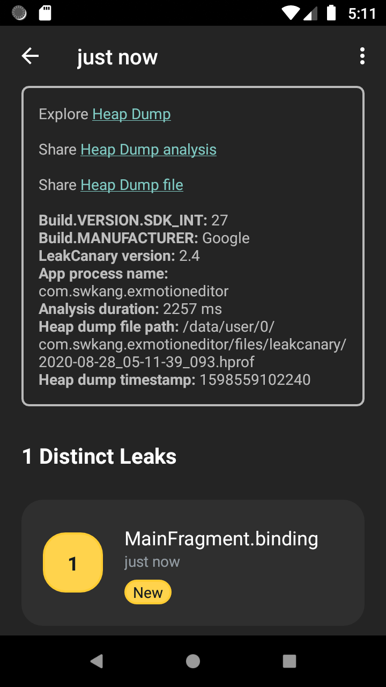
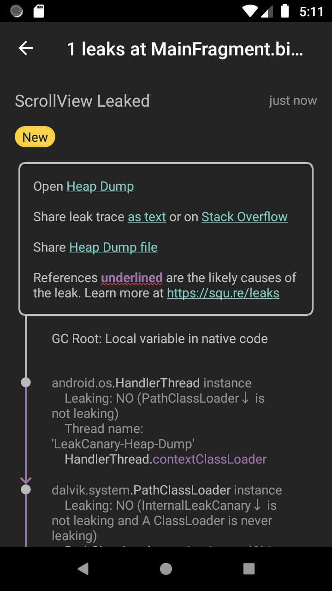
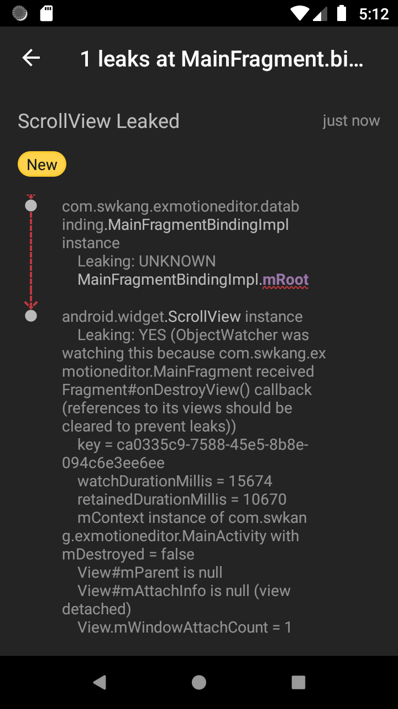

## Data Binding을 사용 할 때 메모리 누수를 막기 

최근 구독중인 android weekly에서 데이터 바인딩을 이용해 뷰 바인딩을 사용시 `Fragment`에서 바인딩 된 뷰 바인딩 객체가 `Framgent`가 더이상 사용되지 않음에도 유지된 상태로 남아 있어 메모리 누수가 발생할 수 있다는 [글](https://proandroiddev.com/avoiding-memory-leaks-when-using-data-binding-and-view-binding-3b91d571c150)을 읽어 보았다. 해당 글을 참고 하여 실제로 메모리 누수가 발생하는지, 그리고 해결방법은 어떤지 하나하나 정리해보려고 한다. 

### 1. 메모리 누수는 어디에서 발생 하는가? 

MVVM아키텍쳐를 프로젝트에 적용 하면서 Data Binding을 이용해 뷰 바인딩을 사용 하는 일이 최근엔 사실상 필수처럼 사용 되었다. 보통 `Fragment`에 데이터 바인딩을 적용 하는데 일반적으로 아래 코드처럼 `lateinit`을 이용해 지연된 초기화를 이용하여 `DataBinding`객체를 초기화 하여 사용했었다. 

```kotlin
class MainFragment : Fragment() {
    private lateinit var binding: MainFragmentBinding

    override fun onCreateView(
        inflater: LayoutInflater,
        container: ViewGroup?,
        savedInstanceState: Bundle?
    ): View? {
        binding = MainFragmentBinding.inflate(inflater, container, false)
        binding.lifecycleOwner = viewLifecycleOwner
        return binding.root
    }
}
```

`MainFragmentBinding`은 `MainFragment`와 레이아웃 파일에 대한 뷰 바인딩 객체이다. 잘 알려진 초기화 방식으로 `lateinit`을 사용 하였으며 별다른 문제는 없어 보인다. 하지만 다른 Fragment로 이동 하다 보면 어느순간 LeakCanary에서 아래와 같은 노티피케이션이 나타난다. 


1개의 유지된 객체가 발견되어, 메모리 누수가 발생할 수 있음을 알리는 내용이며, 터치시 메모리 힙을 덤프 하여 leak trace를 아래처럼 보여주게 된다. (LeakCanary앱을 사용하여 GUI로 볼 수도 있으며, 로그캣 에서도 출력 된다.)



덤프된 힙을 조사한 결과 `MainFragment.binding`에서 누수가 발생되었다고 한다. 





LeakCanary에서 직접적인 메모리 누수의 원인은 붉은 밑줄로 표시되어 있으며, 자세한 내용에 `Leaking : YES`인 부분을 찾아보면 된다. 가장 아래로 스크롤 해 보니 `MainFragment.binding`인스턴스의 `mRoot`인스턴스가 `ScrollView`의 인스턴스를 갖고 있어 메모리 누수가 될 수 있음을 알려주는 내용이다. 

실제 `MainFragment`의 레이아웃파일 내용을 보면, 

```xml
<layout xmlns:android="http://schemas.android.com/apk/res/android"
    xmlns:app="http://schemas.android.com/apk/res-auto">
    <data>
    </data>
    <ScrollView
        android:layout_width="match_parent"
        android:layout_height="wrap_content">
        <androidx.constraintlayout.widget.ConstraintLayout
            android:layout_width="match_parent"
            android:layout_height="wrap_content">
            <Button
                android:id="@+id/button"
                android:layout_width="match_parent"
                android:layout_height="60dp"
                android:text="sub_fragment"
                app:layout_constraintEnd_toEndOf="parent"
                app:layout_constraintStart_toStartOf="parent"
                app:layout_constraintTop_toTopOf="parent" />
            <TextView
                android:layout_width="match_parent"
                android:layout_height="wrap_content"
                android:layout_marginTop="12dp"
                android:lineSpacingExtra="3dp"
                android:padding="15dp"
                android:text="@string/common_str"
                android:textSize="15sp"
                app:layout_constraintTop_toBottomOf="@+id/button" />
        </androidx.constraintlayout.widget.ConstraintLayout>
    </ScrollView>
</layout>
```

위와 같이 되어 있다. 바인딩 된 레이아웃의 가장 root에 존재 하는 뷰인 `ScrollView`의 인스턴스를 인플레이팅 처리 후 얻게 된 인스턴스인 `binding.root`를  `MainFragment.binding`에서 갖고 있고 이 `binding.root`인스턴스를  `MainFragment`가 파괴되어도 유지 되어 메모리 누수로 발전할 수 있음을 알리고 있는 내용이다. 

### 2. 메모리 누수의 해결 방법 1

뷰 바인딩과 관련한 Google의 문서에서는 아래와 같은 방법을 적용 하여 메모리 누수를 방지 할 수 있다. 

```kotlin
class MainFragment : Fragment() {
    private var _binding: MainFragmentBinding? = null
    private val binding get() = _binding!!

    override fun onCreateView(
        inflater: LayoutInflater,
        container: ViewGroup?,
        savedInstanceState: Bundle?
    ): View? {
        _binding = MainFragmentBinding.inflate(inflater, container, false)
        binding.lifecycleOwner = viewLifecycleOwner
        return binding.root
    }

    override fun onDestroyView() {
        super.onDestroyView()
        _binding = null
    }
}
```

이 방법은 `onCreateView()`와 `OnDestroyView()`두 콜백 사이의 라이프 사이클내 에서 뷰 바인딩될 객체의 라이프 사이클을 같이 적용 하려 하는 코드이다. `_binding`라는 backing 필드 객체는 실제 바인딩 될 nullable객체이며, `binding`필드 객체는 `_binding`이 초기화 된 뒤 `get`를 이용해 뷰 바인딩 인스턴스를 얻게 하여 보일러 코드를 제거 하기 위한 방법 이다. 

`Fragment`는 `View`보다 오래 유지된다. 그래서 뷰에 대한 바인딩 객체를 `Fragment`가 제거 될 때 뷰 바인딩 인스턴스를 GC를 통해 제거 하기 위해 null로 처리 해 준다. 

이 방법은 확실하게 데이터 바인딩 객체의 메모리 누수를 막아주지만, 앞으로 생성될 `Fragment`에 바인딩 객체를 backing 필드와 getter필드로 두개를 추가 및 생성하고 `onDestroyView()`콜백을 항상 재정의 하여 뷰 바인딩 객체를 null로 초기화 해주어 GC가 처리 할 수 있게 해줘야 한다. 

### 3. 메모리 누수의 해결 방법 2

다른 방법으로는 `by` 프로퍼티 위임자를 이용해 뷰 바인딩 객체의 초기화를 `viewBinding()`확장 함수에 위임하는 방법이다. 이 `viewBinding()`메소드는 [Kirill Rozov의 블로그](https://proandroiddev.com/make-android-view-binding-great-with-kotlin-b71dd9c87719)에서 공유한 함수로서 `Fragemnt`클래스의 확장 함수 이다. 

이 메소드를 사용 하면 아래와 같이 간단하게 뷰 바인딩 객체를 초기화 할 수있다. 

```kotlin
private val binding: MainFragmentBinding by viewModel()
```

게다가 내부에서 알아서 `onDestroyView()`콜백까지 구현 되어 뷰 바인딩 객체를 알아서 null처리 해주니 안심하고 뷰 바인딩 객체를 사용할 수 있다. 

`viewModel()`확장 함수의 실제 구현과 위임 클래스의 구현은 아래와 같으며, 자세한 내용은 [Kirill Rozov의 블로그](https://proandroiddev.com/make-android-view-binding-great-with-kotlin-b71dd9c87719)을 참고 하면 될거 같다. 

```kotlin 
class FragmentViewBindingProperty<T : ViewBinding>(
    private val viewBinder: ViewBinder<T>
) : ReadOnlyProperty<Fragment, T> {

    private var viewBinding: T? = null
    private val lifecycleObserver = BindingLifecycleObserver()

    @MainThread
    override fun getValue(thisRef: Fragment, property: KProperty<*>): T {
        checkIsMainThread()
        this.viewBinding?.let { return it }

        val view = thisRef.requireView()
        thisRef.viewLifecycleOwner.lifecycle.addObserver(lifecycleObserver)
        return viewBinder.bind(view).also { vb -> this.viewBinding = vb }
    }

    private inner class BindingLifecycleObserver : DefaultLifecycleObserver {

        private val mainHandler = Handler(Looper.getMainLooper())

        @MainThread
        override fun onDestroy(owner: LifecycleOwner) {
            owner.lifecycle.removeObserver(this)
            viewBinding = null
        }
    }
}

/**
 * Create new [ViewBinding] associated with the [Fragment][this]
 */
@Suppress("unused")
inline fun <reified T : ViewBinding> Fragment.viewBinding(): ReadOnlyProperty<Fragment, T> {
    return FragmentViewBindingProperty(DefaultViewBinder(T::class.java))
}
```
