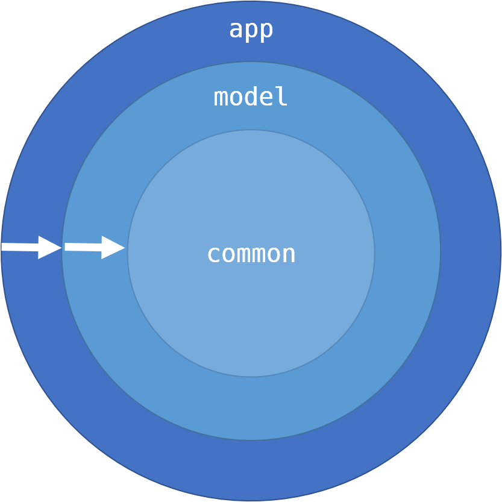

## Android clean architecture

그동안 안드로이드 아키텍쳐에 클린 아키텍쳐를 적용하면서 정리했어야 하는 내용들을 정리 하였다. 

### 1. Clean architecture란 무엇인가

[Clean architecture](https://blog.cleancoder.com/uncle-bob/2012/08/13/the-clean-architecture.html)는 Robert C.Martin(Uncle Bob)이 2012년 아키텍쳐에서의 개념을 정리한 내용이다. 클린 아키텍쳐에서는 5개의 SOLID(객체 지향 설계)를 기반으로 정리된 개념이다. 

SOLID(객체 지향 설계) 5원리는 아래와 같다. (참고로 SOLID는 각 5개원소의 영문 앞한글자씩을 나열한 것 이다)

1. 단일 책임의 원칙 (Single Responsibility Principle - SRP)
    - 클래스 및 함수는 단 하나의 책임만 가져야 한다. 객체지향적으로 응집도를 높게, 결합도는 낮게 설계 하는 것 이좋다. 
    - SRP 에 따르면 클래스, 함수에서는 맡은 책임(기능)에 대해서 많은 요구를 가질필요가 없다. 많은 응집도를 갖게 되면 결합도 또한 높아진다. 이는 유지보수에 악영향을 끼치므로 책음을 세세하게 분리하는게 좋다.
2. 개방-폐쇄 원칙 (Open-Closed Principle - OCP)
    - 클래스는 확장에는 열려(Open)있으나 변경에는 닫혀(Closed)있어야 한다. 
    - 자주 변경되는 기능에 대해선 수정하기 쉽게 설계 하고, 변경되지 않는 내용은 추후 수정될 것 으로 예상될 내용에 영향을 받지 않게 해야 한다. 그렇기 때문에 Interface를 사용 하게 된다. 
3. 리스코프 치환 원칙 (Liskov Subsitution Principle)
    - 자식 클래스는 부모클래스에서 가능한 행위를 수행할 수 있어야 한다. 
    - 부모클래스와 자식클래스간 행위에 일관성이 있어야 한다는 내용이며, 부모클래스의 인스턴스 대신 자식 클래스의 인스턴스를 사용해도 문제가 없어야 한다는 이야기 이다. (IS-A 관계)
4. 인터페이스 분리 원칙 (Interface Segregation Principle)
    - 한 클래스는 자신이 사용하지 않는 인터페이스는 구현하지 말아야 한다. 하나의 일반적인 인터페이스 보다는, 여러개의 구체적인 인터페이스가 낫다. 
    - 말그대로 사용되지 않을 기능에 대해서 영향받는 클래스, 함수를 만들면 안된다. 이럴 경우 하나의 인터페이스에 요구사항 외의 기능을 한꺼번에 추가하는 것 보다는, 인터페이스들을 잘게 분리 하여 서로에게 영향을 받지 않도록 설계 해야 한다. 
5. 의존 역전 원칙 (Dependency Inversion Principle - DIP)
    - 의존 관계를 맺을 때, 변화하기 쉬운것 보단 변화하기 어려운 것에 의존 해야 한다. 
    - 변화하기 쉬운것 은 구체적인 것(구체화된 클래스)을 말하고, 변화하기 어려운 것 은 추상적인 것(인터페이스, 추상 클래스) 을 말한다. 의존성 주입(Dependency injection)에서 요구되는 원칙이다. 

클린 아키텍쳐에서의 다른 개념은, 양파 혹은 과녁그림으로 알려진 그림일 것 이다. 

위 그림에서 보여주고자 하는 바는 각 목적에 맞추어 정리된 냉용을 계층(Layer)로 나누어 의존을 정리 한 것 이다. 원들의 중심으로 갈 수록 높은, 바깥으로 갈 수록 낮은 수준의 컴포넌트로서 이들에 대한 계층의 분리를 통해 효율높은 설계가 가능하다는 것을 설명하고자 하는 것 이다. 

### 2. 안드로이드에서의 클린 아키텍처

안드로이드 앱에 클린 아키텍쳐를 적용하는데에 무리가 없기는 하지만 개발 환경이나 조건에 따라 조금씩 다르게 적용하는 것 으로 알고 있다. 구글에서 안드로이드 클린 아키텍처를 검색하기만 하더라도 개발자들마다 서로 다른 의견과 철학을 가진 아키텍처들과 각 구현방식이 서로 다름을 알 수 있다. 

본인이 개발했던 앱 에서는 기본적으로 각 레이어를 "module"으로 나누어 확실하게 경계를 세워 벽을 만들어 서로간의 의존을 완전히 정리하려고 하였다. 단위 테스트를 조금 더 빠르고 단순하게 동작시키기 위해서 모듈을 나눈 이유도 있지만 개발자들이 할 수도 있는 실수(접근 하면 안되는 계층에 접근하여 의존이 발생하는 것)를 방지함도 있었다. 다만, 각 모듈간 gradle파일의 관리가 복잡해지거나 그냥 `app`모듈 내 에서 패키지로 나뉘어도 문제는 없긴 하다. 

위 이미지에서는 본인이 개발했던 앱의 계층의 이미지 이다. 각 모듈의 역할은 아래와 같다. 

- `app` : 안드로이드에 의존을 갖는 작업들을 수행한다. 
  - 각 도메인별 Activity, Fragment, View등의 안드로이드에 의존을 갖는 클래스들이 있다.
  - 그리고 `model`의 인터페이스의 구현 클래스들이 있다.   
  - 일반적으로 `Presentation Layer`라고도 부른다. 
- `model` : 각 도메인별 비즈니스 로직을 수행한다.  
  - `ViewModel`의 구현. 인터페이스들. 
  - 일반적으로 `Data Layer`라고도 부른다. 
- `common` : `Constants`와 같은 글로벌 상수와 각종 유틸리티성 확장함수들. string 리소스 xml.

필요에 따라 POJO와 같은 entity을 보유하는 모듈이 추가 되거나 다른 환경에 따라 라이브러리 모듈이 추가 될 수도 있다. 

각 모듈들간의 의존은 아래와 같다. 

- `app` 모듈은 `common`, `model`모듈을 알고 있다. 
- `model` 모듈은 `common`모듈만 알고 있다. 
- `common`모듈은 다른 모듈을 전혀 모르고 있다. 

위 아키텍처에서 달성하고자 했던 목표는 아래와 같다. 

1. 비즈니스 로직과 뷰처리 코드들의 완전한 분리. 
2. 유연한 의존성 주입을 위한 재사용가능한 컴포넌트들의 추상화. 
3. 최대한 단순하고 멍청한 `ViewModel`. 
4. 그리고 개발할때 위의 정책을 어기지 않는다. 

### 3. 정리 

아키텍처에는 정확한 정답이 없다고 생각 한다. 하지만 클린 아키텍처는 좋은 아키텍처를 구현하기 위한 좋은 기반이 되어준다고 확신 하고 있다. 각자 다른 개발 환경과 철학 아래에서 만들어지는 아키텍처가 서로 다를수도 있음을 인정 하고 더 좋은 코드를 만들기 위해 같이 고민하는게 가장 좋은 방향이라고 생각 하고 있다. 
