## 안드로이드 퍼포먼스에 대한 팩트 체크

이 글은 Calin Juravle의 [Busting Android performance myths](https://medium.com/androiddevelopers/busting-android-performance-myths-d85ae1d87f22)를 번역 하였다. 

- myth를 미신과 같이 번역해도 괜찮은데 개발적인 의미에서 범위가 넓다고 느껴져서 최근 자주 사용되는 은어인 "팩트"로 사용 해 보았다. 

### 들어가며 

수년동안 Android의 성능에 대하여 몇가지 검증되지 않은 이야기들이 있어왔었다. 일부는 재미있을 법한 흥미로운 이야기 일 수도 있지만, 고성능의 안드로이드 앱을 만드려 할 때 잘못된 개발 방향으로 유도하는 것은 전혀 재미가 없어질 것 이다. 

이 게시글에서는 MythBusters(도시신화나 미신들을 실제 기술로 테스팅 하고 검증하여 진실인지 아닌지 여부를 확인하는 TV 프로그램)의 정신으로 이러한 팩트들에 대해서 테스트 할 것이다. 그래서 팩트에 대해 검증하기 위해 사용할 수 있는 실제 사례들과 도구들을 사용 할 것이다. 이 글에서는 지배적인(dominant) 사용 패턴에 대해 초점을 맞추게 되어 앱에 대해 개발하는 내용들에 초점을 맞추게 될 것 이다. 

이제 팩트에 대한 검증을 시작하도록 해 보자!

### 팩트 체크 1: 코틀린으로 작성된 앱은 자바 보다 용량이 더 크고 느리다? 

Google드라이브 팀은 드라이브 앱을 기존 자바에서 코틀린으로 전환하는 작업을 거쳤다. 이 전환 작업에서만 40개 이상의 빌드 대상을 포함하는 170개 이상의 파일과 16,000줄 이상의 코드가 포함되어 있다. 팀은 전환후 모니터링할 대상중 하나로 그 중 첫번째는 앱의 구동 시간 이었다. 

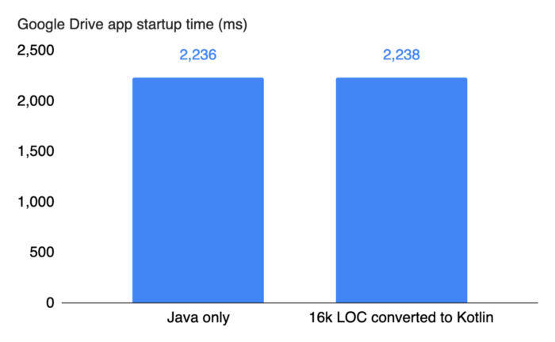

- 이미지의 그래프 설명 : 구글 드라이브 앱의 구동까지의 시간 (좌, 자바로만 작성된 코드), (우, 코틀린으로 작성된 코드)

위 그래프에서 보다시피 코틀린으로 전환된 코드는 실질적으로 구동시간에 영향을 주지 않았다. 

실제로 앱의 전체 벤치 마크에서 팀은 코틀린 전환으로 인한 성능차이를 관찰하지 못했다. 컴파일 시간과 컴파일된 코드의 크기가 약간 증가하기는 하였지만 약 2%내 에서는 큰 영향이 없었다. 

코틀린으로 전환하면서 얻은 이익을 말하자면 팀은 코드라인을 25%줄였다. 이제 코드는 한층 더 깨끗하고 명확하며 유지 관리가 쉬워졌다. 

코틀린에 대해 주목해야 할 점은 R8과 같은 코드 축소 도구(code shrinking tools)를 사용할 수 있다는 것 이다. 이 도구는 코틀린에 대한 특정된 최적화 기능이 포함되어 있다. 

### 팩트 체크 2: (클래스 필드의) Getter와 Setter는 (public 접근자에 비해 성능적으로) 비효율적이다? 

일부 개발자는 성능상의 이유로 setter와 getter를 사용하는 대신 public으로 공개된 필드를 사용 한다. 일반적인 코드 패턴은 아래와 같으며 `getFoo()`를 getter로 사용 한다. 

```java
public class ToyClass {
   public int foo;
   public int getFoo() { return foo; }
}
ToyClass tc = new ToyClass();
```

위 내용을 공개 필드인 `tc.foo`를 직접 접근하여 사용 하는것 과 비교해보도록 하자. 여기에서 코드는 필드에 직접 접근하기 위해서 객체의 캡슐화를 하지 않게 된다. 

작성자는 Android 10이 설치된 Pixel 3에서 Jetpack benchmark라이브러리를 사용하여 이를 벤치마킹 해 보았다. 이 벤치마크 라이브러리는 개발한 코드에 대해 쉽게 테스트 할 수 있는 좋은 방법들을 제공 한다. 라이브러리의 기능 중 하나는 코드를 예열(prewarms) 하므로 결과를 안정적인 수치로 알려준다.

그렇다면 벤치마크를 통해서 얻은 결과는 무엇일까? 

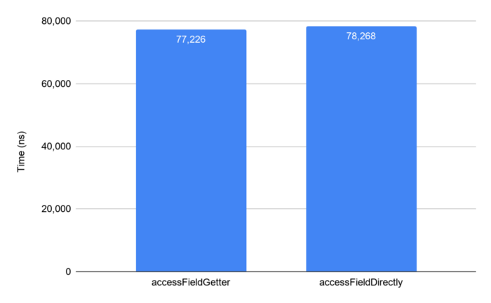

- 이미지의 그래프 설명 : 좌, 클래스 필드에 대해 getter로 접근했을때 걸리는 시간 - 우, public으로 오픈된 클래스 필드에 직접 접근하는데 걸리는 시간 

벤치마크 테스트 에서는, getter와 public 필드에 직접 접근하는 두 방법 모두 같은 방식으로 수행 된다. 결과를 보면 안드로이드 런타임(ART)이 코드의 모든 사소한 액세스 방법에 대해 인라인(inlines)해주므로 놀라운 결과는 아니다. 따라서 JIT또는 AOT컴파일 후 실행되는 코드는 동일하다고 봐도 무방하다. 실제로 코틀린의 필드(위의 예제 에서는 `tc.foo`)에 접근 하면 컨텍스트에 따라 getter또는 setter를 통해 해당 값 또는 참조의 값에 접근 하게 된다. 그러나 모든 접근자들에 대해 ART가 인라인 하기 때문에 성능에는 차이가 없다.  

- [JIT](https://source.android.com/devices/tech/dalvik/jit-compiler?hl=ko)
  - `Just In Time`의 약자로 앱이 실행되는 순간 바이트 코드를 컴파일. 
  - 앱이 실행되거나 화면이 전환시 필요한 코드를 실시간 컴파일링 하기 때문에 그 시간동안 레이턴시가 발생할 수 있다. 
  - 컴파일이 빈번하게 발생하므로 시스템 자원(Ram, CPU, 배터리 등)에 대한 점유가 크다. 
  - AOT에 비해 앱의 설치 시간이 빠르고 앱 용량이 적다. 
- AOT
  - `Ahead Of Time`의 약자로 안드로이드 KitKat버전에서부터 등장한 컴파일러. 
  - 앱 설치할때만 모든 코드를 컴파일한뒤 실행 한다. 
  - 앱 실행시 컴파일을 하지 않기 때문에 JIT보다 런타임 시점에서의 레이턴시는 없다. 
  - JIT에 비해 앱 설치속도가 느리다. 
  - 미리 컴파일을 하기 때문에 앱의 용량이 JIT에 비해 상대적으로 크다. 

코틀린을 사용하지 않는 경우 클래스의 필드를 공개해야 하는 타당한 이유가 없다면 캡슐화를 위반해서는 안된다. 클래스의 필드는 private로 데이터를 숨겨 캡슐화를 하는게 유용하며 성능상의 이유로 노출 할 필요는 없다. 그러므로 getter와 setter를 통해 클래스의 필드는 숨기는 게 맞다. 

### 팩트 체크 3: 람다(Lambda)는 내부 클래스(Inner class)보다 느리다? 

스트리밍(streaming) API가 도입된 후 람다(Lambda)는 매우 간결한 코드를 작성할 수 있게 도와주는 편리한 언어 구조 이다. 객체로 이루어진 배열에서 내부의 일부 원소 값을 합산하는 예제 코드를 살펴 보면 첫째로, map-reduce 작업과 함께 스트리밍 API를 사용함을 알 수 있다. 

```java
ArrayList<ToyClass> array = build();
int sum = array.stream().map(tc -> tc.foo).reduce(0, (a, b) -> a + b);
```

여기에서 첫번째 람다는 객체를 정수로 반환 한하고 두번째 람다는 생성된 두 값을 합산 하여 반환한다. 이는 람다 식에 대해 동등한 클래스를 정의하는 것 과 비교할 수 있다. 

```java
ToyClassToInteger toyClassToInteger = new ToyClassToInteger();
SumOp sumOp = new SumOp();
int sum = array.stream().map(toyClassToInteger).reduce(0, sumOp);
```

다음 예제로 두개의 중첩 클래스(nested class)가 있다. 하나는 객체를 정수로 변환하는 `toyClassToInteger`이고, 두번째 클래스는 합 연산을 하는 `SumOp`이라는 클래스 이다. 첫번째 예제 람다는 두번째 람다보다 훨씬 더 깔끔 하고 보기에 좋다. 대부분의 개발자들은 첫번째 람다와 같은 방법을 사용 할 것 이라고 할 것 이다. 

그러나 이 둘의 성능 차이는 어떨까? 다시 한번 Android 10이 설치된 Pixel 3에서 Jetpack Benchmark 라이브러리를 사용하여 성능 차이를 확인 하였지만 별다른 성능 차이가 없음을 확인 할 수 있었다. 

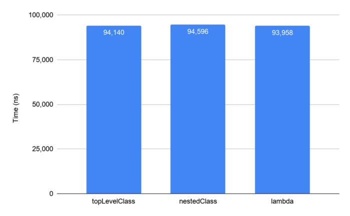

- 이미지 그래프 설명
  - `topLevelClass` : 최상위 클래스를 재정의 하여 테스트 
  - `nestedClass` : 중첩된 클래스를 이용한 구현 
  - `lambda` : 람다를 이용한 구현

그래프를 통해서 최상위 클래스를 정의한 것을 볼 수 있으며 이런 구현 방법을 통해서도 성능차이가 없음을 확인 하였다. 

이러한 성능차이가 없는 이유는 람다가 익명의 내부 클래스로 변환되기 때문이다. 따라서, 내부 클래스를 작성하는 대신 람다를 사용 하는게 좋다. 실제 람다는 내부 클래스로 변환되기 때문에 중첩된 내부 클래스와 성능이 거의 동일할수 밖에 없으며 또한 코드가 간결하고 직관성이 좋아 깔끔한 코드를 만들어 내기에 좋다. 

### 팩트 체크 4: 객체의 할당은 비효율적이니, 객체 풀(pool)을 사용 해야 한다? 

안도르이드에서의 메모리 할당과 가비지 콜렉터(garbage collecter)는 좋은 성능을 이끌어 냈다. 다음 그래프에 나온것 처럼 거의 모든 안드로이드의 OS릴리즈에서 객체 할당에 대해 성능이 향상 되었음을 알 수 있다. 

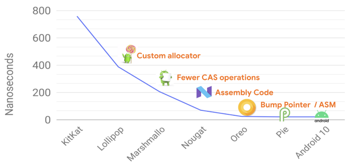

- 왼쪽에서부터 Kitkat부터 Android10까지의 OS 릴리즈에 대해 GC에 걸린 시간을 보여주고 있다. 

가비지 콜렉터 또한 OS릴리즈 마다 성능이 크게 향상 되었었다. 현재에 있어 가비지 컬렉션은 앱에 버벅거림이나 구동에 영향을 크게 미치지 않는다. 다음 그래프에서는 짧은 라이프 주기를 갖는 객체들에 대한 가비지 콜렉션에 대해 안드로이드 10에서 개선된 사항을 보여준다. 이는 다음 새로운 릴리즈인 안드로이드11에서도 확인 할 수 있는 개선 사항이다. 

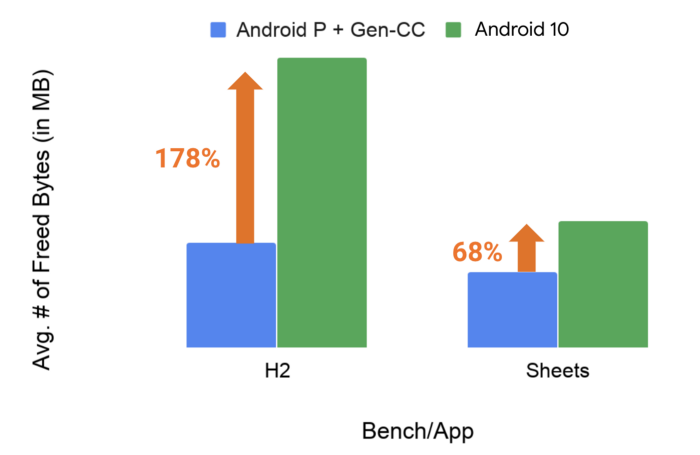

GC 처리량은 H2와 같은 GC벤치 마크에서 170%이상, Google 스프레드 시트와 같은 실제 앱의 경우 68%까지 증가함을 알 수 있다. 

그렇다면 객체 풀을 사용하여 객체를 할당하여 사용 할 때 실제 성능에 어떤 영향을 미치게 될까? 

가비지 콜렉션이 비효율적이고 메모리 할당 비용이 비싸다고 가정하면 생성하는 가비지들이 적으면 적을수록 작동하는 가비지 수집이 줄어든다고 가정할 수 있다. 따라서, 매번 객체를 사용할 때마다 새 개체를 만드는 대신 자주 사용하는 객체의 풀을 유지한 다음 거기에서 객체를 가져오게 한다. 따라서 아래와 같이 구현할 수 있다. 

```java
Pool<A> pool[] = new Pool<>[50];
void foo() {
   A a = pool.acquire();
   …
   pool.release(a);
}
```

여기에서 건너 뛴 코드 세부정보가 일부 있지만, 코드에서 객체 풀을 정의하고 풀에서 객체를 획득 한 다음 결국 이를 `release()` 한다.

이를 테스트 하기 위해 마이크로 벤치 마크를 구현하여 객체 풀 에서 객체를 검색하기 위한 표준 할당의 오버헤드와 가비지 콜렉션이 앱의 성능에 어떠한 영향을 미치는지 파악하기 위한 CPU의 오버헤드를 측정 해보자. 

테스트의 경우, 매우 엄격한 반복문에서 할당 코드를 수천번 실행하는 코드를 안드로이드10의 Pixel 2 XL에서 실행해 보았다. 또한, 작거나 큰 객체마다 성능이 다를 수 있으므로 추가 필드를 추가 하여 다른 객체의 크기를 시뮬레이션 해 보았다. 

첫번쨰로, 객체 할당에 대한 오버헤드의 결과 이다. 

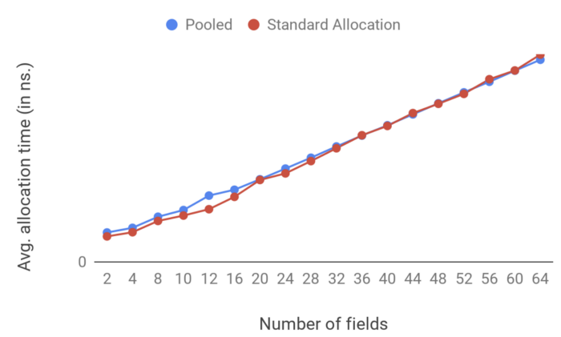

두번째로, 가비지 콜렉션을 위한 CPU의 오버헤드 결과 이다. 

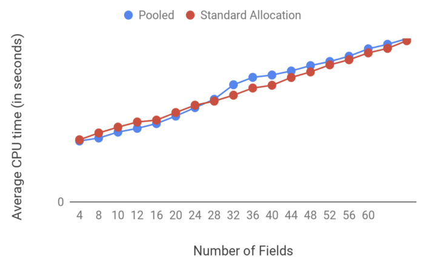

벤치마크에 대한 결과로 일반적인 객체 할당과 객체 풀에 대한 차이가 미미하다는 것을 알 수 있다. 그러나 더 큰 객체에 대한 가비지 콜렉션의 경우 객체 풀을 사용하면 성능이 약간 더 나빠진다. 

이 는 사실 가비지 콜렉션에서 기대하는 것 이다. 객체 풀을 사용하면 앱의 메모리 공간이 증가 하기 때문이다. 갑자기 너무 많은 메모리를 보유하고 있으며 객체 풀을 사용하기 때문에 가비지 콜렉션의 호출 수는 감소하더라도 각 가비지 콜렉션의 호출 비용은 더 높게 된다. 이는 가비지 콜렉션이 아직 살아있는 객체와 수집해야 하는 객체를 결정하기 위해서 더 많은 메모리를 탐색해야 하기 때문이다. 
 
그래서 이 팩트에 대해서 결과는 정확히 어떠한가? 객체 풀에 더 효율적인지 여부는 앱의 요구사항에 따라 다르게 된다. 하지만 먼저, 코드의 복잡성을 제외하고 객체 풀을 사용할 떄에 대한 단점을 먼저 기억하자. 

- 객체풀을 사용하면 더 많은 메모리 공간을 사용할 수 있다. 
- 객체풀을 사용하면 필요 이상으로 객체를 더 오래 유지하게 되는 위험을 안고 간다. 
- 객체풀에 대해서는 매우 효율적으로 구현해 주어야 한다. 

그러나, 객체 풀에 대한 접근 방식은 크기가 크거나 할당 비용이 많이 드는 객체에 대해서는 유용하다고 할 수 있다. 기억해야 할 핵심은 객체 풀을 선택하기 전에 테스트 하고 측정 해 보는 것 이라 할 수 있다. 

### 팩트 체크 5: 디버깅용 앱을 프로파일링 하여 측정 해도 문제 없다? 

디버그 가능한 상태에서 앱을 프로파일링 한다면 릴리즈용 앱을 프로파일링 하는 것 보다 편하게 측정 데이터를 얻을 수 있을 것 이다. 그리고 디버깅 가능한 프로파일링이 부정확할 수 있다 하더라도 더 빠르게 프로파일링을 할 수 있으므로 더 좋을 것 이라고 생각 할 수 있다. 하지만 그렇지 않다. 

이 팩트를 테스트 하기 위해 일반적인 Activity와 관련된 작업들에 대해 몇가지 벤치마크를 살펴 보았다. 

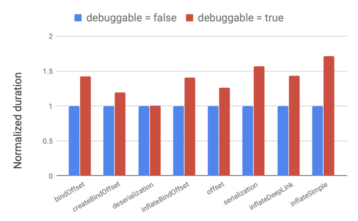

참고로 복호화와 같은 일부 테스트에는 영향이 없었다. 하지만 다른 경우에는 벤치마크에서 50%이상의 회귀(regression)가 있었다. 심지어 100%더 느린 사례도 존재 했었다. 이는 런타임이 디버그 가능할 떄 코드를 거의 최적화하지 않으므로 사용자가 실 기기에서 실행하는 코드와는 매우 다르기 때문이다. 

디버깅 상태에서 프로파일링의 결관느 앱의 핫스팟으로 잘못 지정될 수 있으며 최적화가 필요없는 항목을 최적화 하려고 시도 하는데 시간을 낭비 할 수 있다. 

결론은, 디버깅용앱을 프로파일링 하지 말고 실제 릴리즈용 앱을 대상으로 프로파일링 하여 측정 해야 올바른 측정값을 얻을 수 있다. 

### 잘 알려지지 않은 낯선 것 들

이제 팩트 체크에서 벗어나 "낯선 것"들에 주의를 돌려보도록 하자. 이 낯선것 들은 팩트 체크할 대상은 아니 었다. 오히려 그것들은 즉시 명확하지 않거나 분석하기 어렵지만 결과가 앱 개발 방향을 크게 바꿀수도 있는 것 들이다. 

#### 1. `Multidex`는 앱의 성능에 영향을 주는가? 

APK파일은 점점 더 커져만 가고 있다. 한동안 일반적인 dex의 기준 사양 제약 조건(64k 메소드 제한)에 맞지 않았었다. Multidex는 코드의 메소드 수 제한을 초과하는 경우 이를 분리 해 주는 기술이다. 

그럼 여기에서 질문이 생긴다. 얼마나 많은 메소드가 많은가? 그리고 앱에 dex파일이 많이 늘어난 경우 성능에 영향을 주지 않는가? 이는 앱이 너무 크기 때문이 아니라 더 쉬운 개발을 위해 기능에 따라 dex파일을 분할 할 수 있다. 

여러개의 dex파일의 성능 영향을 조사하기 위해 계산기 앱을 사용해 보았다. 기본적으로 단일 dex파일 으로 구성된 앱이다. 그리고 패키지 경계를 기반으로 5개의 dex파일로 분할하여 기능에 따른 분할을 시뮬레이션 해 보았다. 

그런 다음 앱을 구동시켜 시간에 대해 측정 하여 성능에 대해 여러 가지를 테스트 해 보았다. 

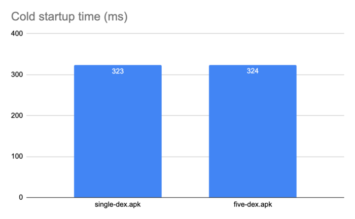

그래프를 참고 하면 dex를 여러개로 분할하여도 성능에 아무런 영향이 없다. 다른 앱의 경우 앱의 크기와 분할 방식과 같은 여러 요인에 따라 약간의 오버 헤드가 있을 수 있긴 하다. 그러나 dex파일을 합리적으로 분할하고 수백개를 추가하지 않는 한 구동 시간에 미치는 영향은 최소화 되어야 할 것이다. 

이번에는 APK파일의 크기와 메모리 사이즈는 어떠할까? 

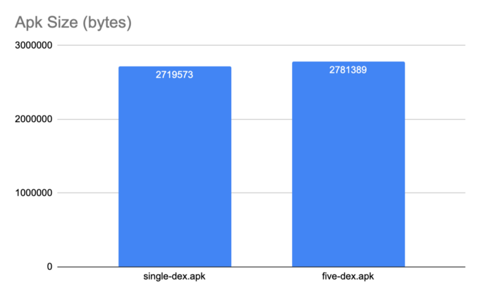

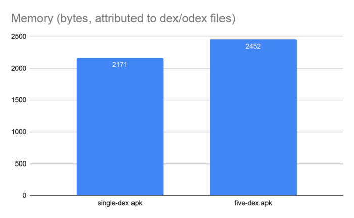

그래프를 보다 시피 APK파일의 크기와 앱의 런타임 메모리 공간이 약간 증가 하였다. 이는 앱을 여러 dex파일로 분할 할 때 각 dex파일에 대한 기호 및 캐시 테이블에 대한 일부 중복된 데이터들이 존재 하기 때문이다. 

그러나 dex파일간의 종속성을 줄임으로서 이러한 apk파일의 크기와 앱의 런타임 메모리 공간의 증가를 최소화 할 수 있다. 위 테스트의 경우에는 이러한 노력을 하지 않았기 때문에 증가한 양이 그대로 보인 것 이다. 종속성을 최소화하려고 시도 했다면 R8및 D8 도구 등을 살펴 보았을 것 이다. 이러한 도구는 dex파일 분할을 자동화하고 일반적인 함정을 피하며 종속성을 최소화 하는데 도움이 된다. 예를 들어 이러한 도구는 필요한 것 보다 더 많은 dex파일을 만들지 않으며 모든 시작 클래스들을 기본 파일에 넣지 않게 된다. 그러나 dex파일의 맞춤 분할을 수행하는 경우 항상 어떤 항목이든 측정 해야 할 필요는 있다. 

#### 2. Dead code

ART와 같은 JIT컴파일러와 함께 런타임을 실행할 때 이점 중 하나는 런타임중 코드를 프로파일링 한 다음 최적화 할 수 있다는 것 이다. 인터프리터/JIT 시스템에 의해 코드가 프로파일링 되지 않으면 아마도 실행되지 않을 것 이라는 여론이 있다. 이 이론을 테스트 하기 위해 Google앱에서 생성 한 ART프로필을 조사 해 보았다. 앱 코드의 상당 부분이 ART 인터프리터-JIT 시스템에 의해 프로파일링 되지 않음을 발견하였다. 이는 많은 코드가 실제로 장치에서 실행되지 않았음을 나타낸다. 

프로파일링 되지 않을 수 있는 여러 유형의 코드는 아래와 같다. 

- 많이 실행되지 않는 오류 핸들링 코드
- 이전 버전과의 호환성을 위한 코드, 특히 Android 5이상 기기 가 아닌 모든 기기에서 실행되지 않는 코드
- 자주 사용하지 않는 기능에 대한 코드 

그러나 우리가 보는 편향 분포는 앱에 불필요한 코드가 많이 있을 수 있다는 강력한 표시가 될 수 있다. 

불필요한 코드를 빠르고 쉽게 무료로 제거 하는 방법은 R8로 코드 축소를 하는 것 이다. 그리고 아직 수행하지 않은 코드의 경우 안드로이드 App bundle및 play 기능 제공을 사용하도록 앱을 변환 한다. 그리고 사용 되는 기능만 설치하게 하여 사용자 경험을 향상 시킬 수 있다. 

### 결론 

안드로이드 성능에 대한 많은 이슈를 파헤쳐 보았지만 일부 경우 상황이 명확하지 않은 건이 있음을 확인 할 수 있었다. 따라서, 복잡한 최적화 또는 좋은 코딩 관행을 위반하는 작은 최적화를 선택하기 전에 벤치 마킹 하고 측정하는 것 이 중요하다. 

앱에 가장 적합한 것을 측정하고 결정하는데 많은 도움이 되는 도구들이 있다. 예를 들어 Android Studio에는 네이티브 및 비 네이티브 코드에 대한 프로파일러가 있으며 배터리 및 네트워크 사용을 위한 프로파일러도 제공 되고 있다. 그리고 Perfetto와 Systrace와 같이 더 깊게 파해쳐 볼 수 있는 도구가 있다. 이러한 도구들은 앱의 구동 또는 실행 중 발생하는 상황에 대해 더 자세히 볼 수 있게 도와준다. 

Jetpack benchmark 라이브러리는 측정 및 벤치마킹과 관ㄹ녀된 모든 복잡성을 제거 할 수 있다. CI(Continuous Integration)에서 이를 사용하여 성능을 추적하고 더 많은 기능을 추가 할 때 앱이 어떻게 작동하는지 확인 하는 것이 좋다. 마지막으로 디버그 모드에서 프로파일링 하지 말자. 
