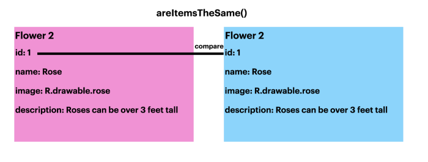
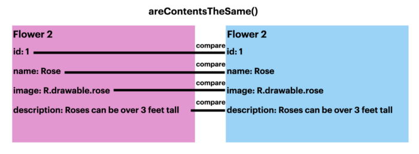

## Adapting to ListAdapter

> 이 문서는 Meghan Mehta가 작성한 [Adapting to ListAdapter](https://medium.com/androiddevelopers/adapting-to-listadapter-341da4218f5b)를 번역 하였다. 

`RecyclerView`는 데이터의 항목 목록을 효율적으로 표현하기 위한 좋은 방법이다. 정적인 데이터 목록을 화면에 표시하려면 기본 어댑터를 사용하면 훌륭하게 작동할 것 이다. 그러나 대부분의 RecyclerView를 사용하는 사례에서의 데이터는 대부분 동적이다. 예를 들어 "할 일"목록을 보여주는 목록 앱을 살펴 보도록 하자. 이 경우 새 할일 항목이 추가되고 완료된 할 일 항목이 제거될 것 이다. 

`notifyItemInserted()`는 지정된 인덱스에 새 "할 일"작업을 삽입할 수 있지만 다른 항목을 제거할 때 문제가 발생한다. `notifyItemRemoved()`는 제거하려는 항목의 인덱스가 있는 경우에만 유효하다. 제거할 항목의 위치를 가져오는 코드를 작성한 다음 `notifyItemRemoved()`를 호출 할 수 있지만 이 코드는 지저분해 질 수밖에 없다. 

`notifyDataSetChanged()`호출은 필수는 아니지만 변경되지 않은 부분에 대해서도 전체 뷰를 다시 그리게 해 준다. 이는 당연히 비용이 많이 들어갈 수 밖에 없다. `ListAdapter`는 전체 뷰 를 다시 그릴 필요 없이 항목의 추가 및 제거를 처리 하고 이러한 변경사항에 대해 애니메이션을 적용할 수 있다. 

`ListAdapter`를 사용할 떄 다른 이점은 항목이 추가되거나 제거 될 때 애니메이션이 제공 된다는 것 이다. 이것은 사용자가 목록의 변경 사항을 확인할 수 있는 멋진 시각적인 효과를 제공 한다. 애니메이션은 `ListAdapter`가 없어도 적용할 수 있지만 개발자가 따로 구현해 주어야 하며 애니메이션과 함께 뷰를 다시 그려야 하기 때문에 ListAdapter보다 나은 성능을 기대하기 어렵다. 

### 1. Split the difference

`DiffUtil`은 `ListAdapter`가 목록의 항목을 효율적으로 변경할 수 있도록 하는 숨겨진 요소 이다. `DiffUtil`은 새 목록을 이전 목록과 비교하여 추가, 이동 및 제거 된 항목을 파악하고 첫 번째 목록을 두번째 목록으로 효율적으로 업데이트 해 준다. 

새 데이터를 식별하기 위해서 `DiffUtil`에서는 `areItemsTheSame()`및 `areConentsTheSame()`두개의 메소드를 재정의 해 주어야 한다. `areItemsTheSame()`은 두 항목이 실제로 동일한 항목인지 확인 한다. 그리고 `areContentsTheSame()`은 두 항목이 동일한 데이터인지 확인 한다. 



  - `areItemsTheSame() 에서는 두 항목이 동일한지만 검사 한다. 



  - `areContentsTheSame()`에서는 두 항목의 데이터가 동일한지를 검사 한다. 

`Adapter`클래스에서 `areItemsTheSame()`및 `areContentsTheSame()`을 재정의하는 `DiffUtil`객체를 만든다. 

```kotlin
object UserDiffCallback: DiffUtil.ItemCallback<User>() {
    override fun areItemsTheSame(oldItem: User, newItem: User): Boolean {
        return oldItem.id == newItem.id
    }

    override fun areContentsTheSame(oldItem: User, newItem: User): Boolean {
        return oldItem == newItem
    }
}
```

`RecyclerView.Adapter`대신 `ListAdapter`클래스를 상속하도록 만든 `Adapter`클래스의 상속구조를 변경 하고 생성자를 통해 구현한 `DiffCallBack`를 전달 한다. 

```kotlin
class UserListAdapter: ListAdapter<String, UserListAdapter.ViewHolder>(UserDiffCallback)
```

### 2. Updating the list

`ListAdapter`는 현재 목록과 비교 하여 표시할 항목을 제출하는 `submitList()`라는 메소드를 이용해 데이터를 세팅 한다. 즉, `ListAdapter`가 목록을 관리하므로 더 이상 `getItemCount()`를 재정의 할 필요가 없다. 

```kotlin
val userList = resources.getStringArray(R.array.user_array).toMutableList()
val userAdapter = UserListAdapter()
userAdapter.submitList(userList)
```

`Adapter`클래스에서 `onBindViewHolder()`는 이제 주어진 `position`을 이용해 `getItem()`을 사용하여 항목을 가져올 수 있다. 

```kotlin
override fun onBindViewHolder(holder: ViewHolder, position: Int) {
    holder.bind(getItem(position))
}
```

`RecyclerView`를 `ListAdapter`으로 사용하도록 변환하려면 몇단계만 거치면 된다. 이제 앱은 `ListAdapter`를 사용하여 변경된 항목만 업데이트하게 함 으로서 더 나은 성능과 좋은 사용자 경험을 제공할 수 있다. 