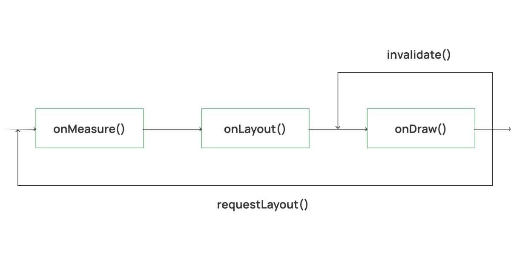
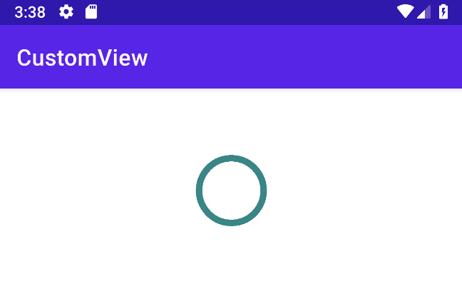

## 안드로이드 사용자 정의 뷰에 대한 가이드

> 이 문서는 Vlad Sonkin이 작성한 [Ultimate Guide To Android Custom View](https://vladsonkin.com/ultimate-guide-to-android-custom-view/)를 번역 하였다. 

Android에서는 앱의 요구사항을 충족시켜줄 많은 표준적인 뷰 들이 있다. 그러나 때로는 디자이너가 새로운 UI요소를 제안하고 이를 구현해야 하는 일이 생길 수 있는데 이 때 Android Custom View를 만들 수 있다. 

이 새로운 UI요소는 일부 개선된 다른 표준 뷰 혹은 다른 여러개의 표준적인 뷰를 포함하는 경우 제공되는 View를 확장하여 [사용자 정의 뷰를 만들 수 있다](https://vladsonkin.com/android-custom-view-extending-the-views/). 이는 기존 제공되는 View를 사용하면서 사용자 정의 View를 만드는 기본적인 방법이다. 

그러나 운이 좋지 않을 경우 이 새로운 사용자 정의뷰는 처음부터 만들어야 할 수 있다. 이 글에서는 사용자 정의 애니메이션 로더를 만들고 뷰의 라이프 사이클, 생성자, 속성 및 애니메이션들과 같은 주제들을 다루게 될 것 이다. 

### 1. Android View Lifecycle

Android의 뷰 에는 자체적인 수명 주기가 있지만 공식 문서 로는 제공되지 않는다. 이 수명주기의 중요한 부분은 아래와 같다. 



액티비티가 보여지는 화면으로 들어오면 ANdroid는 Root View를 요청한 다음 Root view에서 제일 말단에 위치한 뷰 순으로 그려나간다. 이 그려나가는 단계는 아래 3단계로 진행 된다. 

1. `onMeasure()`. View 의 크기를 계산한다. 
2. `onLayout()`. View의 위치를 찾는다. 
3. `onDraw()`. View를 계산한 크기로 찾은 위치에 실제로 그린다. 

> 참고 : 이 프로세스로 인하여 레이아웃은 가능한 평평하게(깊이 없이) 유지하는 것 이 좋다. 그러면 시스템에서 내부 ViewGroup의 크기와 위치를 계산할 때 리소스를 절약 할 수 있다. 

이제, 사용자 정의 뷰를 구현하고 뷰의 수명주기가 실제로 어떻게 동작하는지 살펴 보도록 하자. 사용자 정의 뷰의 생성은 생성자로부터 시작 된다. 

### 2. Android Custom View Constructors 

예제로 만들 `LoadingView`는 일반적인 `View`를 상속 한다. 

```kotlin
class LoadingView: View {    
}
```

AndroidStudio에서는 View에 대한 생성자를 만들어야 한다고 할 것이다. View에서는 아래와 같은 생성자가 존재 한다. 

|생성자 타입|설명|
|---|---|
|`View(context: Context)`|프로그래밍 방식으로 코드에서 뷰를 생성할 때 주로 사용 된다.|
|`View(context: Context, attrs: AttributeSet?)`|XML레이아웃에서 뷰를 생성할 때 사용 된다.|
|`View(context: Context, attrs: AttributeSet?, defStyleAttr: Int)`|XML레이아웃에서 뷰를 생성하고 테마 속성 스타일을 사용할 때 사용 된다.|
|`View(context: Context, attrs: AttributeSet?, defStyleAttr: Int, defStyleRes: Int)`|위 생성자와 동일하지만 추가로, 스타일의 리소스를 사용할 수 있다.|

사용자 정의 뷰를 만들게 될때의 조언은, 위 생성자중 처음으로부터 2개의 생성자를 사용하여 사용자 정의 뷰를 만드는 것 이다. 그리고 테마 혹은 스타일을 사용해야 하는 경우에 대해서만 3, 4번째를 사용 하면 된다. 

```kotlin
class LoadingView: View {
    constructor(context: Context): super(context)
    constructor(context: Context, attrs: AttributeSet?): super(context, attrs)
}
```

이제 수명주기를 실제로 살펴 보도록 하자. 

### 3. `onMeasure()`

이번 단계에서 Android시스템은 뷰의 크기를 계산 하게 된다. 제공된 너비와 높이를 기준으로 뷰가 측정되는 기본 구현이 있으며 대부분의 경우에는 추가 확장할 필요가 없기는 하다. 예를 들어 아래와 같이 사용자 정의 뷰를 생성하였다면, 

```xml
<com.vladsonkin.customview.LoadingView
  android:id="@+id/loading"
  android:layout_width="100dp"
  android:layout_height="100dp"
  android:layout_marginTop="24dp"
  app:layout_constraintStart_toStartOf="parent"
  app:layout_constraintTop_toTopOf="parent"
  app:layout_constraintEnd_toEndOf="parent"/>
```

기본적으로 `onMeasure()`에서는 xml 레이아웃을 통해 제공된 크기 100 x 100을 계산하므로 `onMeasure()`를 재정의할 필요가 없다. 

하지만, 이 경우가 아닐 경우 기본적으로 두가지 작업을 수행하는 `onMeasure()`를 재정의 할 수 있다. 

1. 뷰의 크기를 계산한다. 
2. 위 (1)단계에서 계산된 뷰의 크기로 `setMeasuredDimension(int, int)`를 호출 한다. 

### 4. `onLayout()`

이 단계 에서 Android는 이전 단계의 측정된 값(뷰의 크기)을 가져와 각 View의 크기와 위치를 할당하게 된다. `onMeasure()`와 마찬가지로 기본 구현은 대부분의 경우 잘 작동하며 xml에서 위치를 계산하게 된다. 

### 5. `onDraw()`

이 메소드는 모든 사용자 정의 뷰을 실제로 그리게 해 준다. 이를 위해 아래 2개의 객체를 제공 한다. 

1. `Canvas`. 이 객체는 `onDraw()`의 인수로 제공 되며 화면에 뷰를 그리는 역할을 담당 한다. 
2. `Paint`. 이 객체를 만들고 View의 스타일을 코드로 정의 할 수 있다. 

예제로 설명하자면, 원형 로딩 뷰를 만들어야 하므로 획이 있는 원을 그려야 한다. 

```kotlin
override fun onDraw(canvas: Canvas) {
    super.onDraw(canvas)

    val circleRadius = 100f
    val paint = Paint().apply {
        color = ContextCompat.getColor(context, R.color.teal_700)
        style = Paint.Style.STROKE
        strokeWith = 20f
    }
    canvas.drawCircle(width / 2f, height / 2f, circleRadius, paint)
}
```

여기서 `Canvas`는 `drawCicle()`을 이용하여 원을 그리고 `Paint`는 그려질 원의 스타일을 담당 한다. 그리고 이 사용자 뷰는 아래 처럼 xml레이아웃에 추가 하게 된다. 

```xml
<?xml version="1.0" encoding="utf-8"?>
<androidx.constraintlayout.widget.ConstraintLayout xmlns:android="http://schemas.android.com/apk/res/android"
  xmlns:app="http://schemas.android.com/apk/res-auto"
  xmlns:tools="http://schemas.android.com/tools"
  android:layout_width="match_parent"
  android:layout_height="match_parent"
  android:padding="16dp"
  tools:context=".MainActivity">

  <com.vladsonkin.customview.LoadingView
    android:id="@+id/loading"
    android:layout_width="100dp"
    android:layout_height="100dp"
    android:layout_marginTop="24dp"
    app:layout_constraintStart_toStartOf="parent"
    app:layout_constraintTop_toTopOf="parent"
    app:layout_constraintEnd_toEndOf="parent"/>

</androidx.constraintlayout.widget.ConstraintLayout>
```

예제의 결과를 보면 아래와 같이 보여진다. 



`onDraw()`메소드는 여러번 호출 되므로 일반적으로 `Paint`객체를 다른 곳 으로 이동 시켜 주고 `onDraw()`에서는 이동 시킨 `Paint`객체에 접근 하는 것 이 좋다. 예를 들면 아래와 같이 사용 하면 된다. 

```kotlin
class LaodingView: View {
    private lateinit var paint: Paint
    private val circleRadius = 100f

    constructor(context: Context): super(context) { 
        init(context, null) 
    }
    constructor(context: Context, attrs: AttributeSet?): super(context, attrs) {
        init(context, attrs)
    }

    private fun init(context: Context, attrs: AttributeSet?) {
        paint = Paint().apply {
            color = ContextCompat.getColor(context, R.color.teal_700)
            style = Paint.Style.STROKE
            strokeWidth = 20f
        }
    }

    override fun onDraw(canvas: Canvas) {
        super.onDraw(canvas)
        canvas.drawCircle(width / 2f, height / 2, circleRadius, paint)
    }
}
```

여기에서 모든 생성자 매개변수를 받고 `onDraw()`에서 재사용 되는 `Paint`객체를 생성하게 되는 `init()`메소드를 추가 하였다. 

### 6. Custom View Update

이 글의 초반부분에서 보았던 뷰 생명주기의 다이어그램에서 `invalidate()`와 `requestLayout()`메소드가 있음을 확인 할 수 있다. 이 메소드들은 뷰에 대해 무엇인가가 변경 되면 뷰를 다시 그리는것과 같은 목표가 있다. 이 두 메소드의 유일한 차이점은, `requestLayout()`의 경우 Android시스템이 View의 크기와 위치를 처음부터 다시 계산한다는 점 이다. 

업데이트가 View의 크기에 영향을 주지 않으면 `invalidate()`를 호출 하면 되고, 그렇지 않을 경우 `requestLayout()`을 호출 하면 된다. 

이제 모든 뷰 생명주기를 다루고 간단한 원을 그리는 사용자 정의 뷰를 만들어 보았다. 이 시점에서 원 그림과 함깨 `ImageView`를 사용하여 동일한 결과를 얻을 수 도 있다. 이 경우 훨씬 쉽고 간편할 것 이다. 그러나 사용자 정의 뷰 는 훨씬 더 많은 작업을 수행할 수 있으며 그 예제중 하나가 바로 애니메이션 이다. 

### 7. Custom View Anmations 

각 변경된 사항들에 대해 사용자 지정 뷰에 대한 애니메이션은 단게별로 처리 되어야 한다. 각 변경들에 대해 `invalidate()`를 호출 하면 View가 다시 그려질 것 이다. 이 작업을 반복하게 된다면 애니메이션이 진행 된다. 

원에 적용될 애니메이션은 애니메이션을 취소 할 때 까지 무한대로 커졌다가 작아짐을 반복 한다. 우리가 해야 할 일은 원의 크기 값을 점진적으로 변경하고 다시 뷰를 그리고 이를 반복하게 하는 것 이다. 까다로울 것 같아 보이지만 다행히도 `ValueAnimator`를 사용하여 구현할 수 있다. 

```kotlin
class LoadingView: View {
    private var valueAnimator: ValueAnimator? = null

    // ... 

    fun showLoading() {
        isVisible = true
        valueAnimator = ValueAnimator.ofFloat(10f, circleRadius).apply {
            duration = 1000
            interpolator = AccelerateDecelerateInterpolator()
            addUpdateListener { anim ->
                circleRadius = animation.animatedValue as Float
                animation.repeatCount = ValueAnimator.INFINITE
                animation.repeatMode = ValueAnimator.REVERSE
                invalidate()
            }
            start()
        }        
    }

    fun hideLoading() {
        isVisible = false
        valueAnimator?.end()
    }
}
```

여기에서 `circleRadius`값을 1초 간격으로 10에서 100으로 증가시켜준다. `ValueAnimator`는 이 값을 변경 하고 각 변경될 값에 대해 `addUpdateListener`에서 `invalidate()`를 호출한다. 

`showLoading()`및 `hideLoading()`을 트리거 하는 버튼은 xml레이아웃에 추가 해 주었다. (예제 생략)

그리고 액티비티에서 메소드를 호출 해 주면 아래와 같이 동작한다. 

```kotlin
class MainActivity: AppCompatActivity() {
    private lateinit var ui: ActivityMainBinding

    override fun onCreate(savedInstanceState: Bundle?) {
        super.onCreate(savedInstanceState)

        ui = ActivityMainBinding.inflate(layoutInflater).apply { setContentView(root) }
        ui.showLoadingButton.setOnClickListener { ui.loadingView.showLoading() }
        ui.hideLoadingButton.setOnClickListener { ui.loadingView.hideLoading() }
    }
}
```


### 8. Android Custom View Custom Attributes

지금 예제에서는 원의 선 색상, 선 너비 및 반경이 사용자 정의 뷰에 하드 코딩되어 있지만 사용자 정의 속성을 사용하여 동적으로 제공 할 수 있다. 이를 위해 `attrs.xml`리소스 파일에 원하는 속성들을 추가 해 야 한다. 

```xml
<?xml version="1.0" encoding="utf-8"?>
<resources>
  <declare-styleable name="LoadingView">
    <attr name="lv_color" format="color"/>
  </declare-styleable>
</resources>
```

`attrs.xml`에서 우리는 그려질 원의 색상을 담당하는 `lv_color`속성을 선언 하였다. 이름에 대한 중복으로 충돌을 방지하기 위하여 속성에 고유한 접두사를 추가해 주는 것이 좋다. 일반적으로 사용자 정의 뷰의 약자가 추가 되곤 한다. 

이렇게 추가된 속성은 생성자를 통해 전달되며 이 예제 클래스의 경우 `init()`에서 사용된다.

```kotlin
private fun init(context: Context, attrs: AttributeSet?) {
    val typedArray = context.obtailStyledAttributes(attrs, R.styleable.LoadingView)
    val loadingColor = typedArray.getColor(
        R.styleable.LoadingView_lv_color,
        ContextCompat.getColor(context, R.color.teal_700)
    )

    paint = Paint().apply {
        color = loadingColor
        // ...
    }

    typedArray.recycle()
}
```

속성 데이터는 더이상 필요하지 않게 되므로 속성에 대한 모든 작업이 끝나면 `recycle()`을 호출 해 주어야 한다. 

이제 디자이너가 색상을 변경하려고 할 때 사용자 정의 뷰의 코드를 수정할 필요가 없다. 왜냐하면 xml레이아웃 에서 해당 속성의 값을 다른 컬러로 변경해주기만 하면 되기 때문이다. 

### 9. Android Custom View Summary 

이 글에서는 Android 사용자 정의 뷰가 얼마나 좋은지 살펴 보았다. 예제 처럼 원하는 모든 것을 만들 수 있으며 유일한 한계는 상상력(또는 디자이너의 상상력)이다. 원하는 모든 것을 그리고 애니메이션에 생동감을 불어넣고 사용자 정의 속성으로 스타일을 지정 하자. 