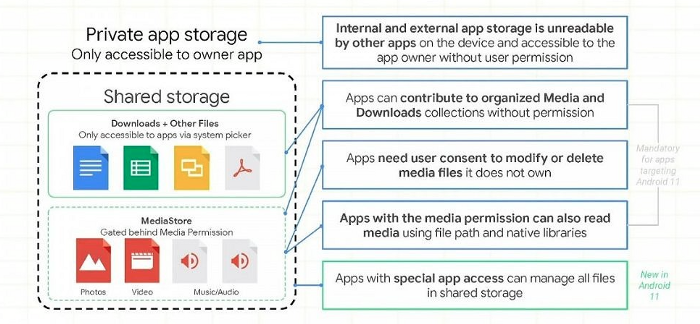
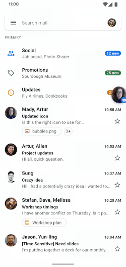

## 안드로이드11 으로 빠른 마이그레이션을 위한 개발자 가이드 

> 이 문서는 Sahil Sharma의 [The Quick Developers Guide to Migrate Their Apps to Android 11](https://proandroiddev.com/the-quick-developers-guide-to-migrate-their-apps-to-android-11-e4ca2b011176)을 번역 하였다. 

Android11은 이미 릴리즈 되었으며 곧 대부분의 주요 (안드로이드 스마트폰)제조업체에서 출시될 예정이다. Android11은 향상된 5G지원, 기본 스크린 녹화기능, 알림의 우선 순위등 과 같은 기능과 범위가 정의된 저장소 및 패키지 가시성과 같은 다양한 개인 정보 개선 기능이 추가 되었다. 

대부분의 앱은 이미 Android11을 사용할 준비가 되어 있지만 아직 이 변경사항들을 인식하지 못한 일부 사용자에게는 시간이 촉박하며, 이 문서는 그들을 위한 것 이다. 

이 글에서는 먼저 중요한 내용부터 빠르게 시작하고 나중에 기존 API및 기능의 유용한 개선 사항과 중단된 것 들에 대해 검토를 할 것 이다. 

따라서 더 이상 고민하지 말고 Android11이 우리에게 어떤것 들을 제공하는지 빠르게 검토 해보도록 하자. 

### 1. Foreground Service Type

앱에서 Android11(API레벨 30)이상을 대상으로 하고 포어그라운드 서비스 카메라 또는 마이크에 액세스 하는 경우, 카메라 또는 마이크들의 포어그라운드 서비스 유형을 각각 `<service>`구성 요소의 속성으로 선언 해야 한다. 

```xml
<manifest>    
    <service 
        android:foregroundServiceType="location|camera|microphone"/>
</manifest>
```

#### 1.1 Add foreground service types of Work Manager Workers

포어그라운드 서비스와 마찬가지로 위치, 카메라, 마이크에 액세스해야 하는 work manager worker가 있는 경우 앱의 메니페스트에서 작업자의 포어그라운드 서비스의 유형을 선언해 주어야 한다. 

```xml
<service
    android:name="androidx.work.impl.foreground.SystemForegroundService"
    android:foregroundServiceType="location|camera|microphone"
    tools:node="merge" />
```

아래처럼 서비스 이름을 적어야 한다. 

```
android:name="androidx.work.impl.foreground.SystemForegroundService"
```

더 알고 싶다면 ["Support for long-running workers](https://developer.android.com/topic/libraries/architecture/workmanager/advanced/long-running#kotlin)를 참고 하도록 하자. 

### 2. Background Location Permission

이전 버전의 Android10의 경우 앱이 백그라운드에서 사용자 위치에 접근 하려면 백그라운드 위치 권한을 요청해야 한다. 

Android11에서는 이제 포어그라운드 위치 권한에 전에 백그라운드 권한에 대한 접근 권한을 부여 할 수 없다. 

즉, 포어그라운드 및 백그라우늗 위치 권한을 함께 요청할 수 없는 것 이다. 포어그라운드 위치 권한과 백그라운드 위치 권한을 동시에 요청하면 시스템이 요청을 무시하고 앱에 권한을 부여하지 않는다. 

주목해야 할 또 다른 중요한 점은 Android11부터 시스템 대화상자에 항상 허용 옵션이 포함되지 않는다는 것 이다. 대신 사용자는 앱의 설정 페이지에서 백그라운드 위치를 활성화 해야 한다. 

### 3. Other enhancements in Permissions

#### 3.1 One-Time Permissions

사용자의 개인 정보를 염두에 두고 앱에서 위치, 마이크 또는 카메라와 관련된 권한을 요청할 때 마다 Android는 이제 사용자에게 권한을 한번만 허용하는 옵션을 제공 한다. 즉, 앱이 종료되는 즉지 모든 일회성권한은 취소 될 것 이다. 

여기서 명심해야 할 몇가지 중요한 사항은 아래와 같다. 

- 런타임 권한에만 적용 된다. 
- 사용자가 앱을 백그라운드로 보내면 앱은 잠시 동안 데이터에 계속 접근할 수 있다. 
- 액티비티가 보여지고 있는 동안, 포어그라운드 서비스를 시작한 다음 사용자가 앱을 백그라운드로 이동하면 해당 포어그라운드 서비스가 중지될 때 까지 앱이 데이터에 계속 접근할 수 있다. 그리고 포어그라운드 서비스가 실행되는 동안 사용자가 액티비티에 다시 돌아온다 하더라도 부여 된 권한은 계속 사용 가능 하다. 

일회성 권한의 경우 코드에서 아무것도 처리 할 필요가 없지만, 위치 권한 요청에 대한 제공되는 모범 사례들을 따르지 않는 경우 기존 기능에 영향을 미칠 수 있으므로 언급할 가치가 있다. 

#### 3.2 The system can Auto Revoke permissions from unused apps

앱이 Android11이상을 타게팅 하고 몇개월동안 사용하지 않는 경우 시스템은 사용자가 앱에 부여한 민감한 런타임 권한을 자동으로 재설정하여 사용자 데이터를 보호한다. 

자동으로 취소된 권한은 아래와 같이 앱의 설정 페이지에서 비활성화 할 수 있다. 

또는 `Intent.ACTION_AUTO_REVOKE_PERMISSIONS`를 사용하여 사용자를 권한 페이지로 보내 비활성화 하도록 요청할 수 있다. 그리고 `android:autoRevokePermission`속성은 더이상 사용되지 않으며 아무 작업도 수행하지 않는다. 

또한 자동 취소 권한이 허용 목록에 있는지 `public boolean PackageManager.isAutoRevokeWhiteListed()`으로 확인 할 수 있다. 


```kotlin
private fun checkForAutoRevokePermission() {
    if (android.os.Build.VERSION.SDK_INT >= android.os.Build.VERSION_CODES.R) {
        if (packageManager.isAutoRevokeWhitelisted) {
            // ...
        }
        else {
            // 사용자에게 자동으로 권한 취소될지에 대한 설정 관리 요청 페이지를 연다.
            startActivity(
                Intent(Intent.ACTION_AUTO_REVOKE_PERMISSIONS, Uri.fromParts("packages", packageName, null))
                    .apply {
                        addFlags(Intent.FLAG_ACTIVITY_NEW_TASK)
                    }
            )
        }
    }
}
```

#### 3.3 Permission Dialog Visibility

런타임시 권한 요청에 대한 반복적인 사용자로부터의 거부는 "다시 묻지 않음"을 의미 한다. 그러면 시스템은 더 이상 사용자에게 권한 대화 상자를 보여주지 않으며 사용자에게 앱 설정 페이지에서 권한을 부여하도록 요청해야 한다. 

### 4. Scoped Storage 

Scoped Storage(범위가 지정된 저장소)는 사용자가 파일을 더 잘 제어하고 파일 관리에 혼란을 제어하기 위해 Android 10에서 처음 도입 되었다. Scoped Storage는 실제로 앱에 전체 외부 저장소를 보거나 수정할 수 있는 권한을 부여하는 대신 앱이 만든 특정 유형의 미디어뿐 아니라 외부 저장소의 앱별 디렉터리에만 액세스 권한을 부여하는 것 이다. 

Scoped Storage는 아래와 같은 경우에 필요하다. 

- 사용자의 데이터를 보호할 때
- 앱이 디스크 전체에 파일을 분산시키는 것을 방지 할 때 
- 해당 앱이 제거될 때 필요없는 앱의 파일들 제거 할 때

Scoped Storage를 도입하여 저장소를 컬렉션으로 분리 하고 공유 저장소에 대한 광범위한 접근을 제한한다. 저장소는 아래와 같이 나뉘게 된다. 

- 앱의 개인 저장소 - 앱에서만 접근할 수 있는 내부 또는 외부 저장소
- 공유 저장소 - 사진, 비디오, 오디오 및 다운로드된 파일들로 분류 된다. 

  

Android 10에서 Scoped Storage는 논란이 존재 하였기 때문에 선택 사항으로 존재 했었다. 하지만 Android11에서는 필수 사항으로 변경 되었다. 

다행히도 Android11에서는 `MediaStore` API와 별도로 아래와 같이 사용할 수 있다. 

- 일반 Java의 `File` API(내부적으로는 `MediaStore`API에 위배됨)
- 네이티브 라이브러리들. 예를 들면 `fopen()`.

미디어파일의 수정은 이전과 동일하지 않으므로 이에 대한 사용자 동의가 필요 하다. `createWriteRequest()`및 `createDeleteRequest()`를 사용하여 각각 미디어 파일을 작성하고 삭제 할 수 있다. 두 방법 모두 단일 요청으로서 동시에 여라 파일(대량 작업)수정을 지원한다. 

또한 두가지 새로운 Media store 개념이 도입 되었다. 

- 휴지통 - Windows OS의 휴지통 개념과 유사하며, 미디어 파일을 복원하지 않으면 잠시 후 영구적으로 삭제 된다. `createTrashRequest()`를 사용하여 수행할 수 있다. 
- 즐겨찾기 - 미디어 파일은 사용자가 즐겨 찾기로 지정할 수 있다. `createFavoriteRequest()`을 사용하여 수행할 수 있다. 

앱에서 여전히 앱 외부에 저장된 파일이 있고 앱이 API레벨 29를 대상으로 하는 경우, `requestLagecyExternalStorage`속성을 사용하고 파일을 앱 디렉터리로 마이그레이션 하면 된다. 

Android11에서 실행되지만 Android10(API 레벨 29)을 대상으로 하는 앱은 여전히 `requestLegacyExternalStorage`속성을 요청할 수 있다. 

### 5. Package Visibility

이전에는 앱이 `queryIntentActivities()`와 같은 메서드를 사용하여 시스템에 설치된 앱의 전체 목록을 쿼리할 수 있었다. 이는 대부분 실제로 필요한 것을 훨씬 더 광범위하게 접근 할 수 있었다. 

Android11에서는 더이상 그렇지 않다. `<queries>`요소를 사용하여 앱은 접근 할 수 있는 다른 패키지 세트를 정의할 수 있다. 이 요소는 앱에 표시할 다른 패키지를 시스템에 알려 최소 권환 원칙을 장려하는데 도움이 된다. 

앱이 Android11이상을 대상으로 하는 경우 앱의 메니페스트 파일에 `<queries>`요소를 추가한다. `<queries>`요소 내에서 name, Intent signature 또는 provider의 권한별로 패키지를 지정할 수 있다. 

```xml
<manifest package="com.example.myapp">
    <queries>
        <!-- 상호 작용하는 앱의 예제 -->
        <package android:name="com.example.store" />
        <package android:name="com.example.maps" />

        <!-- 쿼리할 특정 Intent. 예를 들어 사용자 정의된 공유 UI에서 사용 -->
        <intent>
            <action android:name="android.intent.action.SEND" />
            <data android:mimeType="image/png" />
        </intent>
    </queries>
</manifest>
```

#### 5.1 Example

이메일을 보내려는 경우 Intent를 생성하고 시스템이 요청을 처리 할 적절한 앱을 찾도록 해야 한다. 

```kotlin
val intent = Intent().apply {
    action = Intent.ACTION_SENDTO
    data = (Uri.prase("mailto:recipient@example.com"))
    putextra(Intent.EXTRA_EMAIL, "Hi! how are you?")
    putExtra(Intent.EXTRA_SUBJECT, "testing package visibility")
}
startActivity(intent)
```

위 코드는 이메일 앱이 기기에 설치되어 있으면 API30에서도 잘 작동한다. 하지만 이 요청을 처리할 수 있는 앱이 없다면 어떻게 될까? 이 경우 `ActivityNotFoundException`예외가 발생 한다.

안전한 옵션은 이 요청을 처리할 수 있는 앱이 하나 이상 있는지 먼저 확인 하는 것 이다. 따라서 아래와 같이 확인할 수 있다. 

```kotlin
if (intent.resolveActivity(packageManager) == null) {
    toast("No app found to handle this request")
} else {
    startActivity(intent)
}
```

이제 앱이 설치된 다른 앱을 쿼리할 수 없기 떄문에 여기에서 코드가 실패 한다. 여기에서 코드가 정상적으로 잘 작동하려면 앱의 메니페스트 파일에 `<queries>`를 추가하고 Intent를 선언해야 한다. 

```xml
<?xml version="1.0" encoding="utf-8"?>
<manifest xmlns:android="http://schemas.android.com/apk/res/android"
    package="com.example.android11study">

    <uses-permission android:name="android.permission.ACCESS_FINE_LOCATION" />
    <uses-permission android:name="android.permission.ACCESS_COARSE_LOCATION" />
    <uses-permission android:name="android.permission.ACCESS_BACKGROUND_LOCATION" />
    <uses-permission android:name="android.permission.ACTIVITY_RECOGNITION" />

    <!-- 앱에서 쿼리할 모든 Intent를 정의 -->
    <queries>
        <intent>
            <action android:name="android.intent.action.SENDTO" />
            <data android:scheme="mailto" />
        </intent>
    </queries>

    <application
        android:allowBackup="true"
        android:icon="@mipmap/ic_launcher"
        android:label="@string/app_name"
        android:roundIcon="@mipmap/ic_launcher_round"
        android:supportsRtl="true"
        android:theme="@style/Theme.Android11Study">
        
        <activity android:name=".MainActivity">
            <intent-filter>
                <action android:name="android.intent.action.MAIN" />
                <category android:name="android.intent.category.LAUNCHER" />
            </intent-filter>
        </activity>
    </application>
</manifest>
```

#### 5.2 Custom tabs

사용자 지정 탭을 사용하여 웹Url을 열 때 해당 url을 처리할 수 있는 브라우저가 아닌 앱이 있을 수도 있다. 브라우저가 아닌 앱이 해당 url을 먼저 처리하도록 허용하는게 좋다. 

`FLAG_ACTIVITY_REQUIRE_NON_BROWSER`는 여기에서 브라우저가 아니 앱만 쿼리하는데 사용할 수 있다. 자세한 내용은 Android문서에서 ["Configuring package visibility based on use cases"](https://developer.android.com/training/basics/intents/package-visibility-use-cases)를 참고 하자. 

```kotlin
try {
    val url = "htts://..."
    val intent = Intent(ACTION_VIEW, Uri.parse(url)).apply {
        addCategory(CATEGORY_BROWSABLE)
        flags = FLAG_ACTIVITY_NEW_TASK or FLAG_ACTIVITY_REQUIRE_NON_BROWSER
    }
    startActivity(intent)

} catch (e: ActivityNotFoundException) {
    openInCustomTabs(url)
}
```

#### 5.3 Important point

시스템은 일부 앱을 자동으로 보여주지만, 기본적으로는 다른 앱을 숨긴다. 일반적으로 앱의 서비스를 시작하거나 바인딩 하는 모든 앱, 앱의 content provider에 접근, 앱이 접근하는 content provider등과 같은 방식으로 연결된 앱 이다. 

> 다른 앱이 앱에 표시되는지 여부에 관계없이 암시적 또는 명시적인 인텐트를 사용하여 다른 앱의 Acitivty를 시작할 수 있다. 

#### 5.4 What do i do if my App is an App Launcher or similar, where I need to know all the apps that are installed on the device?

앱이 설치된 다른 모든 앱을 볼 수 있도록 시스템은 `QUERY_ALL_PACKAGES`권한을 제공 한다. 

```xml
<uses-permission android:name"android:permission.QUERY_ALL_PACKAGES" /> 
```

이 권한은 Launcher 앱, 보안 앱, 기기 관리 앱, 접근성 앱 등과 같이 이 권한이 실제로 필요한 앱에 적합하다. 

예정된 정책 업데이트에서 `QUERY_ALL_PACKAGES`권한이 필요한 앱에 대한 가이드 라인을 확인하도록 하자. 

### 6. Good-to-Have Enhancements

#### 6.1 Notifications

알림은 이제 우선 순위 대화 및 기본 채팅 버블을 지원하고 알림 패널에서 바로 이미지를 보내준다. 

  

대화 알림은 대화를 전달하는 앱과 결합된 사람을 나타내는 아바타의 비대화 알림과 다른 스타일로 지정 된다. 이러한 알림은 대화를 우선 순위로 표시하거나, 이 대화를 풍선으로 흥보하거나, 사용자 지정 소리 또는 진동을 설정하거나, 단순히 알림을 무음으로 설정하는 등의 작업을 가져온다. 

#### 6.1 Synchronized IME transitions

새로운 API를 사용하면 앱의 UI를 IME(입력 방식 편집기 또는 화면의 키보드) 및 시스템 표시줄과 동기화 하여 화면 안팎에서 애니메이션을 적용하여 더 자연스럽고 직관적이며 버벅거리지 않는 IME전환을 지원한다. 

새로운 `WindowInsetsAnimation.Callback`API는 시스템 표시줄 또는 IME가 애니메이션 되는 동안 프레임별 변경 사항을 앱에 콜백 해 준다. 

또한 "IME 키보드가 보이는지 확인 할 수 있는 방법"이라는 질문에 대해 마침내 답할 수 있게 되었다. 해당 내용에 대해서는 Chris bane의 [이 글](https://medium.com/androiddevelopers/animating-your-keyboard-fb776a8fb66d)을 참고 하자. 

### 7. Deprecations

#### 7.1 `AsyncTask` is deprecated

API레벨 30부터 `AsyncTask`는 더이상 사용되지 않는다. 이는 코드에서 계속 사용할 수 있기는 하지만 더이상 권장되는 접근 방식이 아니며 곧 `java.util.concurrent`또는 Kotlin 동시성 유틸리티(Kotlin coroutines)로 마이그레이션해야 함을 의미 한다. 

이제 안드로이드가 Kotlin우선이며 이러한 작업에 Kotlin Coroutines를 사용하는것이 좋다. 

#### 7.2 The Non-Looper constructor of Handler is deprecated

`Handler()`및 `Handler(Handler.Callback)`은 `Looper`를 지정하지 않기 때문에 더 이상 사용되지 않는다. 예를 덜아 활성된 Looper가 없는 스레드에서 Handler를 잘못 지정하면 앱이 크래시가 발생한다. 

Android는 `Handler(Looper)`및 `Handler(Looper, Handler.Callback)` 생성자를 사용하며 Looper를 명시적으로 Handler의 생성자에 전달할 것 을 권장한다. 

```kotlin
val handler: Handler = Handler(Looper.getMainLooper())
```

#### 7.3 Custom Toast Views are deprecated

`Toast.setView()`및 `Toast.getView()`메소드는 더 이상 사용되지 않는다. 앱은 포어그라운드에 있을 때 표준 텍스트 토스트를 만들거나 스낵바를 사용할 수 있다. 

또한 UI를 일관되게 만들기 위해 API레벨 30부터 앱이 백그라운드에 있는 동안에는 사용자 지정 토스트 메시지가 표시되지 않는다. 

여기에서 또 다른 중요한 점은 `Toast.setMargin`및 `Toast.setGravity`등 이 더이상 사용되지 않지만 이러한 메소드는 텍스트 알림에서 호출 될 떄 작동하지 않는 다는 것 이다. 그러나 간단한 토스트는 문제없이 잘 작동할 것 이다. 