## Sonarqube 적용기 (1/2)

소나큐브(Sonarqube)는 코드 퀄리티를 관리 하기 위한 정적 분석 도구이다. 소나큐브를 이용 하면 작성한 코드를 대상으로 분석하여 버그, 취약점, 테스트 코드 커버리지, 코드 표준등을 수치화 하여 대시보드를 통해 보고서 형태로 제공 한다. 

이 문서에서는 안드로이드 프로젝트를 대상으로 Docker를 사용하여 설정된 소나큐브로 분석 결과를 얻어 보려고 한다. 

### 1. Docker 

#### 1.1 Docker 설치

[Docker](https://www.docker.com/)는 리눅스베이스의 프로그램(데몬 서비스 포함)들을 소프트웨어 컨테이너 안 에 배치하는 일들을 자동화 하여 클라우드를 통해 제공 하는 오픈소스 프로젝트 이다. Docker를 이용 하면 접근 하는 OS에 상관없이 어디에서도 간단하게 리눅스의 프로그램들을 사용 할 수 있다. 그리고 Docker의 컨테이너 에 설치된 서비스 이며 접근 OS에는 영향을 끼치지 않아 다루기 간단한 이점이 있다.

소나큐브를 사용하기 위해 직접 zip 바이너리를 받아 실행하여도 문제는 없지만, 이번 에는 Docker를 이용해 소나큐브 서비스를 로컬 개인 데스크탑에서 구동 시켜보려고 한다. (개발 환경에 따라 개발서버, 실서버 등 다른 상황이 있을 수 있다)

[Docker get started](https://www.docker.com/get-started)페이지에서 운영체제에 따라 Docker를 받아 설치 한다. 글 작성자의 시점에서는 윈도우10 환경에서 WSL2를 이요해서 Docker 환경을 구축할 예정이다. 


설치 하고 재부팅을 한다. 윈도우10인 경우 아래 처럼 WSL2관련하여 업데이트 패키지를 설치해달라고 창이 뜰 때가 있다. 이 경우 팝업에 보이는 파란색 링크 를 따라 리눅스 커널 업데이트 패키지를 설치 한 뒤 `restart`버튼을 누르면 Docker는 재시작 된다. 

- [x64 머신용 최신 WSL2 Linux 커널 업데이트 패키지](https://wslstorestorage.blob.core.windows.net/wslblob/wsl_update_x64.msi)

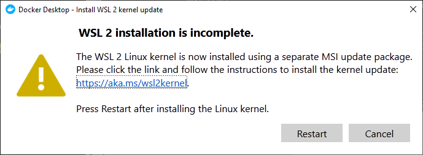

Docker가 정상적으로 설치 되었다면 아래와 같은 화면이 보이게 될 것이다. 

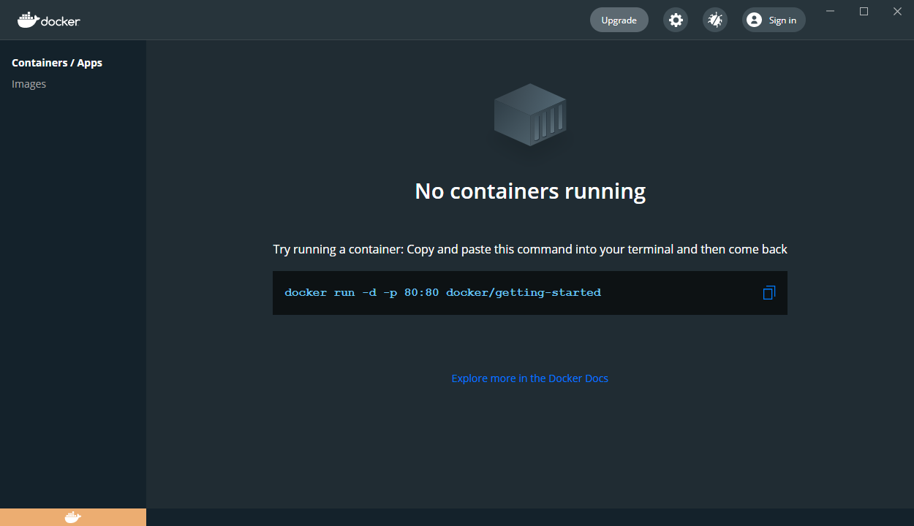

최초 설치의 경우 튜토리얼 화면이 보이게 되는데 이미 잘 알고 있다면 `Skip tutorial`을 눌러 넘어가도 된다. 

#### 1.2 Docker sonarqube 컨테이너 설치 및 실행

cmd, 터미널등을 통해서 `docker pull sonarqube`을 실행 하여 docker에 소나큐브 컨테이너를 올리도록 한다. 

```
C:\Users\username>docker pull sonarqube
Using default tag: latest
latest: Pulling from library/sonarqube
0a6724ff3fcd: Pull complete
eb833291b55c: Pull complete
2a91bfbe66cb: Pull complete
db9c21026d71: Pull complete
ddac7b0d6339: Pull complete
Digest: sha256:6716837a86ab991205a7579b1630fb087c64624835c7f78aa233b6e1bf305082
Status: Downloaded newer image for sonarqube:latest
docker.io/library/sonarqube:latest

C:\Users\username>
```

컨테이너가 정상적으로 잘 올라갔다면 아래 이미지 처럼 `sonarqube`항목이 보일것 이다. 

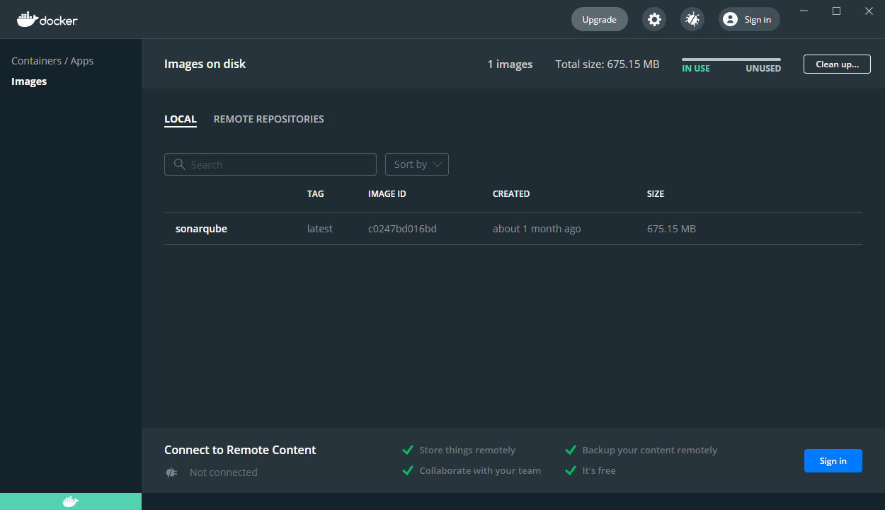

소나큐브 서버를 구동하기 위해서는 cmd, 터미널에서 아래의 커맨드를 입력 하면 된다. 

```
$ docker run -d --name sonarqube -e SONAR_ES_BOOTSTRAP_CHECKS_DISABLE=true -p 9000:9000 sonarqube:latest
```

정상적으로 구동 되었다면 Docker의 `Containers/App`메뉴 에서 항목을 보면 `soanrqube`가 RUNNING상태로 포트 9000이 열린 상태로 실행중임을 알 수 있다. 그리고 Running 상태인 컨테이너를 클릭 해 보면 로그 메시지와 기타 설정 버튼들을 확인 할 수 있다. 

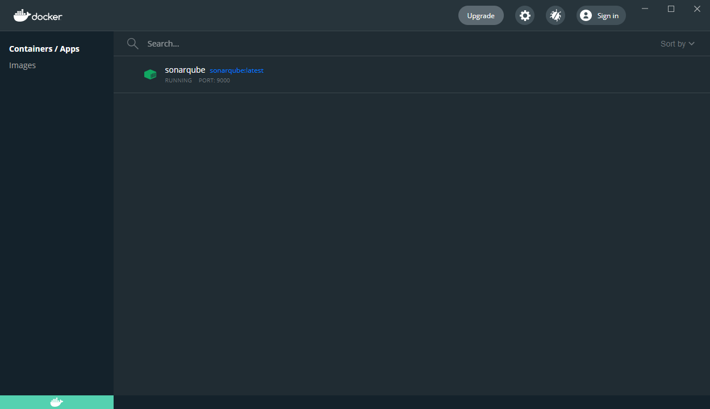

이제 브라우저를 통해 `localhost:9000`으로 접속 하도록 하자. localhost:9000으로 접속시 로그인 화면이 보여질것 이며, 최초 id와 패스워드는 `admin / admin`이다. 로그인 성공 하면 패스워드를 변경 하라고 나오고 변경 한뒤 문제 없으면 아래와 같은 최초 화면이 보여지게 될 것 이다. 

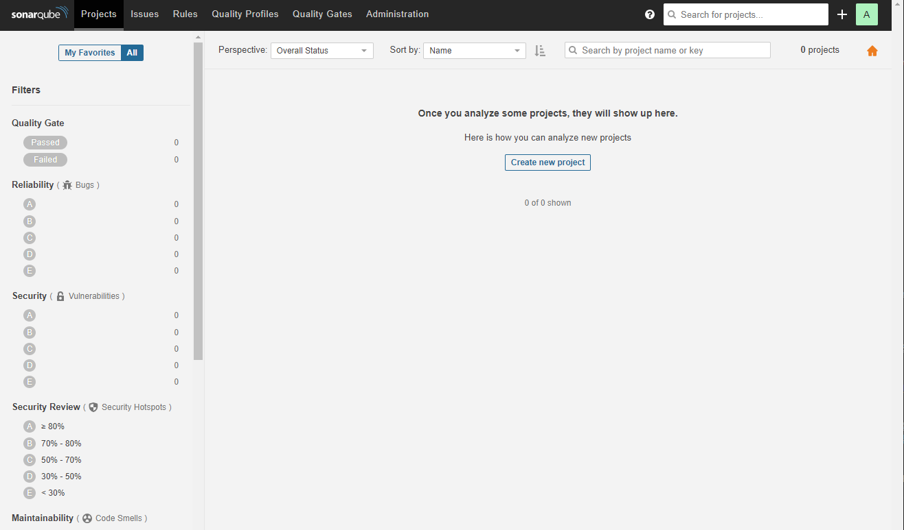

### 2. Sonarqube 

소나큐브의 설치가 모두 끝났다면 이제 소나큐브에서 분석할 프로젝트를 만들고 키(토큰)를 발급 받아야 한다. `Create new project`버튼을 선택 하여 새로운 프로젝트를 생성한다. 

1. 생성할 프로젝트의 키를 발급받기 위해서는 아래 2개의 필수 항목을 작성해야 한다. 
    - Project key : 프로젝트를 구분할 수 있는 유일한 문자열(최대 400자)으로 이루어진 프로젝트의 구분자 이다. 
    - Display name : 프로젝트의 이름 이다. 

2. Provide a token : 키(토큰)의 이름을 작성 하고 `generate`버튼을 눌러 키를 발급 받는다. 
    - 발급된 키는 안드로이드 앱에서 소나큐브와 통신할 때 사용 되는 토큰이 된다. 
    - 토큰을 사용하지 않을 경우 id/password를 통해 task를 구동 할 수 있다. 하지만 보안상 추천하지는 않는다.

3. 이제 안드로이드 스튜디오에서 소나큐브 task를 실행 한다.

소나큐브에서는 생성한 프로젝트로 외부에서 통신을 요청할 때 까지 프로젝트를 완전히 생성하지는 않는다. 

그렇기 때문에 `Run analysis on your project`항목을 보면 Maven, gradle, .NET등 응용 프로그램의 빌드 방식에 따라 소나큐브를 사용할 방법에 대해서 알려준다. 

이 예제에서는 안드로이드 프로젝트에서 소나큐브 task를 사용할 것 이기 떄문에 `Gradle`항목을 선택 하면 된다. 

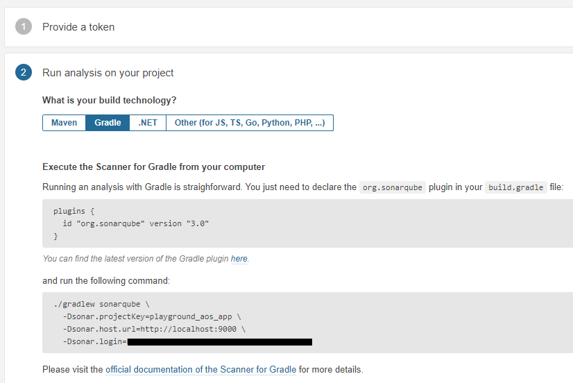

#### 2.1 안드로이드 프로젝트에 소나큐브 task 설정

프로젝트의 root `build.gradle`파일에 아래와 같이 추가 한다. 

```gradle
buildscript {
    ...
    ext.sonarqube = '3.1'
    ...

    dependencies {
        ...
        classpath "org.sonarsource.scanner.gradle:sonarqube-gradle-plugin:$sonarqube"
    }
}

...

apply plugin: "org.sonarqube"
sonarqube {
	properties {
		property "sonar.host.url", "http://localhost:9000/"
		property "sonar.login", "발급받은 키(토큰)을 여기에 작성 한다"
		property "sonar.password", ""	// 인증 토큰 을 사용 하므로 공백처리 한다
		property "sonar.projectKey", "PlayGround"
		property "sonar.projectName", "PlayGround"
		property "sonar.projectVersion", "1.0"
        // 소나큐브의 분석에 포함되지 않을 파일을 `exclusions`에 추가할 수 있다. 
		property "sonar.exclusions", "**/*Test*/**," +  
				"*.json," +
				"**/*test/**," +
				"**/.gradle/**," +
				"**/R.class"
	}
}

subprojects {   // 다른 모듈들에 대한 공통 작업을 정의 한다.
	sonarqube {
		properties {
            // 코틀린의 소스셋의 디렉토리를 따로 가져갔을 경우 해당 디렉토리와 같게 해주어야 한다. 
			property "sonar.sources", "src/main/java"
			property "sonar.sourceEncoding", "UTF-8"
		}
	}
}

// 아래는 Optional 

// 해당 모듈에 직접 작성해도 된다. 
project(":another_module") {
    sonarqube {
        skipProject = true  // 이 모듈은 skip 하겠다는 플래그 설정. 
    }
}

// task가 다른 task에 의존해야 하는 경우 아래처럼 작성 한다.
tasks.sonarqube.dependsOn ":anotherTask"
```

#### 2.2 소나큐브 task 실행 

gradle설정이 끝났다면 아래 스크린샷의 gradle버튼을 찾고 클릭 한다. 

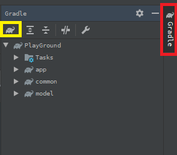

위 이미지에서 노란색 버튼의 gradle 버튼을 누르고 아래 처럼 task를 입력하여 실행 한다. 

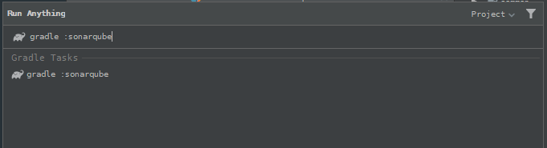

#### 2.2 소나큐브 분석 화면 

소나큐브 task를 문제없이 구동시키고 완료 했다면 아래처럼 소나큐브 대시보드에 분석 결과를 보여주게 된다. 

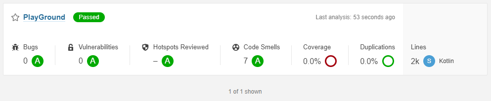

분석한 프로젝트의 버그, 취약점, 보안 이슈, 코드 부채, 테스트 커버리지, 중복 코드 등을 알려준다. 분석된 항목을 선택해서 보면 더 자세한 분석을 확인 할 수 있다. 

분석한 버그나 취약점, 코드스멜등은 자체적인 코드 룰에 의해 분석 된다. 아래 스크린샷을 보면 알 수 있듯이 어떠한 룰에 의해 해당 코드가 문제가 있는지 분류 되어 있으며 더 자세히 문제 수준으로도 필터링 되어 있음을 확인 할 수 있다. 

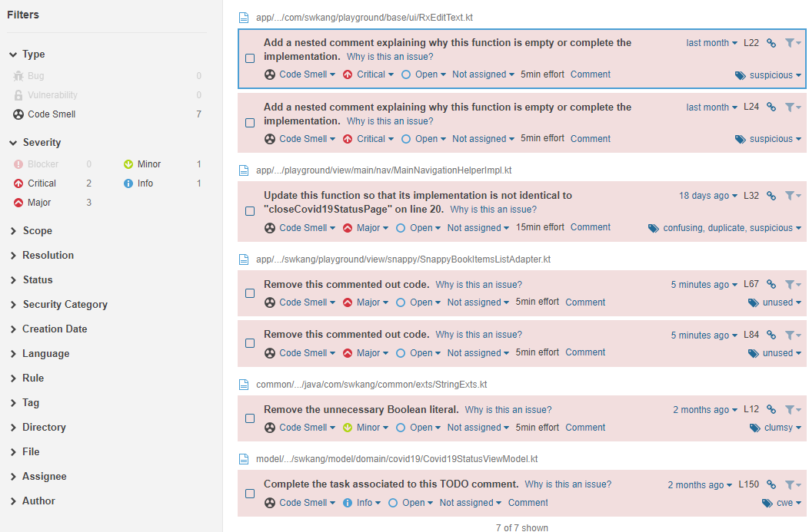

개발자는 이렇게 분석된 내용을 바탕으로 앞으로 어떻게 리팩토링을 해야 할지 등을 고민해 볼 수 자료들을 얻을 수 있다. 

상단 항목에 대해서는 아래와 같다. 

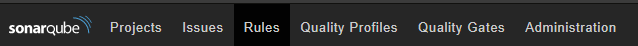

- Projects : 분석된 프로젝트들의 목록을 본다. 같은 외부 응용 프로개름이나 어플리케이션임에도 name으로 구분되어 다르게 관리 될 수 있다. 
- Issues : 분석된 내용들 중 버그, 코드스멜, 취약점 등 주요 이슈들을 확인 한다. 이슈들에 대해서 필터링 할 수 있으며 분석된 취약점들에 대해 분류를 다시 할 수도 있다.
- Rules : 코딩 언어에 따른 룰들을 확인 할 수 있다. 이 룰에 대해서 분류를 하거나 제거, 혹은 추가 할 수 있다. 
- Quality Profiles : 코딩 언어에 따라 분석할 규칙들이다. 이 규칙들은 수정 및 새로 만들거나 제거할 수 있다. 
- Quality Gates : 분석된 정보에 따라 이 코드가 문제 없는지 전체적으로 판단 하여 다음 단계(예를 들어 리얼, 개발 환경이나 CI에 앱을 배포 하는 등)로 넘어가는지 판단 한다. 이 판단 기준에는 코드 커버리지, 중복되는 코드등의 수치적 데이터를 기반으로 판단 한다. (이는 수정 할 수 있다)
- Administration : 소나큐브 서비스에 대한 설정 이다. 

> 코드 커버리지를 전달 하기 위해 jacoco를 설정 하는 방법은 [이 글](https://github.com/ksu3101/TIL/blob/master/Android/210119_android.md)을 참고 하면 된다. 