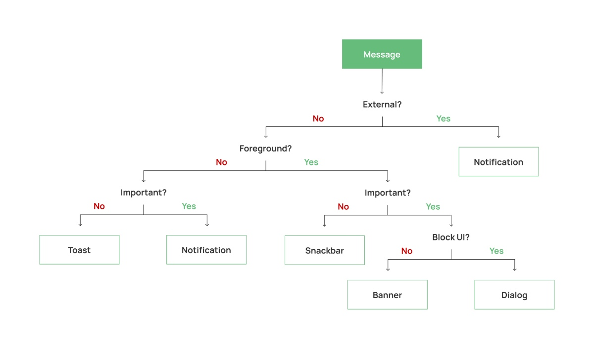
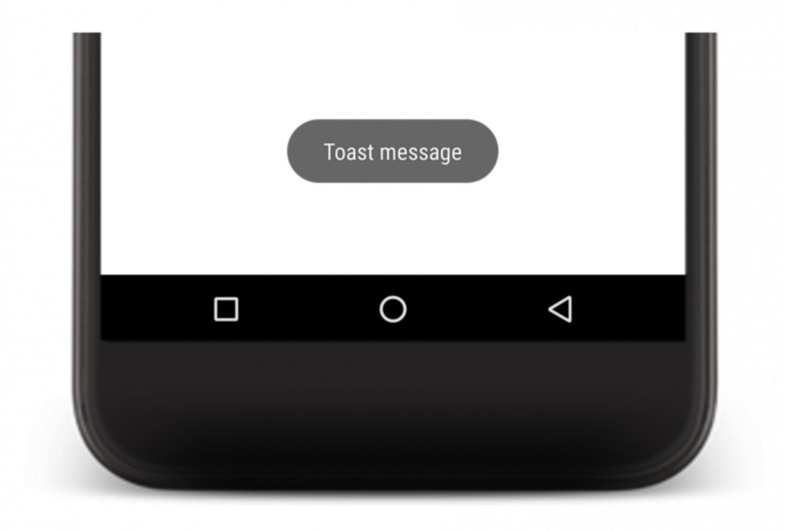
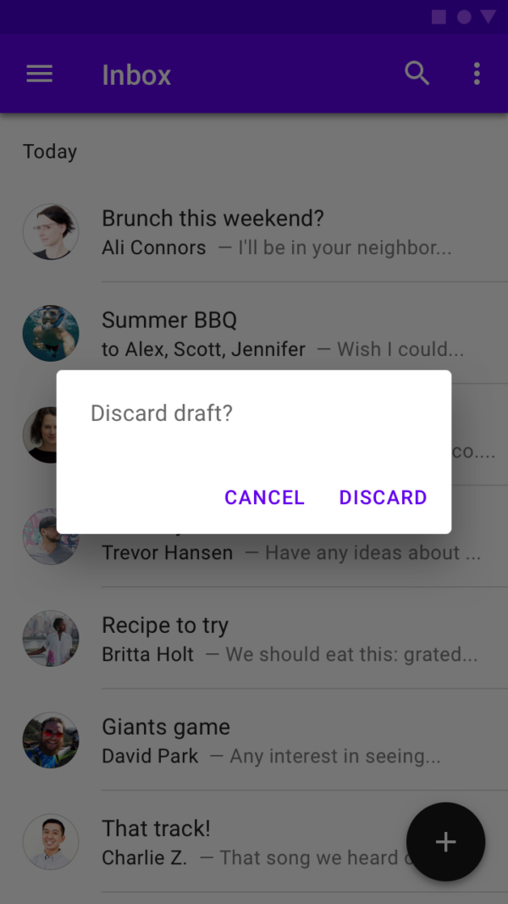
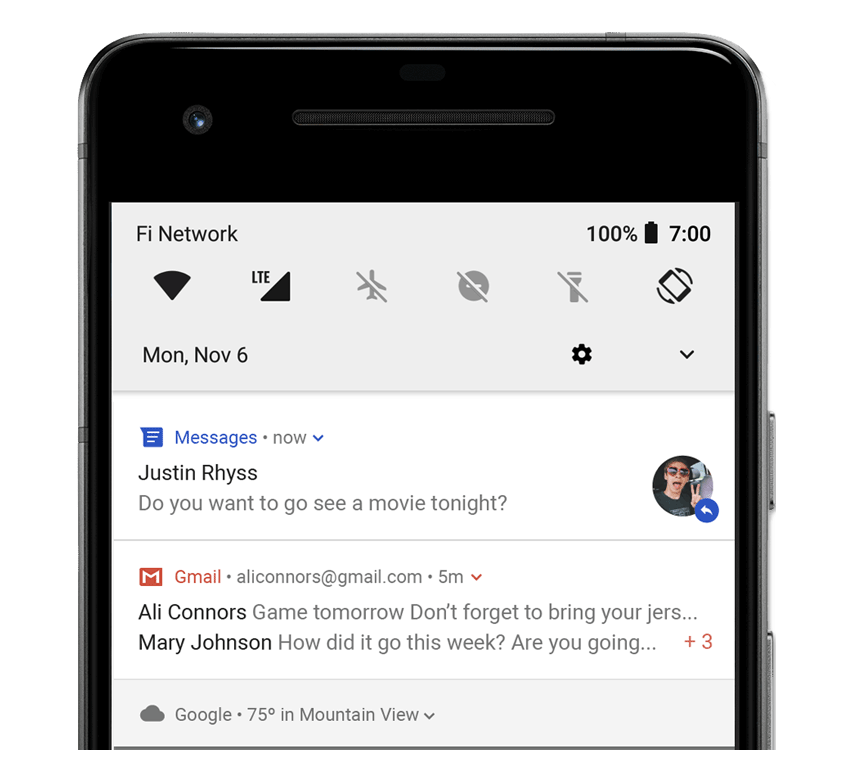

## Choose Wisely: 5 Ways To Show A Message In Android

> 이 글은 Vlad Sonkin의 [Choose Wisely: 5 Ways To Show A Message In Android](https://vladsonkin.com/choose-wisely-5-ways-to-show-a-message-in-android/)을 번역 하였다. 

앱에서 사용자와의 상호 작용중 메시지는 매우 중요한 역할을 한다. 메시지는 서로 다른 수많은 메시지들이 있을 수 있다. 인터넷 연결이 끊어지거나, 사용자가 이메일을 삭제하거나 주문을 취소 하고, 사진을 업로드 하려면 로그인, 알람 등 이 필요하게 되며 이러한 메시지 목록은 무한대로 계속 될 수 있다. Android에서 메시지를 표시하는 방법은 5가지나 있지만 여기에서 문제는 어떤 경우에 어떤 메시지 도구를 사용해서 메시지를 보여줘야 하는 것 이다. 

Android메시지란 앱 에서 사용자에게 보여주려 하는 모든 메시지들을 말한다. 분명히 우리는 많은 예제를 갖고 있으며, 앞으로 나아가기 전에 그 메시지를 보여주는 방식들을 분류 해야 한다. 

### External and Internal messages 

가장 먼저 할 수 있는 일은 메시지의 출처별로 분리 하는 것 이다. 예를 들어 일부 API호출을 수행 하는 동안 연결 오류와 같은 내부 메시지가 앱에서 제공 될 것 이다. 예를 들어 영어 학습 알림과 같은 일부 메시지는 서버에서 전송 된다. 

### Foreground and Background messages 

Background에서 보여지는 메시지란 존재 하지 않는다. 모든 메시지는 항상 UI스레드에서 보여주게 되기 때문이다. 앱이 백그라운드에 있는 동안 해당 메시지를 보낼수는 있다.(예를 들면 `WorkManager`를 이용해서) Foreground상태는 앱이 표시 될 때 메시지가 발생할 수 있다. 

### Message Priorty

메시지의 우선 순위도 생각해볼수 있다. 우선 순위가 높은 메시지는 영구적이고 UI에 필수적으로 표시 되어야 하며, 낮은 우선순위의 메시지는 작고 자동으로 사라질 수 있다. 

일부 메시지는 너무 중요하기 때문에 앱의 사용자 흐름을 차단할 수 도 있다. 예를 들어 사용자가 주문을 취소 하려 할 때 "주문을 취소 하시겠습니까?" 라는 차단 메시지를 표시할 수 있다. 사용자는 이 메시지를 확인 혹은 취소 하기 전 까지는 다음 행동을 진행할 수 없다. 

이제 흥미로운 부분들을 위하여 이러한 메시지 매개 변수들을 사용 가능한 안드로이드의 도구와 겴합해 보도록 하자. 



메시지를 표시하고 싶을 때 몇가지 질문을 해보면 이에 가장 적합한 도구들을 찾게 될 수 있을 것 이다. 이제 더 자세히 보도록 하자. 

### Toast

Android의 Toast는 UI에 간단한 메시지를 표시하는 가장 오래된 방법중 하나 이다. 이는 사용자에게 보여주는 짧은 메시지이기도 하다. 



Toast메시지는 UI상단에 표시되며 어떠한 View에도 관련되어 있지 않다. 이로 인하여 앱이 백그라운드에서 동작중임에도 토스트 메시지를 표시할 수 있다. API도 간단한 한줄로 아래 예제처럼 사용 할 수 있다. 

```kotlin
Toast.makeText(applicationContext, "Hello", Toast.LENGTH_LONG).show()
```

Toast메시지는 앱에서 사용자를 방해하지 않고 자동으로 사라진다. 사용자 정의 View도 적용 가능 하지만 Android11이후에는 Foreground에 보여지는 Toast에 한해서 적용 할 수 있다. 

앱이 백그라운드에 있거나 앱이 닫힐 가능성이 있을 때 표시해야 하는 우선 순위가 낮은 메시지에 Toast를 사용 하면 된다. 그 좋은 예제로는 알람 앱을 들 수 있다. 예를 들면, 사용자가 알람을 설정하고 나면 "알람이 설정 되었습니다"라는 알림이 일정 시간 표시된다. 이 알림은 앱의 종료 여부와는 상관없이 보여진다.

앱이 Foreground에 있는 동안 표시하는 우선 순위가 낮은 메시지에는 Toast를 사용하지 않는것을 권장 한다. 이 경우 권장되는 요소는 Snackbar이다. 

### Snackbar

Snackbar는 앱의 하단에 간략한 메시지를 보여주는 안드로이드 구성 요소 이다. 


Snackbar는 어떤 뷰들과 연결 되어 있을 수 있다. 따라서 앱이 Foreground에 있을 때에만 보여질 수 있다. 아래처럼 간단한 한줄로 Snackbar를 사용할 수 있다. 

```kotlin
Snackbar.make(contextView, "Hello", Snackbar.LENGTH_LONG).show()
```

Snackbar는 Toast와 비슷해보이지만 Context인스턴스 대신 View를 전달하는것이 다르다. 이 뷰는 Snackbar를 표시하려는 화면 레이아웃 계층에 포함되어 있어야 하며 일반적으로는 Snackbar를 실행 한 요소의 View인스턴스를 사용하곤 한다. 예를 들어, 작업을 수행하기 위해 버튼을 눌렀을 때 오류가 발생 하면 이 Button View를 Snackbar의 contextView로 전달 할 수 있다. 

Snackbar는 사용자 정의 View를 적용하여 유연하게 사용할 수 있다. 그 외 에도 Button에 대한 액션을 지원 한다. 이는 때때로 편리하게 느껴질 수 있다. 예를 들어 메일 앱이 있고 사용자가 일부 메일을 삭제 한 경우 "실행 취소"작업 버튼과 함께 Snackbar로 "메일 삭제됨"메시지를 같이 보여줄 수 있는 것 이다. 

```kotlin
Snackbar.makeText(contextView, "메일 삭제 됨", Snackbar.LENGTH_LONG)
    .setAction(R.string.action_undo) {
        // 메일 삭제 작업을 취소 버튼에 대한 이벤트 핸들링 을 여기에서 한다 
    }
    .show()
```

앱에서 우선 순위가 낮은 메시지에 Snackbar를 사용 하면 좋다. 만약 보여주려는 메시지가 조금 더 중요하다고 생각 하고 나은 가시성을 제공 하고 싶다면 Banner를 사용해보도록 하자. 

### Banner 

Banner는 Snackbar가 개선되었다고 생각 하면 편하다. Banner는 상단 툴바 바로 아래에 있는 UI상단에 위치해 있으며, 사용자에게 매우 눈에 띄는 메시지를 표시하는 View이다. 


Banner을 닫으려면 사용자의 작업이 무조건 필요하며 내부에 이 작업 버튼을 1개 또는 2개 추가할 수 있다. 이를 통해 메시지가 사용자에게 확인을 거치므로 더 잘 보일수 밖에 없다. 그러나 Banner는 UI의 일부이며 사용자가 무시할 수 있도록 앱의 흐름을 차단하지 않는다. 

안좋은 소식은 Banner에 대한 공식적인 지원이 이제 앞으로 없을 것 이며, 외부 라이브러리를 사용하거나 모션 레이아웃으로 직접 구현해줘야 한다는 것 이다. 

요약하자면 Snackbar보다 더 많은 가시성이 필요하며 여러개의 작업 버튼이 필요한 경우 Banner를 사용하면 된다. 메시지에 더 많은 공간이 필요한 경우 사용자 지정 UI를 사용하면 된다. 

### Dialog 

어떤 메시지는 너무 중요하여 사용자가 이 메시지에 대한 작업을 수행할 때 까지 전체 사용자 흐름을 차단할 수 있다. 



Dialog는 UI위에 나타나는 모달 윈도우이며 사용자가 조치를 취해야만 종료 된다. Dialog는 일반적으로 제목, 메시지 및 2개의 작업 버튼으로 구성 된다. 

```kotlin
AlertDialog.Builder(this)
    .setTitle("Title")
    .setMessage("message")
    .setPositiveButton("Yes") { dialog, button ->
    }
    .setNegativeButton("No") { dialog, button ->
    }
    .show()
```

사용자의 확인 및 조치가 필요한 중요한 상황에만 신중하게 Dialog를 사용하도록 하자. 

### Notification 

다음으로 중요한 것 은 Android Notification이다. 노티피케이션에 대해 간단히 말하자면 앱 UI외부의 메시지 이다. 



일반적으로 앱이 백그라운드에 있거나 일부 외부 이벤트가 발생했을때 이에 대한 노티피케이션을 생성 한다. 예를 들어 새 메일이 도착했을 때 항상 알림을 받는 경우가 있을 것 이다. 

Notification은 광범위한 주제이며 여기에서는 알림을 수동으로(WorkManager등을 이용해서) 만들거나 Firebase에서 외부적으로 노티피케이션을 실행 하는 방법들이 있다. 
