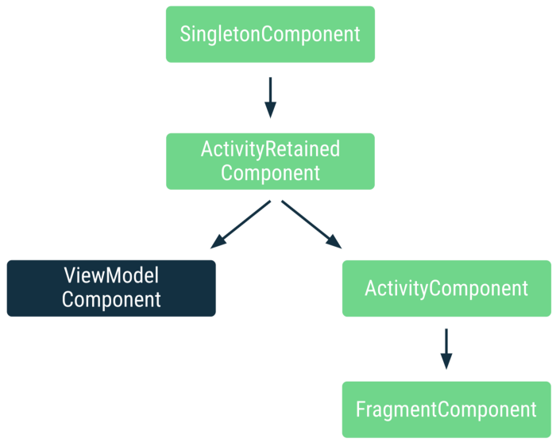

## Using Hilt’s ViewModelComponent

> 이 글은 Manuel Vivo의 [Using Hilt’s ViewModelComponent](https://medium.com/androiddevelopers/using-hilts-viewmodelcomponent-53b46515c4f4)을 번역 하였다. 

`VieModelComponent`는 ViewModel의 수명주기 스코프(scope)를 지정할 수 있는 [Hilt의 계층구조 컴포넌트](https://developer.android.com/training/dependency-injection/hilt-android#component-hierarchy)이다.

`ViewModelComponent`가 Hilt에 추가 되기 전에, ViewModel클래스는 `ActivityRetainedComponent`에 의해 주입되고 있었다. 따라서 ViewModels의 주입 객체들은 모든 ViewModel에서 인스턴스를 공유하게 되는 `SingletonComponent`나 `ActivityRetainedComponent`로 스코프가 지정된 타입 또는 스코프가 지정되지 않은 유형에만 사용할 수 있었다. 

`ActivityRetainedComponent`로 스코프를 지정하면 각 ViewModel클래스가 해당 유형(Retained Activity)마다 다른 인스턴스를 받게 되므로 앱의 각 화면들이 Activity인 경우 에는 위 내용에 대해서 문제가 되지 않는다. 그러나, 대부분의 앱 에서 화면당 Activity가 있는 것은 아니다. 

또한, `SavedStateHandle`은 `ActivityRetainedComponent`에서 바인딩 하여 사용 할 수 없다. 

이제 `ViewModelComponent`을 사용 하면 ViewModel의 수명주기에 맞춰 ViewModel이 생성 되고 주입된다. 각 ViewModel인스턴스에는 `ViewModelComponent`마다 다른 인스턴스가 있으며 이 유형에 맞추어 스코프(scope)를 지정 하려면 `@ViewModelScoped`어노테이션을 사용하면 된다. 



`ViewModelComponent`는 `ActivityRetainedComponent`를 확장(상속) 한다. 따라서, `ViewModelComponent`로 스코프가 지정된 타입은 `ActivityRetainedComponent`및 `SingletonComponent`로 스코프가 지정된 타입을 상속하고 있다. 이 외에도 `ViewModelComponent`에는 ViewModel과 연결된 `SavedStateHandle`의 기본 바인딩이 포함되어 있다. 

### Scoping to the ViewModelComponent

`@ViewModelScoped`를 이용하여 `ViewModelComponent`, 즉 ViewModel으로 스코프를 지정 하면 다른 컴포넌트들로 스코프 지정하는 것 보다 더 많은 유연성과 세분성을 제공 한다. `ViewModel`은 설정 변경(configuration changes)에 관계 없이 수명주기에 신경 쓰지 않고 Activity, Fragment또는 네비게이션 그래프로 제어 할 수 있다. 

`ActivityComponent`및 `FragmentComponent`로 스코프를 지정하는 것 은 이러한 컴포넌트들이 일부 상황에서 필요할 수 있는 설정 변경에 따라 변경 되어지므로 유용하게 사용 할 수 있다. 또한, `FragmentComponent`는 여러 `ActivityComponent`를 상속 하여 여러개의 `ViewModelComponent`으로 가질수 없는 동작을 상속 한다. 

따라서:

- 모든 ViewModel이 동일한 유형의 인스턴스를 공유하기 위해서는 `@ActivityRetainedScoped`주석을 추가 한다. 
- 유형을 ViewModel으로 스코프 지정 하고 설정 변경사항을 유지 하고 / 혹은 네비게이션 그래프에 의해 제어되도록 하려면 `@ViewModelScoped`주석을 추가 한다. 
- 유형의 스코프를 Activity로 지정하고 설정 변경을 유지하지 않는다면 `@ActivityScoped`또는 `@FragmentScoped`로 어노테이션을 달아 해당 동작을 `Fragment`단위로 스코프 지정 한다. 

### Using `@ViewModelScoped`

이 어노테이션을 사용하면 유형의 스코프를 ViewModel의 인스턴스로 지정할 수 있다. 만약 같은 ViewModel에 대해 종속을 가질 경우 이전의 같은 인스턴스가 주입 된다.

아래 예제에서는 `LoginViewModel`및 `RegistrationViewModel`은 변경 가능한 상태를 갖는 `@ViewModelScoped`인 `UserInputAuthData`를 갖고 있다. 

```kotlin
@ViewModelScoped // Scopes type to the ViewModel
class UserInputAuthData(
  private val handle: SavedStateHandle // Default binding in ViewModelComponent
) { /* Cached data and logic here */ }

class RegistrationViewModel(
  private val userInputAuthData: UserInputAuthData,
  private val validateUsernameUseCase: ValidateUsernameUseCase,
  private val validatePasswordUseCase: ValidatePasswordUseCase
) : ViewModel() { /* ... */ }

class LoginViewModel(
  private val userInputAuthData: UserInputAuthData,
  private val validateUsernameUseCase: ValidateUsernameUseCase,
  private val validatePasswordUseCase: ValidatePasswordUseCase
) : ViewModel() { /* ... */ }

class ValidateUsernameUseCase(
  private val userInputAuthData: UserInputAuthData,
  private val repository: UserRepository
) { /* ... */ }

class ValidatePasswordUseCase(
  private val userInputAuthData: UserInputAuthData,
  private val repository: UserRepository
) { /* ... */ }
```

`UserInputAuthData`의 스코프가 ViewModel으로 지정되어 있으므로 `RegistrationViewModel`및 `LoginViewModel`은 `UserInputAuthData`의 다른 인스턴스를 받게 된다. 그러나, 각 ViewModel의 스코프가 지정되지 않은 `UseCase`의 종속성은 ViewModel이 사용하는 것 과 동일한 인스턴스를 사용 하게 된다. 

### Adding bindings to the ViewModelComponent

다른 컴포넌트들과 마찬가지로 `ViewModelComponent`에 바인딩을 추가 할 수 있다. 위의 코드 스니펫에서 `ValidateUsernameUseCase`가 인터페이스인 경우 Hilt에 다음과 같이 사용하도록 구현할 수 있다. 

```kotlin
@Module
@InstallIn(ViewModelComponent::class)
object UserAuthModule {

  @Provides
  fun provideValidateUsernameUseCase(
    userInputAuthData: UserInputAuthData, // scoped to ViewModelComponent
    repository: UserRepository
  ): ValidateUsernameUseCase {
    return ValidateUsernameUseCaseImpl(userInputAuthData, repository)
  }
}
```

`ViewModelComponent`는 ViewModel의 수명주기를 따르며 이에 대한 스코프 지정을 허용 한다. ViewModel의 수명주기는 Activity, Fragment또는 네비게이션 그래프로 제어 할 수 있으므로 스코프를 지정할수 있는 위치에서 더 많은 유연성과 세분성을 얻을 수 있다. 

대상을 ViewModel으로 스코프 지정하려면 `@ViewModelScoped`로 어노테이션을 추가 한다. 모든 ViewModel이 동일한 유형의 인스턴스를 공유 하도록 하려면 `@ActivityRetainedScoped`로 주석을 추가하면 된다. 