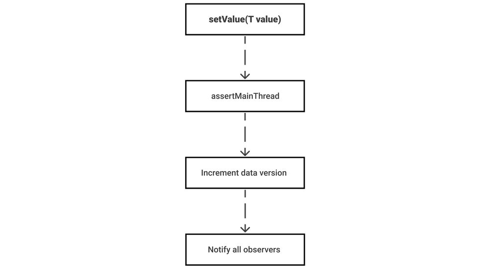
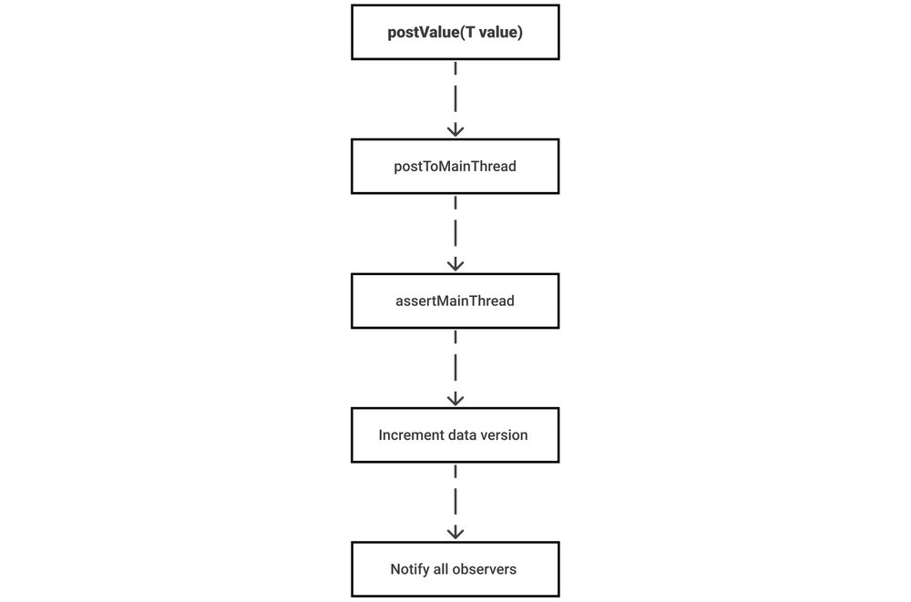
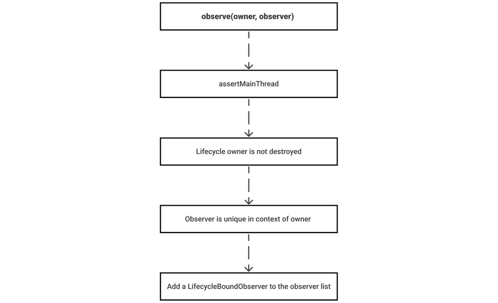
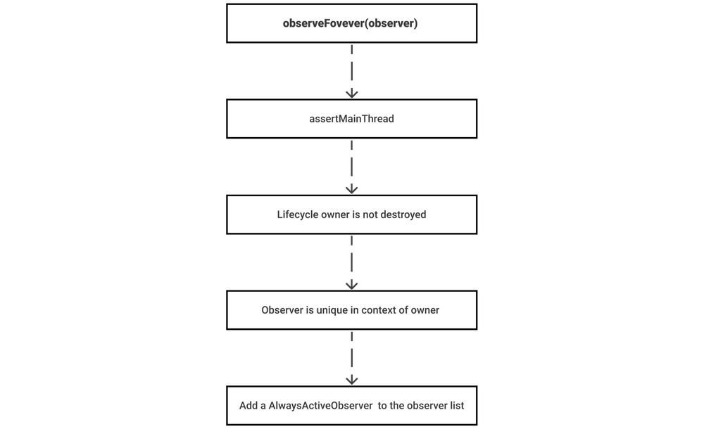

## LiveData: under the hood

> 이 글은 Alex Zhukovich의 [LiveData under the hood](https://alexzh.com/livedata-under-the-hood/)을 번역 하였다. 

- LiveData 관련 글 
  - [LiveData under the hood](https://alexzh.com/livedata-under-the-hood/) / [번역 글](https://github.com/ksu3101/TIL/blob/master/Android/210128_android.md)
  - [LiveData: Good practices](https://alexzh.com/livedata-good-practices/) / [번역 글](https://github.com/ksu3101/TIL/blob/master/Android/210129_android.md)
  - [Migrate from LiveData to StateFlow and SharedFlow](https://alexzh.com/migrate-from-livedata-to-stateflow-and-sharedflow/) / [번역 글](https://github.com/ksu3101/TIL/blob/master/Android/210201_android.md)

`LiveData`는 안드로이드의 Jetpack중에서 가장 많이 사용되는 컴포넌트중 하나일 것 이다. 현재 많은 안드로이드 앱에서는 "UI"와 "데이터"레이어에서 LiveData를 사용하고 있다. 이 글에서는 LiveData 컴포넌트가 내부적으로 어떻게 동작하는지 보여주려 한다. 

> `LiveData<T>`는 관찰가능한(observable) (안드로이드 컴포넌트의)수명주기 인식 데이터 홀더 클래스 이다. 이는 LiveData가 Activity, Fragment등과 같은 LifecycleOwners의 수명주기를 존중한다는 것 을 의미 한다. 

LiveData에 대해 아직 익숙하지 않은 경우 [이 공식 글](https://developer.android.com/topic/libraries/architecture/livedata)을 읽어볼 것을 추천 한다. 

### Lifecycle awareness of LiveData (LiveData의 수명주기 인식)

아래 메소드들 중 하나를 이용하여 LiveData객체의 값을 관찰 할 수 있다. 

- `void observe(@NonNull LifecycleOwner owner, @NonNull Observer<? super T> observer)`
- `void observeForever(@NonNull Observer<? super T> observer)`

이 메소드의 주요 차이점은 `LifecycleOwner`매개변수의 존재 유무 이다. `LifecycleOwner`을 매개변수로 받지 않을 경우에는  라이프사이클을 인식하지 않으며 메모리 누수를 방지 하기 위해서는 수동으로 LiveData의 구독을 취소 해줘야 함을 의미 한다. 이 경우 `removeObserver()`메소드를 이용하여 구독을 취소해 줄 수 있다. 

이제 안드로이드 앱에 사용 가능한 `LifecycleOwner`에 대해 살펴 보도록 하자. 이는 `LifecycleOwner`인터페이스로 시작 하고 있다. 

```java
public interface LifecycleOwner {
   /**
    * Returns the Lifecycle of the provider.
    * @return The lifecycle of the provider.
    */
   @NonNull
   Lifecycle getLifecycle();
}
```

AndroidX 라이브러리의 다음 클래스에서 `LifecycleOwner`인터페이스의 잘 구현된 예제를 확인 할 수 있다. 

- `AppCompatActivity`
- `Fragment`
- `LifecycleService`
- `ProcessLifecycleOwner`

그리고 `BottomSheetDialogFragment`와 같이 위 클래스 중 하나를 상속받은 수명주기 소유 클래스 들이 많이 있다. 

수명주기에 대한 인식을 요약하자면, 관찰하는 방법에 대해서만 수명주기를 인식함을 알아야 한다. 하지만, 테스트 코드와 `observeForever()`메소드를 사용 하면 GitHub의 안드로이드 프로젝트의 예제등을 찾아 볼 수 있을 것 이다. 

### LiveData API 

`LiveData<T>`는 `Observable<T>`또는 `Flow<T>`와 같은 많은 작업을 지원하지는 않지만 그래도 기본적인 기능을 수행 할 수는 있다. 이 글에서는 데이터에 대한 관찰과 관련된 작업에 중점을 둘 것 이다. 

- 데이터의 갱신: 
  - `postValue` : 주어진 값을 설정 하기 위해 워커 스레드에서 작업(값의 갱신)을 수행 한다. 
  - `setValue` : 메인스레드에서 주어진 값을 설정 한다. 

- 데이터 관찰 : 
  - `observe` : 주어진 LifecyclerOwner의 수명주기 내 에서 주어진 LiveData를 옵저버를 옵저버 목록(observer list)에 추가 한다. 이것은 수명주기를 인식하기 위한 방법이며, LifecycleOwner가 destroyed되기 전 까지 자동으로 수행하기 때문에 `removeObserver()`를 사용해 수동으로 구독을 취소할 필요가 없다. 
  - `observeForever` : 주어진 옵저버를 옵저버 목록(observe list)에 추가 한다. 메모리 누수를 방지하기 위해서는 `removeObserve()`메소드를 이용해서 구독을 취소해주어야 한다.
  - `removeObserver` : 옵저버 목록(observer list)에서 옵저버를 제거 한다. 

- 데이터를 가져옴 : 
  - `getValue` : 값을 가져 온다. 이 값은 `null`일 수도 있다. 

LiveData의 메소드 내부 작업을 살펴보기 전에 `LivecycleBoundObserver`클래스를 소개 하고 싶다. `LifecycleBoundObserver`클래스의 주요 아이디어는 `LifecycleOwner`의 상태 변경을 처리 하는 것 이다. 

```java
class LifecycleBoundObserver extends ObserverWrapper implements LifecycleEventObserver {
    @NonNull
    final LifecycleOwner mOwner;

    LifecycleBoundObserver(@NonNull LifecycleOwner owner, Observer<? super T> observer) {
       super(observer);
       mOwner = owner;
    }

    @Override
    public void onStateChanged(
       @NonNull LifecycleOwner source,
       @NonNull Lifecycle.Event event
    ) {
       Lifecycle.State currentState = mOwner.getLifecycle().getCurrentState();
       if (currentState == DESTROYED) {
          removeObserver(mObserver);
          return;
       }
       Lifecycle.State prevState = null;
       while (prevState != currentState) {
          prevState = currentState;
          activeStateChanged(shouldBeActive());
          currentState = mOwner.getLifecycle().getCurrentState();
       }
    }

    ...
}
```

이 구현은 수명주기의 상태 변경이 처리되는 방법에 대해서 보여주고 있다. 다음 섹션에서는 이 구현에 대해 더 자세히 설명 한다. 

#### Subscribing

`observe()`메소드 중 `LifecycleOnwer`를 매개변수로 받는 메소드에서는 옵저버를 옵저버 목록(observer list)에 추가하기 때문에 이 메소드의 내부 작업들에 대해 확인해보도록 하자. 아래 코드는 이에 대해서 보여주고 있다. 

```java
@MainThread
public void observe(@NonNull LifecycleOwner owner, @NonNull Observer<? super T> observer) {
    ...

    LifecycleBoundObserver wrapper = new LifecycleBoundObserver(owner, observer);
    ObserverWrapper existing = mObservers.putIfAbsent(observer, wrapper);
    if (existing != null && !existing.isAttachedTo(owner)) {
       throw new IllegalArgumentException("Cannot add the same observer"
               + " with different lifecycles");
    }
    if (existing != null) {
       return;
    }
    owner.getLifecycle().addObserver(wrapper);
}
```

처음에는 `LifecycleBoundObserver`의 객체가 생성되고 나중에 Activity, Fragment등과 같은 `LifecycleOwner`의 옵저버 목록에 추가됨을 알 수 있다. 

`observeForever()`의 동작은 `observe()`와 다르며 LiveData의 옵저버 목록에 옵저버를 추가 하는 것 은 같다. 이는 "observeForever"섹션에서 자세히 설명 한다. 

#### Unsubscribing

`removeObserve()`메소드를 사용하면 추가했던 기존 옵저버를 제거 할 수 있다. 이 메소드에서는 `observeForever()`메소드를 사용 하는 경우에는 필수적이다. 그리고 가능하면 `observeForever()`는 사용하지 않는 것 이 좋다. 

이 방법의 주요 목적은 LiveData객체의 옵저버 목록에서 옵저버를 제거하는 것 이다. 

```java
@MainThread
public void removeObserver(@NonNull final Observer<? super T> observer) {
   assertMainThread("removeObserver");
   ObserverWrapper removed = mObservers.remove(observer);
      if (removed == null) {
         return;
   }
   removed.detachObserver();
   removed.activeStateChanged(false);
}
```

`LifecycleOwner`가 `DESTROY`상태에 있으면 LiveData객체가 `LifecycleOnwer`에서 자동으로 구독 취소 된다. 이는 아래 `LifecycleBoundObserve`클래스의 구현에서 확인할 수 있다. 

```java
class LifecycleBoundObserver extends ObserverWrapper implements LifecycleEventObserver {
    @NonNull
    final LifecycleOwner mOwner;

    LifecycleBoundObserver(@NonNull LifecycleOwner owner, Observer<? super T> observer) {
       super(observer);
       mOwner = owner;
    }

    @Override
    boolean shouldBeActive() {
       return mOwner.getLifecycle().getCurrentState().isAtLeast(STARTED);
    }

    @Override
    public void onStateChanged(
       @NonNull LifecycleOwner source,
       @NonNull Lifecycle.Event event
    ) {
       Lifecycle.State currentState = mOwner.getLifecycle().getCurrentState();
       if (currentState == DESTROYED) {
          removeObserver(mObserver);
          return;
       }
       Lifecycle.State prevState = null;
       while (prevState != currentState) {
          prevState = currentState;
          activeStateChanged(shouldBeActive());
          currentState = mOwner.getLifecycle().getCurrentState();
       }
    }

    @Override
    boolean isAttachedTo(LifecycleOwner owner) {
       return mOwner == owner;
    }

    @Override
    void detachObserver() {
       mOwner.getLifecycle().removeObserver(this);
    }
}
```

`removeObserver()`메소드는 LiveData객체의 옵저버 목록에서 지정된 옵저버를 제거 해 준다. 

#### Changing data

`LiveData<T>`는 데이터 홀더 클래스이며 LiveData객체 내 에 `T`타입의 데이터를 저장 한다. 앞에서 봤듯이 `observe()`또는 `observeForever()`메소드를 사용 하여 LiveData객체의 데이터 변경을 관찰 할 수 있다. 

LiveData객체 내 에서 데이터를 변경하는데 사용할 수 있는 메소드의 내부 구현에 대해 살펴 보도록 하자. 

모든 LiveData객체에서는 LiveData객체의 옵저버 목록에 있는 모든 옵저버에게 알리는데 도움이 되는 `mVersion`이라는 프로퍼티가 있다. 초기 버전에서는 `-1`또는 `0`이다. 이 프로퍼티는 LiveData객체를 만드는데 사용되는 생성자에 따라 조금 다르다. 

```java
public abstract class LiveData<T> {
   static final int START_VERSION = -1;

   private int mVersion;
   ...

   public LiveData(T value) {
      mData = value;
      mVersion = START_VERSION + 1;
   }

   public LiveData() {
      mData = NOT_SET;
      mVersion = START_VERSION;
   }
}
```

#### The `setValue()` method

`void setValue(T value)`메소드는 메인 스레드에서 LiveData객체의 값을 설정 한다. 



처음에 이 메소드는 메인 스레드에서 값을 설정하려는지 확인 한다. 다음 단계에서는 데이터의 버전(`mVersion`)과 데이터 자체를 업데이트 하는 것 이다. 이후 옵저버 목록의 모든 옵저버(구독중인)는 새 데이터를 얻게될 것 이다. 

#### The `postValue()` method

`void postValue(T value)`메소드는 값을 메인스레드에서 업데이트 하고 LiveData객체의 데이터를 업데이트 하여 워커 스레드에서 데이터를 업데이트 하게 한다. 



`postValue()`는 `setValue()`메소드와 유사하지만 워커 스레드에서 메인 스레드로 데이터를 업데이트 하는 추가 단계가 있다. 즉, 데이터는 항상 메인 스레드에서 업데이트 되며 LiveData는 "데이터"레이어에 이상적인 구조는 아니라고 할 수 있다. 

### Observing and getting data

LiveData객체 내부의 데이터는 `setValue()`또는 `postValue()`메소드로 업데이트 할 수 있다. 이제 아래 메소드를 이용해서 LiveData의 데이터 변화를 관찰할 수 있는 방법에 대해서 알아보자. 

- `void observe(@NonNull LifecycleOwner owner, @NonNull Observer<? super T> observer)`
- `void observeForever(@NonNull Observer<? super T> observer)`

이 외에도 `T getValue()`메소드를 사용하여 현재 값을 가져올 수 도 있다. 

#### The `observe()` method

`observe()`메소드는 특정 LifecycleOwner의 수명주기내에서 옵저버 목록에 옵저버를 추가 한다. 



옵저버 목록에 옵저버를 추가하기 전에 아래 사항들을 확인 해야 한다. 
- `observe()`메소드는 메인스레드에서 호출 해야 한다.
- `LifecycleOwner`는 Destoryed 상태가 아니어야 한다.
- 옵저버는 유사한 Lifecycle owner에게 연결(attach) 된다. 이는 다른 Lifecycle owner에 대해 동일한 옵저버를 사용할 수 없음을 의미 한다.

모든 사항에 대한 검사가 완료 되면 옵저버는 옵저버 목록에 추가 된다. 

#### The `observeForever()` method

`observeForever()`메소드는 옵저버 목록에 옵저버를 추가 한다. 이 메소드는 `LifecycleOwner`와 독립적이므로 `LifecycleOwner`를 제거 하기 전에 수동으로 구독을 취소해야 한다. 



옵저버 목록에 "항상 활성화된 옵저버"(새로운 `AlwaysActiveObserver(observer)`)를 추가하기 전 에 `observeForever()`메소드의 구현은 아래의 몇가지 사항들을 확인 해야 한다. 

- `observeForever()`메소드는 메인 스레드에서 호출 해야 한다.
-  옵저버는 유사한 Lifecycle owner에게 연결(attach) 된다. 이는 다른 Lifecycle owner에 대해 동일한 옵저버를 사용할 수 없음을 의미 한다.

#### The `getValue()` method

`T getValue()`메소드는 LiveData객체의 현재 값을 반환 한다. 이 메소드에서는 LiveData에 아직 값이 설정되지 않은 경우 `null`을 반환할 수 있다. 

이 메소드의 소스 코드를 확인 해보도록 하자. 

```java
public abstract class LiveData<T> {
   static final Object NOT_SET = new Object();   

   public LiveData() {
      mData = NOT_SET;
      mVersion = START_VERSION;
   }

   ...

   @Nullable
   public T getValue() {
      Object data = mData;
      if (data != NOT_SET) {
         return (T) data;
      }
      return null;
   }
}
```

### Summary 

`LiveData<T>`는 "UI"계층에서 데이터를 제공하기 위해 일반적으로 사용되는 구조 이다. 이 구조는 "데이터"계층에서는 비효율적이다. 작업자 스레드에서 `postValue()`를 호출 하더라도 `postValue()`및 `setValue()`메소드가 메인 스레드에서 LiveData객체의 값을 업데이트 하기 떄문이다. 

`observee()`또는 `observeForever()`메소드를 사용해서 LiveData의 값 변경을 관찰(observe)할 수 있다. `observe()`메소드는 수명주기를 인식하는 반면, `observeForever()`메소드는 인식하지 않는다. 이는 Activity또는 Fragment와 같은 컴포넌트들에서 파괴되기 전에 `removeObserver()`를 필수로 호출 해줘야 한다. 