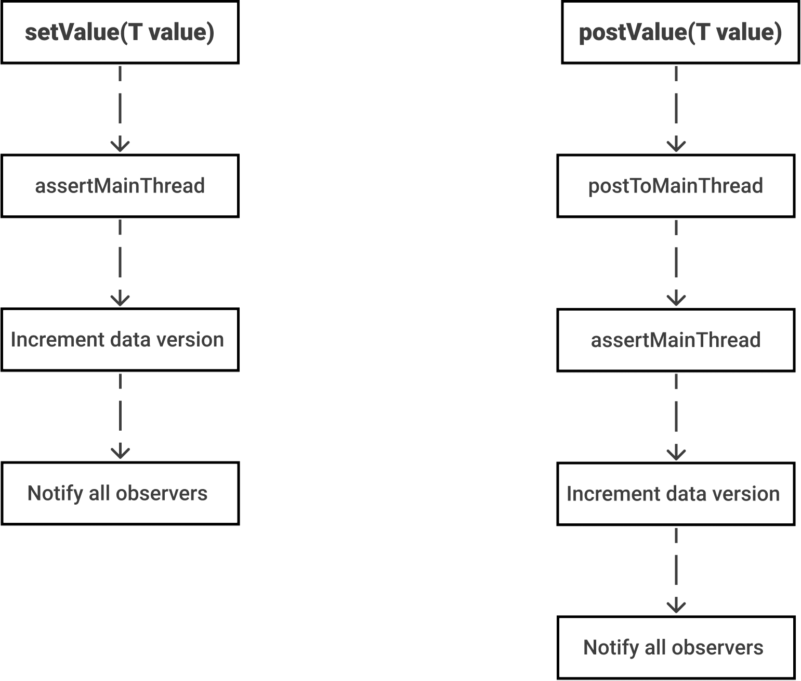

## LiveData: Good practices

> 이 글은 Alex Zhukovich의 [LiveData: Good practices](https://alexzh.com/livedata-good-practices/)을 번역 하였다. 

- LiveData 관련 글 
  - [LiveData under the hood](https://alexzh.com/livedata-under-the-hood/) / [번역 글](https://github.com/ksu3101/TIL/blob/master/Android/210128_android.md)
  - [LiveData: Good practices](https://alexzh.com/livedata-good-practices/) / [번역 글](https://github.com/ksu3101/TIL/blob/master/Android/210129_android.md)
  - [Migrate from LiveData to StateFlow and SharedFlow](https://alexzh.com/migrate-from-livedata-to-stateflow-and-sharedflow/)

LiveData는 Android jetpack에서 가장 많이 사용되는 컴포넌트들 중 하나이다. 현재 많은 안드로이드 앱에서 LiveData를 사용하고 있다. [이전 글](https://alexzh.com/livedata-good-practices/) 에서는 LiveData가 어떻게 내부적으로 동작하는지 살펴 보았었다. 이번 글에서는 `LiveData<T>`객체를 사용하는 좋은 방법들에 대해 공유 하려고 한다. 

### Use the "observe()" method in the UI layer

LiveData는 `LiveData<T>`객체에 저장된 데이터의 최신 버전을 관찰하기 위한 `observe()`및 `observeForever()`메소드가 있다. 

```java
public void observe(
    @NonNull LifecycleOwner owner, 
    @NonNull Observer<? super T> observer
)
```

`observe()`메소드를 사용할 때 `LivecycleOwner`매개변수를 전달 하고 상태가 `DESTROYED`이면 전체 LiveData가 Lifecycle owner로부터 자동으로 구독 취소되어 진다. 이는 메모리 누수를 방지하는데 도움이 된다. 

```kotlin
viewModel.products.observe(this) {
    handleProducts(it)
}
```

`AppCompatActivity`및 `Fragment`는 가장 잘 알려진 `LifecycleOwner`를 가진 컴포넌트 이다. 

### Do not expose the `MutableLiveData` to the UI layer

> `MutableLiveData`를 UI레이어에 노출 시키지 말자.

앱의 UI계층은 화면에 데이터를 표시하고, 사용자의 입력을 처리하여 다른 계층에 전달해준다. 이는 UI가 LiveData객체에 직접 데이터를 변경할 수 없음을 의미 한다. ViewModel, Presenter, Controller또는 이와 유사한 것들로부터 LiveData객체의 데이터를 변경할수 있는 방법이 있어야 한다. 

```kotlin
class ProductsViewModel(...) : ViewModel() {
    private val _products = MutableLiveData<List<Product>>()
    val products: LiveData<List<Product>>
        get() = _products

    ...
}
```

위 방식의 구현을 통해 `ProductsViewModel`클래스에서만 `_products`변수를 이용하여 읽기전용인 `products` LiveData객체 데이터 값을 변경할 수 있다. `products`를 `observe()`메소드를 통해 값 수정 없이 데이터를 관찰 할 수 있다. 

### Use Livedata only in the UI layer

LiveData는 데이터 홀더 클래스이다. `setValue()`및 `postValue()`메소드를 이용하여 LiveData객체의 값을 업데이트 핧 수 있다. 내부적으로 이 두 메소드는 메인스레드에서 값을 설정하므로 값에 따라 뷰의 속성을 변경하기 위해서 이 구조는 UI에 이상적일수밖에 없다. 



[이 글](https://alexzh.com/livedata-under-the-hood/)에서 LiveData의 내부 동작에 대해 더 자세히 알 수 있다. 

데이터 저장소에서 데이터를 가져오거나 로직을 수행하는 경우 워커 스레드에서도 데이터를 변환할 수 있으므로 워커 스레드에서 수행하는 것이 가장 좋다. 이 경우에는 LiveData가 최선의 선택은 아니다. 

### Use LiveData as a state

일반적으로 앱의 거의 모든 화면에 대해 데이터 객체로 정의해보도록 하자. 저장된 "작업 목록"을 보여주는 화면이 있다고 가정 하였을때, 다음 상태 중 하나를 가질 수 있을 것 이다. 

- 성공 
  - 현재 "작업 목록"이 없음
  - "작업 목록"이 존재 함
- 에러 
  - 네트워크 연결 에러 

이러한 상황에 대해 ViewModel클래스에서는 여러 LiveData객체를 가질 수 있다. 

```kotlin
class TasksViewModel(...) : ViewModel() {
    private val _tasks = MutableLiveData<List<Task>>()
    val tasks : LiveData<List<Task>>
        get() = _tasks

    private val _error = MutableLiveData<Throwable>()
    val error : LiveData<Throwable>
        get() = _error
        
    ...
}
```

다른 상황의 경우 한개의 ViewModel에서 더 많은 LiveData객체를 가지는 경우도 있을 수 있다. 일단 여기에서 주된 문제는 LiveData를 적절한 순서대로 처리해 주어야 하는 것 이다. 

- 발생한 에러를 처리 한다.
- 전달받은 "작업 목록"을 처리 한다. 

오류가 발생하면 작업을 끝낼수 있지만 더 나은 방식으로도 처리 할 수 있다. ViewModel은 전체 화면의 상태와 함께 하나의 LiveData객체를 가질 수 있다. 

```kotlin
private val _tasks = MutableLiveData<UiState<List<Task>>>()
val tasks : LiveData<UiState<List<Task>>>
    get() = _tasks
```

이 경우 `UiState`는 `Success`, `Error`혹은 `Loading`일 수 있다. 

```kotlin
sealed class UiState<out T : Any> {
    data class Success<out T: Any>(val data: T) : UiState<T>()
    data class Error(val error: Throwable) : UiState<Nothing>()
    object Loading : UiState<Nothing>()
}
```

이 경우 `Success`데이터 클래스 에서만 저장된 "작업" 데이터에 접근 하여 처리 할 수 있고 `Error`데이터 클래스에서는 오류에 대한 정보에 접근할 수 있으므로 데이터를 처리 하는데 시퀀스가 필요하지 않다. 

```kotlin
viewModel.tasks.observe(this) {
    when (it) {
        is UiState.Success -> handleSuccess(it.data)
        is UiState.Error -> handleError(it.error)
        is UiState.Loading -> showLoading()
    }
}
```

### Remember about collecting lastest emitted data after screen rotation

> 화면이 회전된 뒤 최근 방출되었던 데이터를 다시 방출해야함을 잊지 말자. 

`LiveData.observe()`메소드는 화면 회전과 같은 설정의 변경 후 최신 버전의 값을 받게 된다. 따라서 아래와 같이 데이터를 한번만 내보내고 싶을 때가 있을 수 있다. 

- 오류 혹은 오류 메시지
- 네비게이션 이벤트 

이러한 데이터를 한번만 가져오고 설정 변경 후 중복되는 이벤트를 방지하기 위해서는 `MutableLiveData<T>`대신 `SingleLiveEvent<T>`를 사용할 수 있다. 

> 그러나 `SingleLiveData<T>`는 종종 안티 패턴이라고 불리며 이상적으로는 피해야 한다. 이는 `Flow`로 대체할 수 있다. [여기](https://alexzh.com/migrate-from-livedata-to-stateflow-and-sharedflow/)에서 LiveData의 `StateFlow`및 `SharedFlow`로 마이그레이션 하는 방법에 대해 자세히 알아볼 수 있다.

그러나 `LiveData<T>`를 계속 사용 하는 경우 `SingleLiveEvent<T>`를 사용할 수 있다. 

`SingleLiveEvent<T>`의 구현은 [여기](https://github.com/android/architecture-samples/blob/dev-todo-mvvm-live/todoapp/app/src/main/java/com/example/android/architecture/blueprints/todoapp/SingleLiveEvent.java)를 확인 하자. 

```kotlin
private val _message = SingleLiveEvent<String>()
val message : LiveData<String>
    get() = _message

...

_message.value = "Tasks successfully added"
```

### Summary

`LiveData<T>`는 UI계층에 데이터를 제공하기 위해 일반적으로 사용되는 구조 이다. 이 구조는 `postValue()`및 `setValue()`가 메인 스레드에서 내부적으로 데이터를 설정 하기 때문에 UI계층에 효율 적이다. 

추가적으로 팁을 추천하자면:

- UI 계층에서 `observe()`메소드를 사용 하자
- UI 계층에서 LiveData를 사용 하자
- ViewModel에서 하나의 LiveData로 뷰 상태를 갖자
- 데이터를 한번만 관찰하기 위해서는 `SingleLiveEvent`를 사용 한다
- ViewModel, Presenter, Controller의 공용 변수로 LiveData를 사용 할수 있다. 