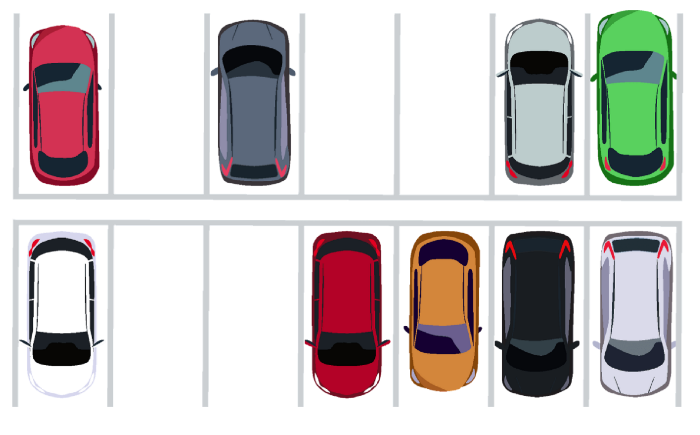
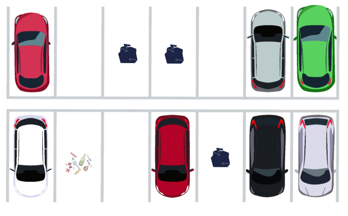
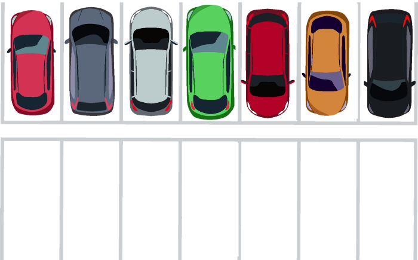

## A Garbage Collection Story

> 이 글은 Denis Crăciunescu의 [A Garbage Collection Story](https://proandroiddev.com/a-garbage-collection-story-2421b96e4c84)을 번역 하였다.

- 비유에 대한 간단 정리 
  - 주차장 : Heap 메모리 공간 
  - 자동차, 전차, 사람 : 앱에서 사용 하는 Heap 메모리 (작을수도 있고 클 수도 있으며 연속적일 수도 있다)
  - 쓰레기 : Heap을 사용하는 참조가 사라진 메모리 
  - 주차장의 쓰레기 처리꾼 Bill : 쓰레기를 처리 하는 가베지 콜렉터  

### Introduction 

(아래의 이미지처럼)사용량이 많은 주차장을 상상해 보자. 

자동차가 들어오고 또 나간다. 일부 자동차는 하나의 주차 공간을 차지 할 수도 있고 큰 차는 주차장 전체를 다 차지할 수도 있을 것 이다. 사람들은 일반적으로 주차장이 부족한 상황일 때 화가 날 것 이다. 

여기에서의 주차장은 바로 **메모리**이다. 

그리고 주차장에는 가베지 콜렉터(Garbage collector)인 쓰레기 처리꾼(Recycler) Bill이 라는 사람이 있다. 이 사람의 유일한 인생의 목적은 주차장에서 쓰레기를 모아 처리 하는 것 이다. 

사람들이 주차장에서 떠날때 사람들은 쓰레기들을 봉투에 넣어 Bill이 수거할 수 있도록 주차했던 장소에 두고 떠난다. 

여기에서 Bill에게는 문제가 존재 한다. 어떤 사람들은 쓰레기를 봉투에 넣어 버리지 않는다. 대신 주차장에 쓰레기 더미를 그대로 방치하고 떠날것 이다. 

안타깝게도 Bill은 이 일에 대한 충분한 급여를 받지 못했기 때문에 쓰레기 더미를 수거 할 수 없을 수 있다. 쓰레기는 결국 Bill이 처리 하지 못하면 무기한으로 주차 공간을 차지하게 될 것 이다. 

이러한 현상을 **메모리 누수**(Memory leak)라고 한다. 

주차장에 온 자동차는 주차를 시도 하려고 하는데 주차 공간이 여의치 않다면... 주차장은 폭발하고 Bill도 폭발해 버리고 말 것 이다.

이 폭발은 `OutOfMemoryException`이라고 한다. 

Bill은 단순히 가비지 콜렉터 그 이상의 존재 이다. 이제 그의 손에는 주차장의 운명이 달려 있는 것 이다. 

쓰레기 처리꾼 Bill이 주차장 최고의 가비지 콜렉터가 되는 여정을 이제 따라가 보도록 하자. 

### Dalvik - Bill (up until Android 4.4)

주차장의 상황은 좋진 않다. 주차장에 주차하기에는 그 주차 비용이 너무 비싸다. 따라서 필요한 경우에만 주차를 하는게 좋다.

게다가 Bill이 가비지 콜렉션을 할 때마다 다른 모든 사람들의 일들을 중단 시켜야 하기 때문에 다른 사람들은 짜증을 낼 것 이다. 그리고 Bill이 쓰레기 수거를 마칠 때 까지 주차장에 출입하는 차량은 없어야 한다. 

그래서 Bill은 이 모든 불편을 해결하기 위해 무엇을 해야 했을까? 

가비지 콜렉터의 작업은 간단 해 보인다. 그러나 Bill의 복잡한 기술은 다른 가비지 콜렉터보다 눈에 띄게 만들었었다. 그는 그의 기술을 [Mark and Sweep](https://www.geeksforgeeks.org/mark-and-sweep-garbage-collection-algorithm/)이라고 부른다. 

우선 Bill은 쓰레기를 자주 수집하는것이 효과적이지 않음을 알아 차렸다. 대신 주차장이 자동차로 꽉 찰 때까지 기다린다. 그리고 주차장이 꽉 차면 그 때 가비지 콜렉션을 시작 한다. 

그리고 Bill은 2가지 단계를 통해 쓰레기를 수거 하게 된다:

1. 그는 주차장을 돌아 다니며 자동차가 있는 주차된 공간들을 표시 한다. 이 때 주차장 내부의 모든 사람들과 차량을 멈추게 할 것이다.

2. 자동차가 어느 지점에 있는지 이제 알게 되었으니 Bill은 포장 된 쓰레기가 있는 표시 되지 않은(주차된 차량이 없는) 주차 지점들을 청소 한다. 근느 아직 급여가 높지 않기 때문에 풀어진 봉투의 쓰레기들은 수거하지 않는다. 

Bill은 주차장에서 문제 없이 일하는것 같아 보이지만 새로운 문제들을 발견 한다. 

그가 쓰레기를 수거 한 뒤 주차장에는 많은 틈(쓰레기 수거를 완료 했지만 그렇지 않은 공간들로 인하여 생긴 gap))들이 남아 있었다. 만약 군대가 와서 그들의 전차를 주차 하기 위한 커다란 연속적인 공간을 요구 한다면 어떻게 될 까? 

이 문제들은 **힙의 조각화**(Heap fragmentation)이라고 한다. 

시간이 지나고 Bill은 결국 해결책을 제시 한다. 

야간에는 주차장에 차량이 많지 않으므로 슈퍼 히어로의 힘을 빌려 모든 자동차를 들어올려 다시 정렬하여 연속적인 주차 공간으로 정렬 시키는 것 이다. 

이는 앱이 백그라운드에있을때 의 **Heap compaction**을 하는 것 이다.

하지만 여전히 거대한 군대의 전차들이 오면 주차장이 폭발할 가능성이 남아 있다. 

### ART - Bill 

수년동안 Bill은 그의 쓰레기 처리 기술을 향상 시켰다. 

이제 Bill은 승진을 받았고, 낮 시간에도 주차장을 재배치 할 수 있다. Bill은 이제 군대의 전차들이 와도 주차장에 같이 주차 할수 있게 된 것 이다. 

이는 앱이 포어그라운드에 있어도 **Heap Compaction**을 할수 있게 된 것 이다. 

주차장은 전보다 발전했다. 주차 비용은 내려갔고 이제 사람들은 주차장에 차를 추자하는 것을 덜 망설이게 되었다. 

Bill은 주차 점유 장소를 표시 할 때 이전처럼 다른 사람이나 차량을 멈추지 않게 했다. 그리고 전체 쓰레기의 수집 속도는 3배 빨라졌다. 

또한 주차장의 디지털화로 인해 Bill은 각 차량이 주차 공간을 차지한 시간을 훨씬 더 쉽게 추적할 수 있게 되었다. 이러한 정보들을 바탕으로 Bill은 이제 여러 세대애 걸쳐 자동차를 그룹화 시켜 처리 할 것 이다. 

이것들을 **Heap generation**이다. 

- Young generation : 이는 3개의 컨테이너인 Eden, S0, S1으로 나뉜다. 
- Old generation
- Permanent generation

주차장의 차량이 충분히 오래 주차 되었 다면 Bill은 자동차를 Old gen에 옳긴 다음 Permanent gen으로 옳긴다. 

각 세대에는 주차 된 차량이 차지할 수 있는 공간에 대한 상한선이 지정 되어 있다. 각 세대의 한계에 도달하게 되면 Bill은 해당 세대에 대해서만 가비지 콜렉션을 시작 한다. 

### Conclusion

쓰레기 처리꾼 Bill이 단순한 가비지 콜렉터에서 Bill-Gargabe-Man으로 어떻게 진화했는지 보았다. 그러나 그는 아직 최대의 잠재력을 달성한 것은 아니다. 그때 까지 주제에 대해 더 깊이 파고 싶다면 Bill의 삶에 대한 [다음 영상](https://youtu.be/oKMsPrDMprE)을 참고 하도록 하자. 