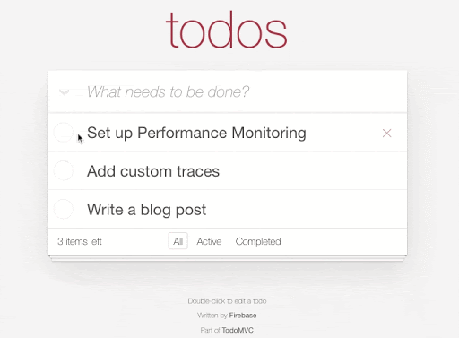
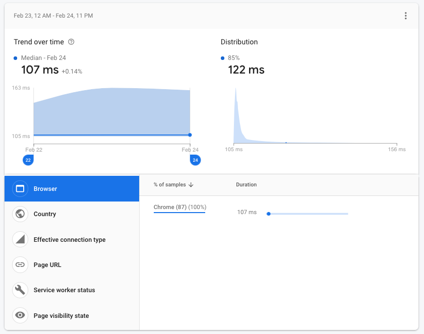
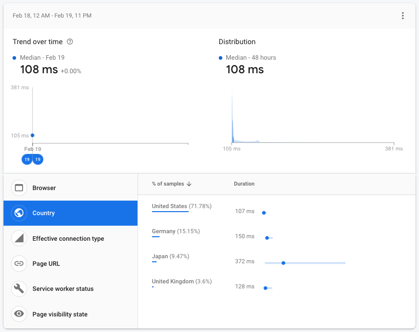
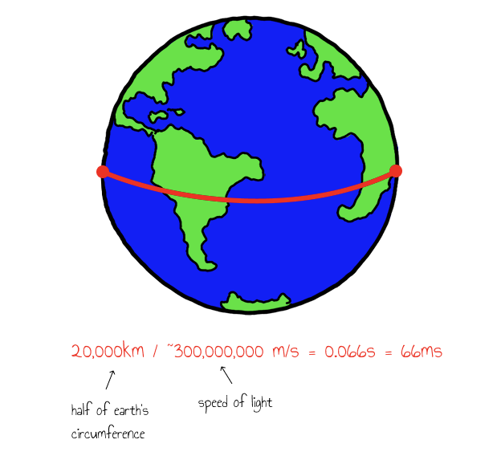
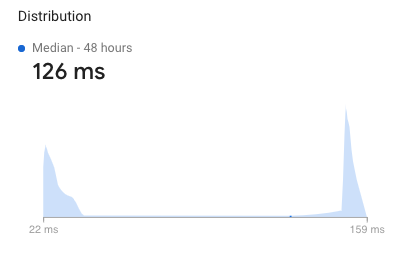
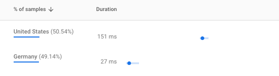

## Measuring Realtime Database performance with Firebase Performance Monitoring

> 이 글은 Sam Stern의 [Measuring Realtime Database performance with Firebase Performance Monitoring](https://firebase.googleblog.com/2021/03/rtdb-performance-monitoring.html)을 번역 하였다. 

실시간 데이터베이스(Realtime Database)과 함께 앱을 빌드해서 사용해봤다면 이 것이 생각보다 빠르다는것을 알고 있을 것 이다. 지연 시간이 짧은 웹 소켓 연결을 SDK의 로컬 캐싱 기능과 결합해 보면 변경 사항이 거의 즉시 적용됨을 알 수 있다. 

하지만 실제 사용자들을 위한 데이터베이스의 운영 속도가 얼마나 빠른지 궁금한 적이 있는가? 좋은 앱 개발자는 실제 성능 데이터들을 수집하여 실제 환경에서 앱을 사용하는 경험이 기대와 일치하는지 확인 해야 할 것이다. 기술 업계의 많은 사람들이 이런 측정들을 실제 사용자 모니터링(Real User Monitoring-RUM)이라고 부르며 앱 성능 및 사용자 경험을 측정 하는데 있어 표준으로 간주 한다. [Firebase Performance Monitoring](https://firebase.google.com/docs/perf-mon)은 앱 또는 웹 사이트에 대한 RUM데이터들을 수집하고 분석 하는데 도움이 되는 무료 교차 플랫폼 서비스 이다. 

Firebase 성능 모니터링은 최초 paint시간 및 HTTP요청 성능과 같은 일반적인 측정 항목에 대해 자동으로 측정 해 준다. 실시간 데이터데이스는 별도의 HTTP요청이 아닌 장기적인 실행 WebSocket연결을 사용하기 때문에 사용자 지정 추적을 사용하여 데이터베이스 작업의 성능을 모니터링해야 하기 때문이다. 

이 게시글을 위해 [ReactFire](https://github.com/FirebaseExtended/reactfire)라이브러리를 사용하여 React에서 표준 [TodoMVC](http://todomvc.com/)앱의 Firebase기반 구현을 빌드 하였다. 



할일 목록에서 항목을 추가, 업데이트 또는 제거 할 때 마다 실시간 데이터베이스에서 직접 변경 해 준다. 예를 들어 아래의 코드는 새 할일 항목을 추가 하는 코드 이다. 

```javascript
function App() {
  // Get an instance of Firebase Realtime Database using the 'reactfire' library
  const db = useDatabase();

  // Load all the 'todos' from the database
  const todosRef = db.ref("todos");
  const list = useDatabaseList(todosRef);
  
  // ...

  // Add a new todo to the database
  const handleAddTodo = (text) => {
    todosRef.push({
      text,
      completed: false,
    });
  };

  // ...
}
```

실시간 데이터베이스 SDK는 백엔드에서 쓰기를 승인하거나 거부할때까지 기다리는 동안 로컬 리스너에게 새 할일을 즉시 추가하기 때문에 이 작업들은 즉시 처리되는 것 처럼 보인다. 그러나 실제로 서버에서 쓰기를 완료(commit) 하는데 걸리는 시간을 알아보려면 어떻게 해야 할까? 

이 작업에 실제로 걸리는 시간을 측정하는 코드를 예제에 추가 해 보겠다. `Promise`를 반환하는 모든 작업들에 대해 사용자 지정 추적을 기록 하는데 도움되는 `tracePromise`라는 새로운 함수를 만든 다음 `add-todo`라는 간단한 사용자 지정 추적을 추가할 것 이다. 

```javascript
function tracePromise(trace, promise) {
  trace.start();
  promise.then(() => trace.stop()).catch(() => trace.stop());
}

function App() {
  // Get and instance of Performance Monitoring using the 'reactfire' library
  const perf = usePerformance();

  // ...

  const handleAddTodo = (text) => {
    const p = todosRef.push({
      text,
      completed: false,
    });

    // Use the 'tracePromise' helper to see how long this takes
    const trace = perf.trace("add-todo");
    tracePromise(trace, p);
  };

  // ...
}
```

이 코드를 배포하고 Firebase콘솔로 이동해보면 대부분의 경우 `add-todo`작업에 약 100ms가 소요되며 최악의 경우 160ms가 소요됨을 알 수 있다. 



이를 국가별로 분류하면 미국 사용자가 다른 국가들보다 더 빠르게 작업 됨을 알 수 도 있다. 



이는 대부분의 실시간 데이터베이스의 인스턴스가 미국에 있으므로 전 세계의 지연 시간에 영향을 줄 수도 있다. 지리적인 대기 시간 증가는 물리적 거리와 두 지점간의 네트워크 토폴로지에 따라 달라질 수 있다. 

우리는 코딩 할 때 자주 생각하지는 않긴하지만 데이터는 빛의 속도로 이동 할 수 있음을 간주 한다. 지구 반대편에 있는 두 지점의 경우 빛의 속도만으로도 66ms의 대기 시간이 추가 되며, 여기에는 실제 네트워크의 처리 대기 시간은 포함되지 않는다. 이것이 앱에 RUM을 추가해야 하는 중요한 이쥬 중 하나 이다. 



좋은 소식은 2020년 말 벨기에 지역 출시를 시작으로 실시간 데이터베이스가 이제 전 세계를 대상으로 더 많은 지역들로 확장 중인 것 이다. 할일 목록 앱은 각 사용자의 데이터가 독점적으로 자신의 데이터이기 떄문에 (인스턴스 의)분할에 매우 적합하다. 따라서 벨기에 지역의 앱에 두번째 실시간 데이터 베이스 인터페이스를 추가 하고 각 사용자를 임의의 데이터베이스 인스턴스에 할당하여 각 지연시간에 어떤 영향을 주는지 확인 해보도록 하자. 

먼저 나중에 위치별로 데이터를 필터링할 수 있도록 퍼포먼스 모니터링 추적에 사용자 지정 특성을 추가 해 준다. 

```javascript
function getMyLocationCode() {
  // User's location could be stored in a URL param, cookie, localStorage, etc.
  // ... 
}

function tracePromise(trace, promise) {
  // Add a custom attribute to the trace before starting it
  const location = getMyLocationCode();
  trace.putAttribute("location", location);

  trace.start();
  promise.then(() => trace.stop()).catch(() => trace.stop());
}
```

이제 이러한 수정 사항을 배포 한 뒤 새로운 사용자 데이터가 들어올때 까지 기다려 보자. 몇일 후 이 실험이 효과가 있음을 확인 할 수 있을 것 이다. 먼저 분포에 이제 두개의 분명한 피크(peak)가 있음을 알 수 있다. 



이것은 두 데이터베이스 인스턴스 중 하나에 무작위로 사용자를 할당해주기 때문에 우리가 예상했던 것 이다. 그들이 있는곳에 따라 그들은 데이터베이스에 가깝거나 멀 것 이기 때문이다. 

데이터를 더 자세히 살펴보면 독일 사용자가 벨기에 인스턴스에 정말 빠르게 연결되어 있음을 확인 할 수 있다. 독일 사용자의 경우 벨기에의 인스턴스로부터 22ms만에 업데이트를 받을 수 있다. 이는 미국의 인스턴스를 대상으로 통신 할 때 150ms이상에 비해 크게 개선되었다고 할 수 있다. Firebase SDK의 로컬 캐싱은 어느 쪽이든 UI로서는 깔끔하게 생각할 수 있지만 협업 또는 여러개의 기기를 사용하는 시나리오에서는 속도에서 큰 차이를 느낄수 있을 것 이다. 



이 RUM데이터를 사용하면 새 데이터베이스 인스턴스를 추가하여 앱이 더 빨라질 수 있음을 확신할 수 있다. 다음으로 사용자가 등록할 때 사용자 위치를 감지하고 각 계정을 가장 적합한 지역에 할당하는 방법을 찾는 방법을 알아보도록 하자. 

자신의 앱에서 성능 측정을 시작할 준비가 되었다면 아래 링크를 확인하도록 하자. 

- [Get started with Performance Monitoring for Web](https://firebase.google.com/docs/perf-mon/get-started-web)
- [Get started with ReactFire](https://github.com/FirebaseExtended/reactfire)