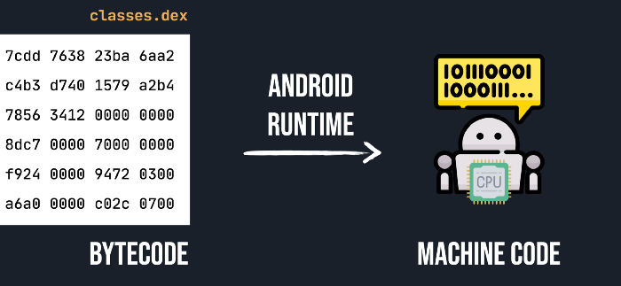
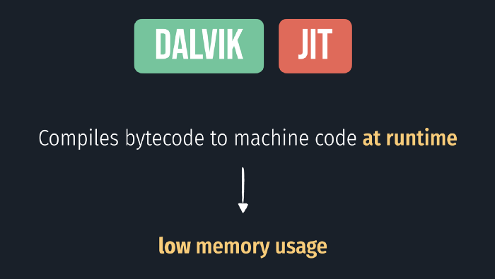
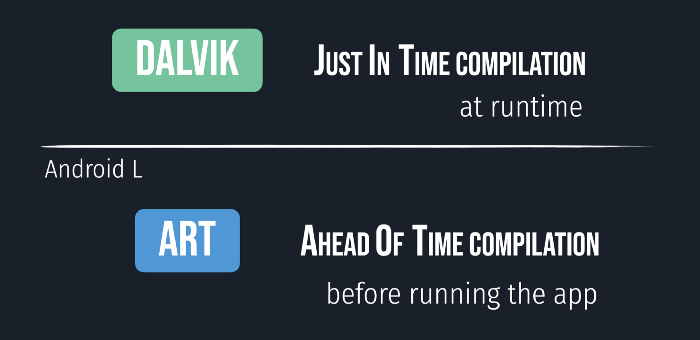
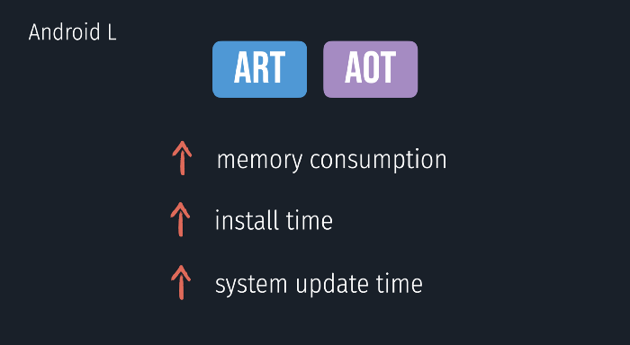
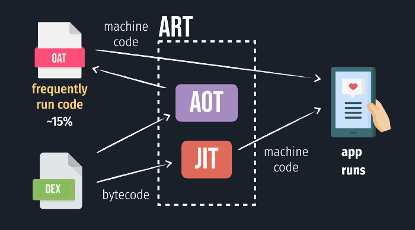
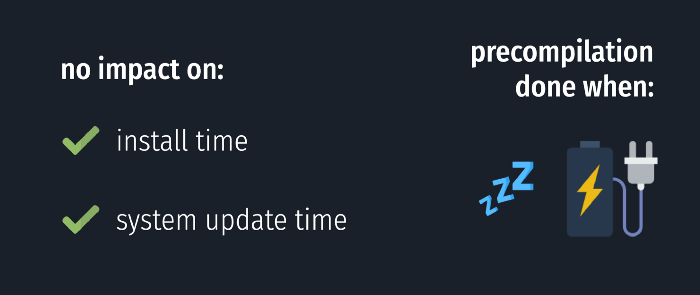
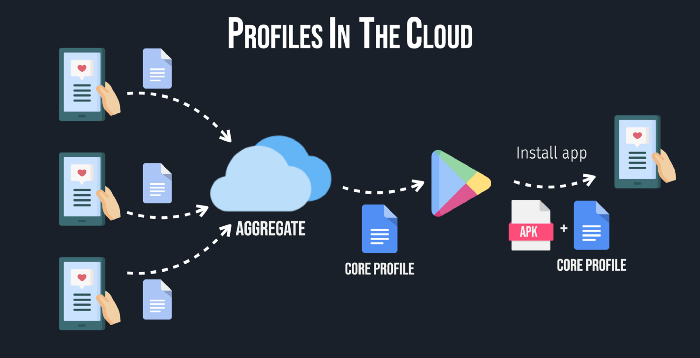
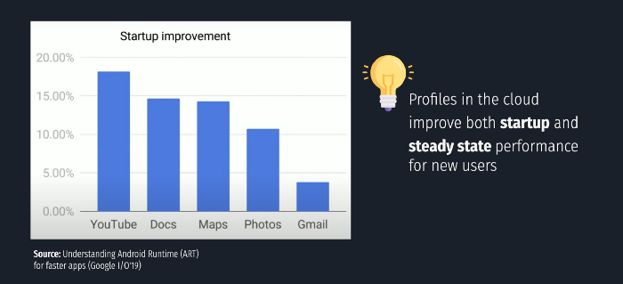

# Android Runtime — How Dalvik and ART work?

> 이 글은 Paulina Sadowska의 [Android Runtime — How Dalvik and ART work?](https://proandroiddev.com/android-runtime-how-dalvik-and-art-work-6e57cf1c50e5)을 번역 하였다. 

안드로이드의 런타임은 안드로이드 생태계 핵심 구성 요소중 하나 이다. 여러분은 대부분 Dalvik, ART, JIT및 AOT라는 용어를 한번은 들어본 적 있을 것 이다. 이러한 용어가 정확히 무엇을 의미 하는지, 안드로이드 런타임이 앱을 최대한 빨리 구동시키기 위해 어떻게 작동되는지 궁금하다면 이 문서에서 확인 할 수 있을 것 이다. 

# 안드로이드 런타임이란?

안드로이드 앱을 빌드하고 APK파일을 생성할 때 이 APK의 일부에는 `.dex`파일이 있다. 이 파일에는 소프트웨어 인터프리터용으로 설계된 저수준 코드(low-level code)인 바이트 코드에서부터 모든 라이브러리들을 포함한 앱의 소스코드들이 포함 되어 있다. 

사용자가 앱을 실행하게 되면 `.dex`파일로 작성된 바이트 코드는 안드로이드 런타임에 의해 기계가 직접 이해할 수 있고 CPU에서 처리되는 명령인 머신 코드로 변환된다. 

안드로이드 런타임도 메모리와 가비지 콜렉션을 괸리하고 있다. 하지만 이 글에서는 컴파일에 대해 집중 하도록 하겠다. 

# Dalvik (up to Android K)

초기의 안드로이드 스마트폰은 지금처럼 강력하지 않았었다. 대부분 당시의 스마트폰에는 RAM이 약 200MB에 불과하여 매우 적었다. 

Dalvik으로 알려진 최초의 안드로이드 런타임은 RAM의 사용량을 최적화 하기 위해 구현 된 것이다. 따라서 앱을 실행하기 전에 머신 코드로 컴파일하는 대신, Just in Time컴파일. 즉 간단히 말하면 JIT라는 전략을 사용하게 되었다. 

이 전략에서 컴파일러는 인터프리터 역할을 담당한다. 앱을 실행하는 동안 런타임중 작은 코드 덩어리들을 컴파일 한다. 

Dalvik은 런타임중 필요한 코드만 컴파일 하므로 RAM을 절약할 수 있다. 

그러나 이 전략에서는 한가지 심각한 단점이 존재 한다. 결국 이 모든 일들이 런타임에 발생하기 때문에 어쩔수 없이 런타임 성능에 영향을 미치게되는 것 이다. 

결국 Dalvik의 성능을 높이기 위해서 몇가지 최적화가 도입 되었다. 자주 사용되는 컴파일된 코드 조각 중 일부가 캐시화 되게 하여 또다시 런타임중 컴파일 되지 않도록 한다. 그러나 초기엔 RAM이 매우 부족했기 때문에 이것은 매우 제한적일 수 밖에 없었다. 

Dalvik은 몇 년동안 잘 작동하는 듯 했지만 스마트폰은 점점 성능이 좋아져갔으며 점점 더 많은 RAM을 갖게 되었다. 또한 앱이 더 커지고 있기 때문에 JIT의 성능에 미치는 영향은 큰 문제가 되어가고 있었다. 

이것이 안드로이드 L에 새로운 런타임인 ART가 도입된 이유이다. 

# ART (Android L)

안드로이드 L에서 ART가 작동하는 방식은 Dalvik에서 180도 다르게 바뀌었다. Dalvik에서 Just In Time컴파일을 사용하는 것 처럼 ART는 Ahead of Time이라는 전략을 사용 한다. 

ART에서는 런타임중 코드를 해성하는 대신 앱을 실행하기 전에 코드를 컴파일 하기 떄문에 앱이 실행 되면 기계어 코드들이 이미 준비되어 있다. 

이러한 접근 방식은 네이티브 기계 코드들을 실행하기 때문에 런타임 성능이 크게 향상되었다. 이는 JIT컴파일 보다 약 20배 이상 빠르다. 

하지만 ART의 단점으로는 Dalvik보다 더 많은 RAM을 사용한다는 점 이다. 

또 다른 단점으로는 APK를 다운로드 한 후 앱을 기계 코드로 변환해야 하고 최적화를 수행해야 하기 때문에 앱을 설치하는데 많은 시간을 필요로 한다. 

앱에서 자주 실행되는 부분의 경우 미리 컴파일 되었지만 실제로는 사용자는 해당 기능의 부분을 사용하지 않을 수도 있으며 이렇게 되면 전체 앱을 미리 컴파일 하는게 효과가 없다. 

이것이 바로 안드로이드 N에서 Just In Time컴파일이 Profile guided 컴파일이라는 기능과 함께 다시 안드로이드 런타임에 도입된 이유 이다. 

# Profile-guided compilation (Android N)

Profile guided 컴파일은 안드로이드 앱이 실행되는 동안 지속적으로 성능을 향상시키기 위한 전략이다. 기본적으로 앱은 Just In Time컴파일 전략을 사용하여 컴파일 되지만 ART에서 일부 메소드가 자주 사용됨을 감지하여 ART는 이런 메소드들을 미리 컴파일 하고 캐시하여 최상의 성능을 얻을 수 있다. 

이 전략을 사용하면 RAM사용량을 줄이면서 앱의 주요 부분들에 대해 최상의 성능을 제공할 수 있다. 왜냐하면 대부분의 앱에서 알려진바와 같이 코드의 10~20%만 자주 사용되기 때문이다. 

이 전략을 사용한 후 ART는 앱 설치 및 시스템 업데이트의 속도에 영향을 끼치지 않았다. 앱의 주요 부분의 사전 컴파일은 기기 배터리에 미치는 영향을 최소화 하기 위해 스마트폰이 유휴 상태이며 충전중 일 때만 발생 한다. 

이러한 접근 방식의 유일한 단점은 프로필 데이터를 얻고 자주 사용하는 메소드와 클래스들을 미리 컴파일 하기 위해서 사용자가 실제로 앱을 사용 해야 한다는 점 이다. 즉, Just In Time컴파일 만 사용되기 때문에 처음 앱을 사용할때에는 약간 느릴 수 있다. 

그래서 초기 사용자 환경을 개선하기 위해 구글 클라우드에 프로필을 Android P에서 도입하게 된다. 

# Profiles in the cloud (Android P)

클라우드 프로필의 기본 아이디어는 대부분의 사람들이 앱을 매우 유사한 방식으로 사용한다는 점 에서 착안하였다. 따라서 설치 한 후 성능을 향상 하기 위해 이미 이 앱을 사용했던 다른 사람들로부터 프로필 데이터를 수집하여 사용 한다. 이 집계된 프로필 데이터는 앱에 대한 공통 핵심 프로필이라는 파일을 만드는데 사용 된다. 

따라서 새로운 사용자가 앱을 설치하게 되면 이 프로필 파일이 앱과 함께 같이 다운로드 된다. ART는 이를 사용하여 사용자가 자주 사용하는 클래스와 메소드들을 미리 컴파일 한다. 이렇게 하면 신규 사용자가 앱을 다운로드 한 뒤 더 나은 성능을 얻을 수 있다. 

그렇다고 이전의 전략들이 더이상 사용되지 않는다는 것은 아니다. 사용자가 앱을 실행한 후 ART는 사용자 별 프로필 데이터를 수집하고 기기가 유휴 상태일때 이 특정 사용자가 자주 사용하는 코드들을 다시 컴파일 한다. 

# Summary 

안드로이드 런타임은 APK의 일부인 바이트 코드를 CPU에서 직접 이해할 수 있는 기계어 코드로 컴파일 한다. 

최초의 안드로이드 런타임인 Dalvik이라고 불렸던 Just In Time컴파일은 당시에 부족했던 RAM의 사용을 최적화 하여 사용 하였다. 

안드로이드 L에서는 성능을 향상시키기 위해 Ahead of time 컴파일을 사용하는 ART가 도입 되었다. 이를 통해 더 나은 런타임 성능을 얻을 수 있었지만 설치시간과 RAM의 사용량이 늘어났었다. 

그렇기 떄문에 안드로이드 N에서 JIT가 ART에 다시 도입되었고 profile guided 컴파일을 이용해 자주 사용되는 코드들에 대해 더 나은 성능을 얻을 수 있었다. 

안드로이드 P에서 앱을 설치한 후 가능한 최고의 성능을 얻을 수 있도록, 구글은 APK와 함께 다운로드되는 공통 핵심 프로필 파일을 이용해 최적화를 보완하고 ART가 자주 실행할 수 있는 코드들을 미리 컴파일 할 수 있도록 클라우드에 도입 하였다. 

이러한 최적화 과정들을 통해 안드로이드 런타임은 앱의 성능을 최대한 높일 수 있었다. 