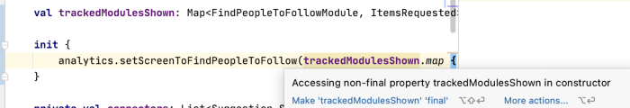
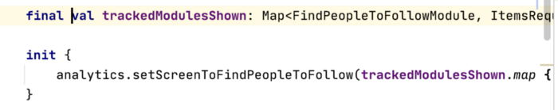
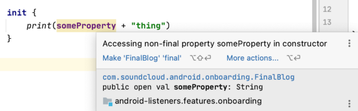
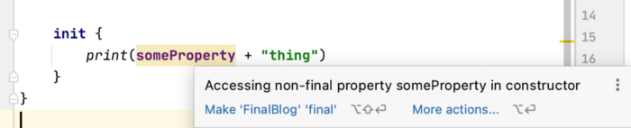

# The Kotlin modifier that shouldn't be there

> 이 글은 Danny Preussler의 [The Kotlin modifier that shouldn't be there](https://proandroiddev.com/the-modifier-that-shouldnt-be-there-77ff941f0529)을 번역 하였다. 

대부분의 Kotlin개발자들은 `val`이 JAVA의 `final`과 동일하다고 생각 할 것 이다. 하지만 이는 완전히 그렇지 아니하며, 때로 `final val`이 되어야 한다고 하면 어떻게 될까? 

JAVA와는 반대로 Kotlin에서 명시적으로 `open`키워드를 사용하지 않는 한 `final`속성이다. 이것은 `final`키워드가 사실상 필요하지 않음을 의미 한다. 

하지만 그럼에도, Android Studio에서는 `final`키워드를 `val`에 추가하라고 할 때가 있다. 아래의 예제를 보면 그렇다.



이 경우 `val trackedModulesShown`속성에 `final`키워드를 추가하면 다음과 같이 된다. 



그렇다면, 속성에 대해 `final`키워드가 추가 되었을 때 어떻게 그리고 언제 `val`을 `final`로 만들어 주는 것 일까? 

아래 간단한 예제를 통해 동작들을 확인 해 보자. 

```kotlin
class FinalBlog {
    val someProperty: String = "some"

    init {
        print(someProperty + "thing")
    }
}
```

이 예제는 문제 없이 작동하며 클래스가 인스턴스화 될 떄 코드는 "something"이라는 텍스트를 출력 한다. 

이제 `open`키워드를 추가 해 보자. 

```kotlin
open class FinalBlog {
    open val someProperty: String = "some"

    init {
        print(someProperty + "thing")
    }
}
```

이 경우 이전에 받았던 경고를 Android Studio를 통해 받게 된다. 



이에 대해 분명하게 정리해보면 클래스는 서브 클래스화 될 수 있으며 (클래스의 멤버)속성또한 재정의 될 수 있다. 하지만 이로 인하여 예기치 않은 부작용들이 발생 할 수 있다. (이 글의 끝에서 살펴보도록 하자)

위 경고는 클래스의 필드 속성에 `open`키워드를 제거 함 으로서 쉽게 수정할 수 있다. 따라서 경고의 원인이 같진 않지만 Android Studio에서 경고 한 경우와 같은 시나리오는 아니다. 여기에서 `final`을 추가 할 수 있는 방법은 없다. non open은 이미 `final`임을 의미 한다. 

이제 다른 something을 확인 해 보자. 

```kotlin
interface BlogTopic {
    val someProperty: String
}

open class FinalBlog: BlogTopic {
    override val someProperty: String = "some"

    init {
        print(someProperty + "thing")
    }
}
```

속성이 인터페이스에서 상속한 경우 기본적으로는 `open`된 상태이다. 이 경우 다시 Android Studio로부터 경고를 받게 된다. 



이 경우 `final`를 추가 하면 된다. 

```kotlin
open class FinalBlog: BlogTopic {
    final override val someProperty: String = "some"

    init {
        print(someProperty + "thing")
    }
}
```

Voila! 우리는 이제 `final val`을 사용했다. 

아마도 지금 궁금할 것이 있을 것 이다. 최초의 예제 코드에서 `val`속성은 방금 예제 처럼 (interface를 상속한)재정의 된 값이 아니다. 그리고 사실 이 (`FinalBlog`)클래스는 `open`한다고 선언하지 않았었다. 

이 미스터리에 대한 간단한 해결방법이 있다. 

```kotlin
@OpenForTesting
class FindPeopleToFollowViewModel
```

이 것은 테스트를 하기 위해 [Kotlin 컴파일러 플러그인](https://kotlinlang.org/docs/reference/compiler-plugins.html#all-open-compiler-plugin)을 이용하여 (어노테이션을 추가 한)클래스를 open할 수 있게 해 주어 mock을 이용한 테스트를 할 수 있도록 해준다. 그러나 이것은 이 클래스를 `open`하고 테스트 하는 것과 무관하게 모든 클래스 필드를 `open`해 준다. 그리고 이것이 실제로 `open`되는 `val`를 확인한 방법 이기도 하다. 

이 작은 여행이 즐거웠기를 바라며, 컴파일 플러그인도 사용한다면, 대신 Mockito의 사용도 고려해볼 수 있다. 또는 더 낳은 방법은 더 적은 수의 mock을 사용하는 것 이다. 그러면 처음부터 아예 필요하지 않을 것 이다. (이 때 TDD가 도움이 될 것 이다)

## Aftermath 

위의 예제를 다시 보자. 

```kotlin
open class FinalBlog: BlogTopic {
    override val someProperty: String = "some"

    init {
        print(someProperty + "thing")
    }
}
```

이제 이 클래스를 확장 해 보자. 

```kotlin
class ChildBlog: FinalBlog() {
    override val someProperty = "another "
}
```

이 클래스를 초기화 하면 무엇을 출력 할 까? 

"something" 아니면 "anothing thing"?

사실은, 이 코드는 "nullthing"을 출력 한다!

이것은 Android Studio에서의 경고가 말하는 바 이다. 이 문제를 해결 하기 위하여 바이트 코드를 살펴 보도록 하자. ("show Kotlin bytecode"를 사용하여 "decompile"을 선택해 Java형식으로 읽으면 된다)

```java
public class FinalBlog implements BlogTopic {
   @NotNull
   private final String someProperty = "some";
   @NotNull
   public String getSomeProperty() {
      return this.someProperty;
   }
   
   // ...
```

Kotlin의 속성은 getter이면서 내용을 가진 필드 이기도 하다. 

자식 클래스(`ChildBlog`)를 보면 아래와 같다. 

```java
public final class ChildBlog extends FinalBlog {
   @NotNull
   private final String someProperty = "another ";

   @NotNull
   public String getSomeProperty() {
      return this.someProperty;
   }
}
```

여기에서 문제는 부모클래스의 생성자 값에 접근하려고 한다는 것 이다. getter가 재정의 되면 자식 클래스의 필드를 호출 한다. 그러나 여전히 super생성자 내부에서 멤버 호출이 존재 하고 있으며 자식의 필드는 아직 초기화 되지 않았다. 그렇기 떄문에 값은 `null`이 된다. (non-null으로 선언된 필드에 경우에 한해)

그러나 아래처럼 구현한다면,

```kotlin
class ChildBlog: FinalBlog() {
    override val someProperty
        get() = "another "
}
```

이는 문제 없이 동작한다. 결국, 생성자에서는 `final` 필드가 아닌 필드에 접근 하려 하지 말자. 

그리고 Android Sudio의 경고를 항상 주시하도록 하자. 이는 크게 도움이 될 것 이다. 