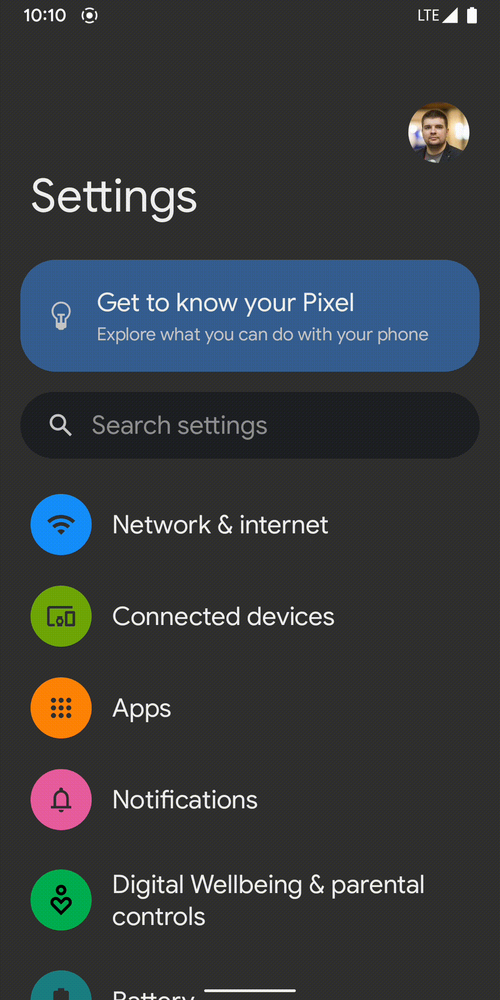
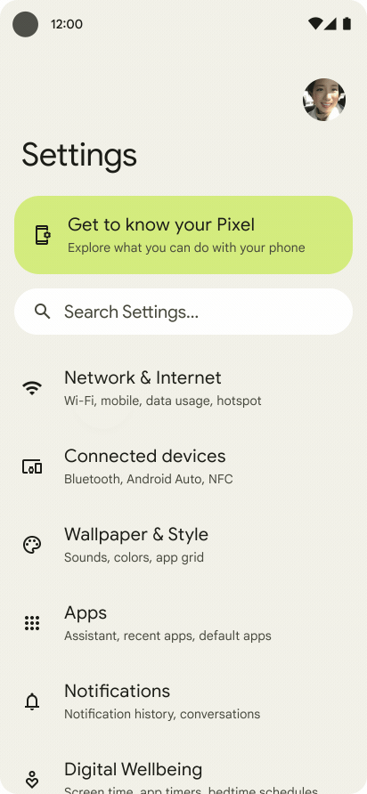
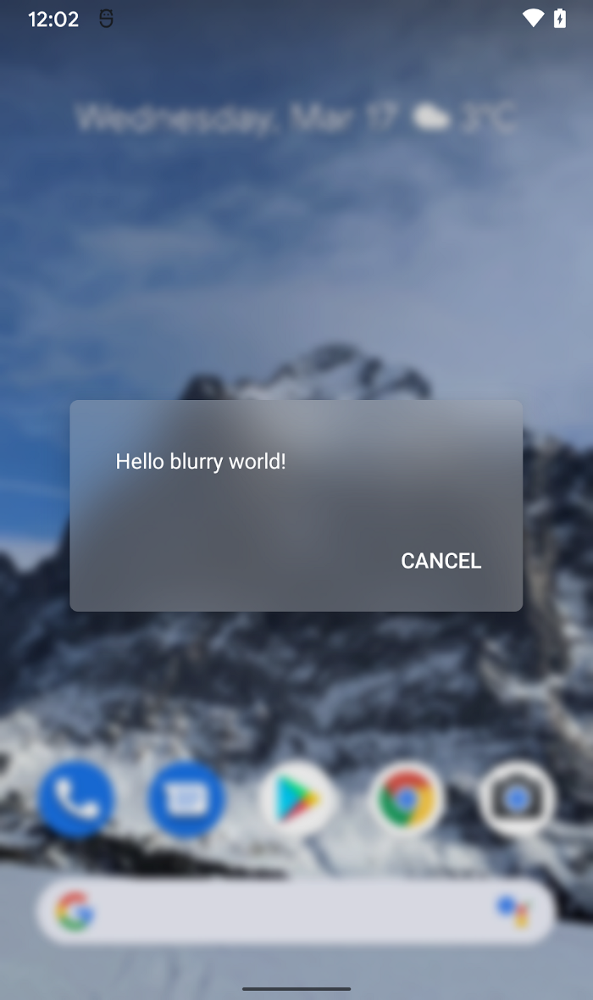
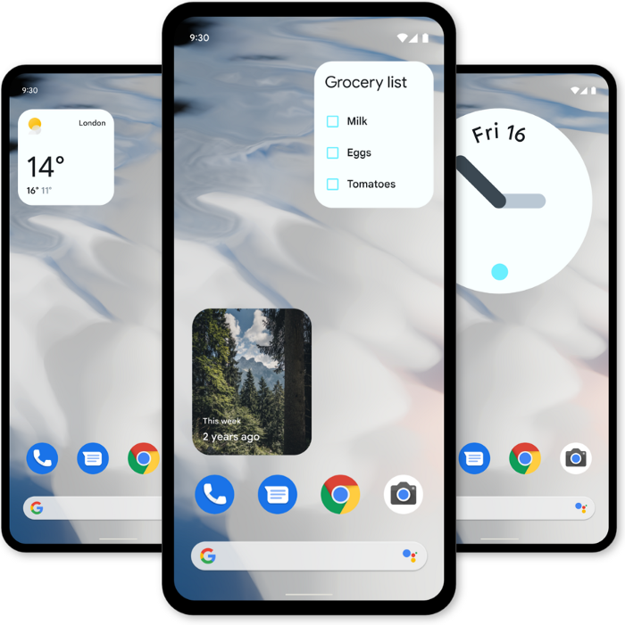
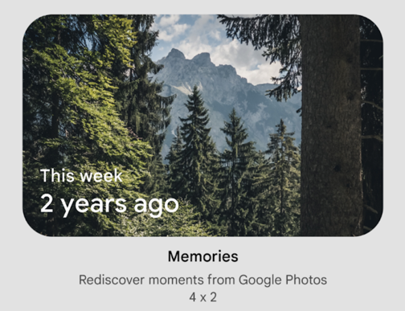
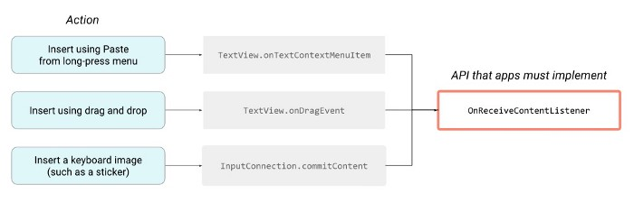
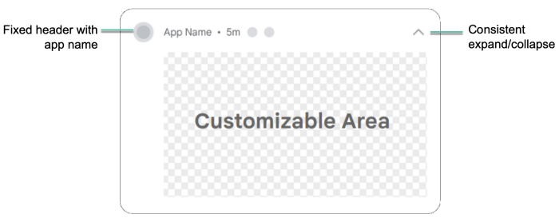
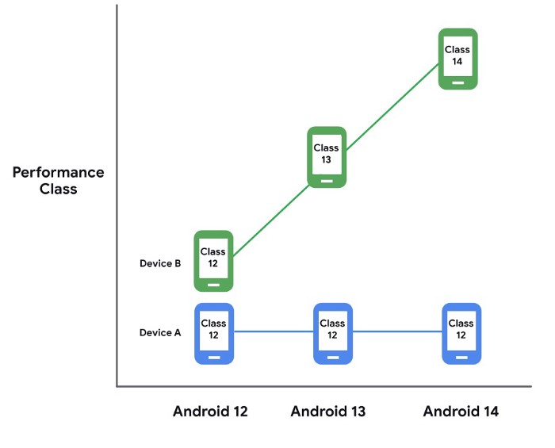
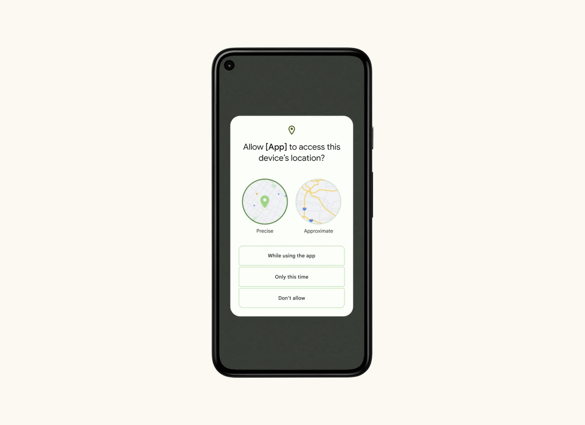

# Android 12 review for developers

> 이 글은 Kirill Rozov의 [Android 12 review for developers](https://proandroiddev.com/review-of-android-12-for-developers-ea3ce9247e0)을 번역 하였다. 


Google I/O'21이 열리고 난 뒤 새로운 Android의 버전에 대해 배울 수 있었으며, 그로 인해 Pixel혹은 GSI이미지를 통해 다른 기기에서도 Beta1 을 설치 하여 새로운 버전에 대해 확인해 볼 수 있었다.

이 새로운 버전 릴리즈에서 중요한 포인트는 OS에 와 데이터 프라이버시 향상을 통한 보안성 향상과 시스템의 재 설계가 있다. 그들은 이 버전을 통해 새로운 미디어 표준을 지금도 훌륭하게 지원하고 있으며, 플래그십 장치나 구형, 저가형 스마트폰에서 겪게 될 고난을 최소화 하게 해 주었다. 그리고 첫번째 버전을 통해 유저들의 요청에 따라 앱 위젯이 개선 되었다. 

## Design 

### New Material You design 

- [Youtube - #Android12: Designed for you](https://www.youtube.com/watch?v=UHQPdP8qgrk)

Google은 색상 팔레트를 개인화하는 데 중점을 둔 새로운 버전인 Material Design을 공개 했다. 예를 들어 Pixel스마트폰 기기의 색상은 배경으로 사용된 이미지를 기반으로 결정 된다. Android12의 두번째 베타 버전에서는 이를 완벽하게 경험해 볼 수 있다. 

그럼 다음과 같은 질문이 생길 수 있다. "(스마트폰 기기)공급업체가 펌웨어에서 Material You를 어떻게 적용할 것 인가?" 이다. 이 색상 개념은 순수한 Android에 남아 있고 공급 업체와 타사의 응용 프로그램들은 이런 디자인 개념을 무시하고 자신들의 아이디어를 사용할 가능성이 있다. Material의 전체 색상 팔레트는 앱의 브랜드 색상을 기반으로 하며 이는 이제 사용자 정의가 가능해야 한다. 이는 앱 인터페이스 디자이너가 새로운 디자인을 어떻게 조정하는지에 따라 다르다. 

### Standard Splash Screen for all msv apps

```xml
<item name="android:windowSplashScreenBackground">@color/...</item>
<item name="android:windowSplashScreenAnimatableIcon">@drawable/...</item>
<item name="android:windowSplashScreenIconBackground">@color/...</item>
<item name="android:windowSplashScreenBrandingImage">@drawable/...</item>
```

## Updating UI effects

### Ripple effect



디자인의 업데이트는 UI시스템의 여러 측면에 대해 영향을 미쳤으며 이로 인한 Ripple effect또한 업데이트 되었다. 이제 가장자리에 "white noise"효과가 추가되었다. 

### Overscroll 



리스트의 경계에 도달할 때 새로운 효과는 Android 12에서 기본적으로 사용할 수 있게 되었다. 오버 스크롤은 iOS의 효과를 겪었던 사람들에게 매우 친숙할 것 이다. 

### RenderEffect API



RenderEffect는 Blur, Color filter및 기타 그래픽 효과를 이제 훨씬 더 쉽고 효율적으로 적용할 수 있는 새로운 API이다. 이제 단 한줄의 API로 Blur효과등을 쉽게 적용할 수 있다. 

```kotlin
// RenderEffect 효과는 아무 뷰 에나 적용할 수 있다. 
view.setRenderEffect(
    RenderEffect.createBlurEffect(radiusX, radiusY, SHADER_TILE_MODE)
)

// 블러 효과를 윈도우 백그라운드에 코드로 적용 할 수 있다. 
Window.setBackgroundBlurRadius(radius: Int)

// 테마에서도 백그라운드 블러를 정의 할 수 있다. 
<style name="AppTheme">
    <item name="android:windowBackgroundBlurRadius">15dp</item>
</style>
```

### Widgets

Android12에서는 위젯 API가 크게 개편되었다. iOS14에서 위젯에 대한 기능들이 등장하면서 Google은 이 API에 대해 개발자 불만사항에 주의를 기울이고 있는듯 하다. 이제 위젯은 아래처럼 표시된다. 



- Android12 버전 이상에서의 모든 위젯은 배경에 둥근 모서리가 생긴다. 
- 위젯은 Material You에 새로 추가된 테마의 동적 색성을 적용할 수 있다. 
- 초기 위젯 설정은 선택 사항이며 이를 건너 뛸 수 도 있다. 
- CheckBox, Switch 및 RadioButton지원이 추가 된다. 토글 스위치들을 통한 설정이 있는 다양한 위젯을 구성할 수 있게 된다. 
  ```xml
  <appwidget-provider
      ...
      android:targetCellWidth="3"
      android:targetCellHeight="2"
      android:maxResizeWidth="250dp"
      android:maxResizeHeight="110dp"
  />
  ```
- 이제 위젯 미리보기에 정적 이미지를 넣을 수 있을 뿐 아니라 xml으로 UI를 레이아웃화 하고 설명을 추가 할 수도 있다. 

  ```xml
  <appwidget-provider
      ...
      android:previewLayout="@layout/my_widget_preview"
      android:description="@string/my_widget_des"
  />
  ```
  
- 위젯을 클릭하여 앱을 열 때 애니메이션이 추가 된다. 이 애니메이션은 위젯의 배경이 Activity의 배경으로 전환 된다. 
- 위젯의 작업 목록을 위해 API는 더 단순화 되었다. 
- Android12 이전 및 이후 버전들의 위젯에 대해 훌륭햔 역 호환성 가이드를 제공 한다. 

그리고 이전 버전의 Android를 지원하는 `Compose`와 유사한 DSL스타일로 위젯을 작성하기 위한 라이브러리도 제공 받을 수 있을 것이다. 이것은 `View`계층으로 변환될 특별한 DSL이 될 것 이지만, Compose스타일이 시스템의 기존 기능에도 구현될 것 이라는 점에 만족스러울 것 이다. 

### Rounded Corner API

Rounded Corner API를 이용하여 둥근 디스플레이에 대한 정보를 얻고 컨텐츠가 잘리지 않도록 안전하게 배치할 수 있다. 반올림에 대한 정보를 기반으로 컨텐츠를 상쇄하기 위해 Google에서 제공하는 아래 예제는 이제 최소한 옵션이 추가 된 것 이다. 

```java
// Get the top-right rounded corner from WindowInsets.
final WindowInsets insets = getRootWindowInsets();
final RoundedCorner topRight = insets.getRoundedCorner(POSITION_TOP_RIGHT);
if (topRight == null) return;

// Get the location of the close button in window coordinates.
int[] location = new int[2];
closeButton.getLocationInWindow(location);
final int buttonRightInWindow = location[0] + closeButton.getWidth();
final int buttonTopWindow = location[1];

// Find the point on the quater circle with a 45 degree angle. 
final int offset = (int)(topRight.getRadius() * Math.sin(Math.toRadians(45)));
final int topBoundary = topRight.getCenter().y - offset;
final int rightBoundary = topRight.getCenter().x + offset;

// Check whether the close button exceeds the boundary.
if (buttonRightInWindow < rightBoundary && buttonTopInWindow > topBoundary) return;

// Set the margin to avoid truncating. 
int[] parentLocation = new int[2];
getLocationInWindow(parentLocation);
FrameLayout.LayoutParams lp = (FrameLayout.LayoutParams) closeButton.getLayoutParam;
lp.rightMargin = Math.max(buttonRightInWindow - rightBoundary, 0);
lp.topMargin = Math.max(topBoundary - buttonTopInWindow, 0);
closeButton.setLayoutParam(lp);
```

### Rich Content Insertion

서로 다른 응용프로그램간 컨텐츠를 공유 하는 것 은 모든 시스템에서의 중요한 기능중 하나 이다. Google은 이제 drag & drop, 키보드의 이미지 및 클립보드를 통한 컨텐츠 삽입등을 위해 하나의 API인 Rich Content Insertion을 제공 한다. 또한 Compat API `OnReceiveContentListener`는 이미 Jetpack Core 1.5.0에 Stable상태로 추가 되었다. 



### Notifications

Android의 업데이트는 노티피케이션의 정밀 검사도 다루었었다. 이에 대해 템플릿이 다시 변경 되었고 몇가지 새로운 기능들이 추가 되었다. 

- MessageStyle및 BigPictureStyle에서 애니메이션을 추가 할 수 있게 되었다. 
- 인텐트를 보내기 전 필수 사용자 인증을 요구할 수 있다. 
- 수신, 발신 및 진행중인 통화에 대해 다양한 스타일을 생성할 수 있는 새로운 통화 알림 스탕리인 CallStyle을 이용하여 통화의 중요도를 설정할 수 있다. 
- 사용자 정의 View에 할당된 노티피케이션 영역은 이제 더 줄어들것 이다. 




스프링보드는 노티피케이션을 클릭 하면 Activity이 시작되는 경우이지만 직접 수행하지는 않는다. 예를 들면, 먼저 BroadcastReceiver를 통해 Activity가 시작 될 것 이다. 하지만 이방법은 성능과 UX를 개선하기 위해 금지 된다. 이제는 노티피케이션에서 직접 Acitivty를 직접 열어야 한다. 그렇지 않다면 아무일도 일어나지 않으며 로그는 아래와 같은 메시지를 보게 될 것 이다. 

```
Indirect notification activty start (trampoline) from PACKAGE_NAME, \ this shoud be avoided for performance reasons.
```

## Media

### AVIF support

AV1형식의 이미지 또는 AVIF파일을 지원한다. 이 형식은 비디오에서 가져온 것 으로 압축을 최대한 적용 하고 JPG와 동일한 크기로 더 높은 이미지 품질과 디테일을 제공 한다. 

### Compatible Media Transcoding

Android12에서는 모든 앱에서 최신 비디오 형식을 재생할 수 있는 기능이 추가 된다. Android는 HEVC(H.265)를 AVC(H.264)로, HDR10을 SDR로 변환할 수 있게 된다. 이 경우 최신 형식에 대한 지원을 정의한 xml을 만든다음 앱 리소스에 추가한 뒤 AndroidManifest에 링크를 추가 해 주어야 한다. 

```xml
<?xml version="1.0" encoding="utf-8"?>
<media-capabilities xmlns:android="http://schemas.android.com/apk/res/android">
    <format android:name="HEVC" supported="true"/>
    <format android:name="HDR10" supported="false"/>
    <format android:name="HDR10Plus" supported="false"/>
</media-capabilities>

<property
    anroid:name="android.media.PROPERTY_MEDIA_CAPABILITIES"
    android:resource="@xml/media_capabilities"
/>
```

이 새로운 기능을 통해 장치에서 최신 형식의 비디오를 만들고 자동으로 변환하여 컨텐츠를 앱에서 사용하는데 문제가 발생하지 않게 할 수 있게 된다. 

비디오 변환속도는 빠르다. 1080p의 1분에 초당 30프레임의 비디오는 Pixel4에서 9초만에 변환 된다. Pixel4에서 플래그십 Snapdragon 845프로세서와 6GB RAM이 있음을 생각 해보면 이 보다 나쁜 기기에서는 변환 속도가 늘리 수는 있다. 

### Performance Class



Android 12부터 새로운 성능 등급 표준이 제공된다. Android버전에 필요한 최소 기능인 장치 기능 세트를 말한다. 개발자는 이제 이 성능 등급을 확인하고 설정을 변경하여 사용자 기기에 최상의 사용자 경험을 제공할 수 있게 된다. 

```kotlin
if (Build.VERSION.MEDIA_PERFORMANCE_CLASS >= BUild.VERSION_CODES.S) {
    // Provide the most premium experience for highest performing devices.
} 
else if (BUild.VERSION.MEDIA_PERFORMANCE_CLASS == BUild.VERSION_CODES.R) {
    // Provide a high quality experience.
}
else {
    // Remove extras to keep experience functional.
}
```

클래스12는 Android12릴리즈와 함께 게시 되며 비디오의 재생 기능, 컨텐츠 촬영 기능, 디스플레이 사양, 디스크 읽기등에 대한 요구사항들이 포함 된다. 

### Other

- 오디오 스트림을 기반으로 한 진동 피드백을 생성할 수 있게 된다. 이는 게임과 같은 서비스에 매우 유용할 것 이다.
- 고해상도 카메라를 사용할 수 있는 기능이 추가 되어 108메가 픽셀 및 기타 거대한 픽셀 크기들을 캡쳐할 수 있게 된다. 
- 실행중인 앱 간에 오디오 전환시 불륨이 일시 중단 되는 대신 페이드처리 된다. 
- Camera2 API에서는 이제 CameraX확장과 유사한 특수 모드를 사용할 수 있는 확장들이 포함 된다. 

## Security and Privacy

### Approximate location



