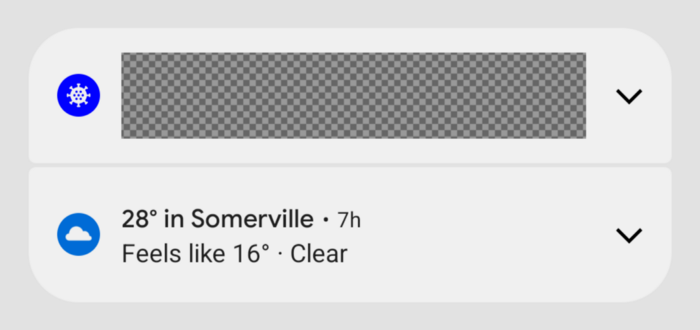
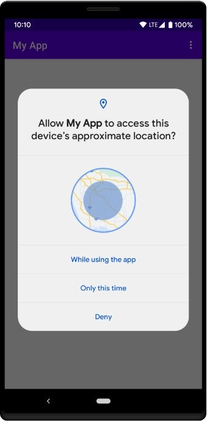
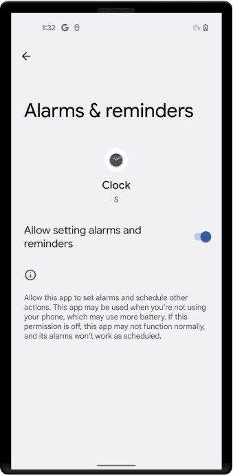
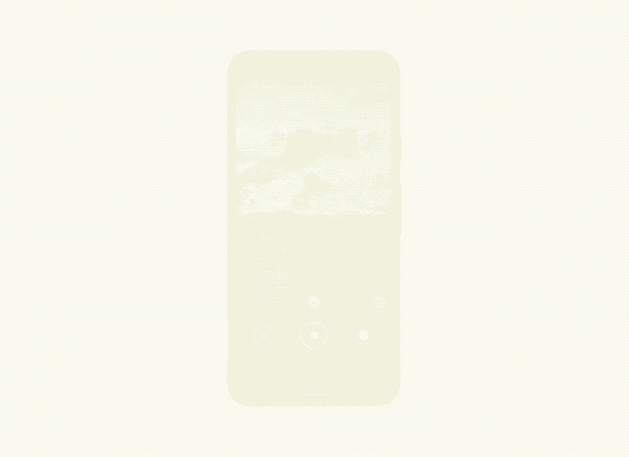

# Android 12 review for developers

> 이 글은 Kirill Rozov의 [Android 12 review for developers](https://proandroiddev.com/review-of-android-12-for-developers-ea3ce9247e0)을 번역 하였다. 


Google I/O'21이 열리고 난 뒤 새로운 Android의 버전에 대해 배울 수 있었으며, 그로 인해 Pixel혹은 GSI이미지를 통해 다른 기기에서도 Beta1 을 설치 하여 새로운 버전에 대해 확인해 볼 수 있었다.

이 새로운 버전 릴리즈에서 중요한 포인트는 OS에 와 데이터 프라이버시 향상을 통한 보안성 향상과 시스템의 재 설계가 있다. 그들은 이 버전을 통해 새로운 미디어 표준을 지금도 훌륭하게 지원하고 있으며, 플래그십 장치나 구형, 저가형 스마트폰에서 겪게 될 고난을 최소화 하게 해 주었다. 그리고 첫번째 버전을 통해 유저들의 요청에 따라 앱 위젯이 개선 되었다. 

## Design 

### New Material You design 

- [Youtube - #Android12: Designed for you](https://www.youtube.com/watch?v=UHQPdP8qgrk)

Google은 색상 팔레트를 개인화하는 데 중점을 둔 새로운 버전인 Material Design을 공개 했다. 예를 들어 Pixel스마트폰 기기의 색상은 배경으로 사용된 이미지를 기반으로 결정 된다. Android12의 두번째 베타 버전에서는 이를 완벽하게 경험해 볼 수 있다. 

그럼 다음과 같은 질문이 생길 수 있다. "(스마트폰 기기)공급업체가 펌웨어에서 Material You를 어떻게 적용할 것 인가?" 이다. 이 색상 개념은 순수한 Android에 남아 있고 공급 업체와 타사의 응용 프로그램들은 이런 디자인 개념을 무시하고 자신들의 아이디어를 사용할 가능성이 있다. Material의 전체 색상 팔레트는 앱의 브랜드 색상을 기반으로 하며 이는 이제 사용자 정의가 가능해야 한다. 이는 앱 인터페이스 디자이너가 새로운 디자인을 어떻게 조정하는지에 따라 다르다. 

### Standard Splash Screen for all msv apps

```xml
<item name="android:windowSplashScreenBackground">@color/...</item>
<item name="android:windowSplashScreenAnimatableIcon">@drawable/...</item>
<item name="android:windowSplashScreenIconBackground">@color/...</item>
<item name="android:windowSplashScreenBrandingImage">@drawable/...</item>
```

## Updating UI effects

### Ripple effect


디자인의 업데이트는 UI시스템의 여러 측면에 대해 영향을 미쳤으며 이로 인한 Ripple effect또한 업데이트 되었다. 이제 가장자리에 "white noise"효과가 추가되었다. 

### Overscroll 


리스트의 경계에 도달할 때 새로운 효과는 Android 12에서 기본적으로 사용할 수 있게 되었다. 오버 스크롤은 iOS의 효과를 겪었던 사람들에게 매우 친숙할 것 이다. 

### RenderEffect API


RenderEffect는 Blur, Color filter및 기타 그래픽 효과를 이제 훨씬 더 쉽고 효율적으로 적용할 수 있는 새로운 API이다. 이제 단 한줄의 API로 Blur효과등을 쉽게 적용할 수 있다. 

```kotlin
// RenderEffect 효과는 아무 뷰 에나 적용할 수 있다. 
view.setRenderEffect(
    RenderEffect.createBlurEffect(radiusX, radiusY, SHADER_TILE_MODE)
)

// 블러 효과를 윈도우 백그라운드에 코드로 적용 할 수 있다. 
Window.setBackgroundBlurRadius(radius: Int)

// 테마에서도 백그라운드 블러를 정의 할 수 있다. 
<style name="AppTheme">
    <item name="android:windowBackgroundBlurRadius">15dp</item>
</style>
```

### Widgets

Android12에서는 위젯 API가 크게 개편되었다. iOS14에서 위젯에 대한 기능들이 등장하면서 Google은 이 API에 대해 개발자 불만사항에 주의를 기울이고 있는듯 하다. 이제 위젯은 아래처럼 표시된다. 


- Android12 버전 이상에서의 모든 위젯은 배경에 둥근 모서리가 생긴다. 
- 위젯은 Material You에 새로 추가된 테마의 동적 색성을 적용할 수 있다. 
- 초기 위젯 설정은 선택 사항이며 이를 건너 뛸 수 도 있다. 
- CheckBox, Switch 및 RadioButton지원이 추가 된다. 토글 스위치들을 통한 설정이 있는 다양한 위젯을 구성할 수 있게 된다. 
  ```xml
  <appwidget-provider
      ...
      android:targetCellWidth="3"
      android:targetCellHeight="2"
      android:maxResizeWidth="250dp"
      android:maxResizeHeight="110dp"
  />
  ```
- 이제 위젯 미리보기에 정적 이미지를 넣을 수 있을 뿐 아니라 xml으로 UI를 레이아웃화 하고 설명을 추가 할 수도 있다. 

  ```xml
  <appwidget-provider
      ...
      android:previewLayout="@layout/my_widget_preview"
      android:description="@string/my_widget_des"
  />
  ```
  
- 위젯을 클릭하여 앱을 열 때 애니메이션이 추가 된다. 이 애니메이션은 위젯의 배경이 Activity의 배경으로 전환 된다. 
- 위젯의 작업 목록을 위해 API는 더 단순화 되었다. 
- Android12 이전 및 이후 버전들의 위젯에 대해 훌륭햔 역 호환성 가이드를 제공 한다. 

그리고 이전 버전의 Android를 지원하는 `Compose`와 유사한 DSL스타일로 위젯을 작성하기 위한 라이브러리도 제공 받을 수 있을 것이다. 이것은 `View`계층으로 변환될 특별한 DSL이 될 것 이지만, Compose스타일이 시스템의 기존 기능에도 구현될 것 이라는 점에 만족스러울 것 이다. 

### Rounded Corner API

Rounded Corner API를 이용하여 둥근 디스플레이에 대한 정보를 얻고 컨텐츠가 잘리지 않도록 안전하게 배치할 수 있다. 반올림에 대한 정보를 기반으로 컨텐츠를 상쇄하기 위해 Google에서 제공하는 아래 예제는 이제 최소한 옵션이 추가 된 것 이다. 

```java
// Get the top-right rounded corner from WindowInsets.
final WindowInsets insets = getRootWindowInsets();
final RoundedCorner topRight = insets.getRoundedCorner(POSITION_TOP_RIGHT);
if (topRight == null) return;

// Get the location of the close button in window coordinates.
int[] location = new int[2];
closeButton.getLocationInWindow(location);
final int buttonRightInWindow = location[0] + closeButton.getWidth();
final int buttonTopWindow = location[1];

// Find the point on the quater circle with a 45 degree angle. 
final int offset = (int)(topRight.getRadius() * Math.sin(Math.toRadians(45)));
final int topBoundary = topRight.getCenter().y - offset;
final int rightBoundary = topRight.getCenter().x + offset;

// Check whether the close button exceeds the boundary.
if (buttonRightInWindow < rightBoundary && buttonTopInWindow > topBoundary) return;

// Set the margin to avoid truncating. 
int[] parentLocation = new int[2];
getLocationInWindow(parentLocation);
FrameLayout.LayoutParams lp = (FrameLayout.LayoutParams) closeButton.getLayoutParam;
lp.rightMargin = Math.max(buttonRightInWindow - rightBoundary, 0);
lp.topMargin = Math.max(topBoundary - buttonTopInWindow, 0);
closeButton.setLayoutParam(lp);
```

### Rich Content Insertion

서로 다른 응용프로그램간 컨텐츠를 공유 하는 것 은 모든 시스템에서의 중요한 기능중 하나 이다. Google은 이제 drag & drop, 키보드의 이미지 및 클립보드를 통한 컨텐츠 삽입등을 위해 하나의 API인 Rich Content Insertion을 제공 한다. 또한 Compat API `OnReceiveContentListener`는 이미 Jetpack Core 1.5.0에 Stable상태로 추가 되었다. 


### Notifications

Android의 업데이트는 노티피케이션의 정밀 검사도 다루었었다. 이에 대해 템플릿이 다시 변경 되었고 몇가지 새로운 기능들이 추가 되었다. 

- MessageStyle및 BigPictureStyle에서 애니메이션을 추가 할 수 있게 되었다. 
- 인텐트를 보내기 전 필수 사용자 인증을 요구할 수 있다. 
- 수신, 발신 및 진행중인 통화에 대해 다양한 스타일을 생성할 수 있는 새로운 통화 알림 스탕리인 CallStyle을 이용하여 통화의 중요도를 설정할 수 있다. 
- 사용자 정의 View에 할당된 노티피케이션 영역은 이제 더 줄어들것 이다. 




스프링보드는 노티피케이션을 클릭 하면 Activity이 시작되는 경우이지만 직접 수행하지는 않는다. 예를 들면, 먼저 BroadcastReceiver를 통해 Activity가 시작 될 것 이다. 하지만 이방법은 성능과 UX를 개선하기 위해 금지 된다. 이제는 노티피케이션에서 직접 Acitivty를 직접 열어야 한다. 그렇지 않다면 아무일도 일어나지 않으며 로그는 아래와 같은 메시지를 보게 될 것 이다. 

```
Indirect notification activty start (trampoline) from PACKAGE_NAME, \ this shoud be avoided for performance reasons.
```

## Media

### AVIF support

AV1형식의 이미지 또는 AVIF파일을 지원한다. 이 형식은 비디오에서 가져온 것 으로 압축을 최대한 적용 하고 JPG와 동일한 크기로 더 높은 이미지 품질과 디테일을 제공 한다. 

### Compatible Media Transcoding

Android12에서는 모든 앱에서 최신 비디오 형식을 재생할 수 있는 기능이 추가 된다. Android는 HEVC(H.265)를 AVC(H.264)로, HDR10을 SDR로 변환할 수 있게 된다. 이 경우 최신 형식에 대한 지원을 정의한 xml을 만든다음 앱 리소스에 추가한 뒤 AndroidManifest에 링크를 추가 해 주어야 한다. 

```xml
<?xml version="1.0" encoding="utf-8"?>
<media-capabilities xmlns:android="http://schemas.android.com/apk/res/android">
    <format android:name="HEVC" supported="true"/>
    <format android:name="HDR10" supported="false"/>
    <format android:name="HDR10Plus" supported="false"/>
</media-capabilities>

<property
    anroid:name="android.media.PROPERTY_MEDIA_CAPABILITIES"
    android:resource="@xml/media_capabilities"
/>
```

이 새로운 기능을 통해 장치에서 최신 형식의 비디오를 만들고 자동으로 변환하여 컨텐츠를 앱에서 사용하는데 문제가 발생하지 않게 할 수 있게 된다. 

비디오 변환속도는 빠르다. 1080p의 1분에 초당 30프레임의 비디오는 Pixel4에서 9초만에 변환 된다. Pixel4에서 플래그십 Snapdragon 845프로세서와 6GB RAM이 있음을 생각 해보면 이 보다 나쁜 기기에서는 변환 속도가 늘리 수는 있다. 

### Performance Class


Android 12부터 새로운 성능 등급 표준이 제공된다. Android버전에 필요한 최소 기능인 장치 기능 세트를 말한다. 개발자는 이제 이 성능 등급을 확인하고 설정을 변경하여 사용자 기기에 최상의 사용자 경험을 제공할 수 있게 된다. 

```kotlin
if (Build.VERSION.MEDIA_PERFORMANCE_CLASS >= BUild.VERSION_CODES.S) {
    // Provide the most premium experience for highest performing devices.
} 
else if (BUild.VERSION.MEDIA_PERFORMANCE_CLASS == BUild.VERSION_CODES.R) {
    // Provide a high quality experience.
}
else {
    // Remove extras to keep experience functional.
}
```

클래스12는 Android12릴리즈와 함께 게시 되며 비디오의 재생 기능, 컨텐츠 촬영 기능, 디스플레이 사양, 디스크 읽기등에 대한 요구사항들이 포함 된다. 

### Other

- 오디오 스트림을 기반으로 한 진동 피드백을 생성할 수 있게 된다. 이는 게임과 같은 서비스에 매우 유용할 것 이다.
- 고해상도 카메라를 사용할 수 있는 기능이 추가 되어 108메가 픽셀 및 기타 거대한 픽셀 크기들을 캡쳐할 수 있게 된다. 
- 실행중인 앱 간에 오디오 전환시 불륨이 일시 중단 되는 대신 페이드처리 된다. 
- Camera2 API에서는 이제 CameraX확장과 유사한 특수 모드를 사용할 수 있는 확장들이 포함 된다. 

## Security and Privacy

### Approximate location


Android11에서는 앱을 사용하는 동안 한번만 지리적 위치에 접근할 수 있는 권한을 부여 할 수 있었다. 사용자의 80%가량은 이러한 방법을 사용했었다. Google은 위치에 대한 앱 접근에 대해 사용자 제어 아이디어를 개발 중이다. Android에서는 정확하고 대략적인 위치를 요청 할 수 있으며, 이제 사용자는 이에 대해 거부할 수도 있지만 정확한 위치를 요청 할 때 마다 접근 권한을 부여할 수 있게 된다. 

정확한 위치에 대한 접근을 요청하는 앱 개발자는 코드를 변경해주어야 하므로 변경 사항에 대해서는 `targetSdk == S`인 경우에서만 작동하도록 한다.



정확한 위치가 필요하고 사용자가 이전에 대략적인 위치를 제공했었던 경우 다시 요청하게 되면 정확한 위치에 접근할 수 있는지 묻는 메시지가 보여진다. 

### Separate permission for Nearby scanning via Bluetooth

현재 버전의 Android에서 블루투스를 이용하여 주변 기기들을 스캔 하려면 위치에 대한 접근 권한을 요청했어야 했고, 이는 때때로 사용자를 혼란스럽게 할 수 있었다. 그러나 Android12에서는 이러한 권한이 `BLUETOOTH_SCAN`및 `BLUETOOTH_CONNECT`라는 새로운 권한으로 분리 된다. 

`BLUETOOTH_SCAN`은 블루투스 장치를 검색할 때의 접근시 사용 되며, `BLUETOOTH_CONNECT`는 이미 페어링 된 장치에 연결해야 할 때 사용 된다. 그리고 크롤링 기반 위치 접근이 필요한 경우에는 위치 접근에 대해 권한 요청을 하는 것 이 필수적이다. 

### Exact alarm permission



주어진 시간내에 작업을 수행하도록 하는 것 은 Android개발자에게 고통스럽게 느껴질 수 있다. 이들 각각의 셸이 고유한 방식으로 비활성화 될 수 있도록 강제 하는 자체 전원 최적화를 수행하면서 앱은 명령을 수행할 수 있어야 한다. 이제 `SCHEDULE_EXACT_ALARM`권한이 시스템에 표시되고 `AlarmManager`에서 정확하게 알람을 호출 하면 `SecurityException`이 발생하므로 정확한 알람 트리거 작업이 개선되어질 수 있게 됬다. 

새 권한은 런타임이 아니므로 사용자가 이 권한을 얻으려면 시스템 설정으로 보내야 한다. 

앱에서는 중요한 기능인 경우 새로운 유형의 알람을 사용 해야 한다. 예를 들어, 알람이나 타이머, 정확한 시간에 호출되어야 하는 기능등이 포함된 앱이 있을 수 있다. Google play에서는 이 기능을 허용하지 않을 수 있다. 

```kotlin
if (!alarmManager.canScheduleExactAlarms()) {
    startActivityForResult(
        Intent(Settings.ACTION_REQUEST_SCHEDULE_EXACT_ALARM, "package:<package_id>")
    )
}
```

### Access Tracking to Clipboard

이제 시스템은 클립보드에 대한 접근을 모니터링하고 백그라운드 앱이 클립보드에서 데이터를 가져가려고 시도 하게 되면 그에 대한 알림을 받게 된다. 다른 사람들이 나의 데이터를 모니터링하려 하는 행위를 방지하는 좋은 혁신이다. 

### Restrictions on the use of the Foreground Service

Android개발자를 혼란스럽게 할 Android12의 주요 변경사항은 몇가지 경우를 제외하고는 Foregorund Service를 더 이상 백그라운드에서 시작할 수 없다는 것 이다. 만약 서비스를 시작하게 되면 `ForegroundServiceStartNotAllowedException`이 발생하며 앱이 종료될 것 이다. 

아래와 같은 경우에 예외가 발생한다. 

- 높은 우선순위를 가진 Push
- `ACTION_BOOT_COMPLETED, ACTION_LOCKED_BOOT_COMPLETED, ACTION_MY_PACKAGE_REPLACED`에 대한 반응.
- 앱에 대해 특별한 권한 또는 역할이 있는 경우
- 앱이 배터리 최적화를 무시할 경우
- 알람 시간에 맞추어서
- 그 외 특정한 경우

`WorkManager 2.7.0`에 이미 추가된 새로운 Expedited Jobs API를 사용하는것 이 좋다. Android12이상은 JobScheduler에서 해당 API를 실행하고 이전 Android버전은 포어그라운드 서비스를 실행한다. 

```kotlin
OneTimeWorkRequestBuilder<T>().apply {
    setInputData(inputData)
    setExpedited(OutOfQuotaPolicy.RUN_AS_NON_EXPEDITED_WORK_REQUEST)
}.build()
```

Expedited job을 사용하면 앱이 짧고 중요한 작업을 수행하는 동시에 시스템이 리소스에 대한 접근들을 더 잘 제어할 수 있게 해 준다. Expedited job은 Foreground service와 JobScheduler의 일반 작업 사이의 특성이다. 

작업의 해당 시간은 짧은 몇분 정도에 해당 하며 오래 걸리게 되면 시스템은 작업을 중지할 수 있다. 

또한, Expedited job은 절전 및 잠자기 모드와 같은 절전 시스템의 관리 효과에 덜 민감하다. 

시스템에 이를 위해 충분한 리소스가 있고 이미 시작된 작업들 수가 시스템에서 설저된 제한을 초과하지 않으며 사용 가능한 RAM이 충분히 있는 경우 시스템은 Expedited job을 시작하게 된다. 이 요구사항은 다른 작업의 경우보다 훨씬 더 엄격 하다. 

### Foreground Service notifications will be shown to you with a delay 

몇 초 동안 나타났다가 사라지는 노티피케이션을 얼마나 자주 볼까? 어쩌면 자신의 코드로 하여금 그러한 알림을 만들었던 적이 있는가? 숙련된 개발자는 이 것이 어떤 작업이 신속하게 완료ㅗ 되어버려 알림이 빠르게 나타나고 사라지는 Foreground service임을 알고 있다. 

Android12에서는 Foreground service와 연결된 알림이 처음 5초동안은 표시 되지 않는다. 이 개선은 UX에 중점을 두었으며 사용자에게 좋은 평가를 받을수 있다고 생각 한다. 몰론 규칙에 예외도 있다. 예를 들어, 노티피케이션에 버튼이 있고 이를 통해 추가적인 작업을 해야 한다면 즉시 표시될 것 이다. 개발자는 `Notification.Builder.setForegroundServiceBehavior()`라는 새 API를 활용하여 노티피케이션이 즉시 표시되도록 명시할 수 있다. 

```kotlin
Notification.Builder(context)
    .setForegroundServiceBehavior(Notification.BEHAVIOR_IMMEDIATE_DISPLAY)
    .build()
```

### Microphone and camera usage indicator 



최신 버전의 Android와 iOS는 서로 아이디어를 적극적으로 차용하고 있으며 새로운 시스템 기능은 iOS와 유사하게 구현되고 있다. 앱에서 카메라나 마이크를 사용하는 경우 상태표시줄에 인디케이터가 나타나 백그라운드에서 작업을 수행할 수 없다. 또한 사용자는 언제든지 토글을 하여 모든 앱에서 카메라나 마이크에 대한 접근을 비활성화 할 수 도 있다. 

### Privacy Dashboard


Android12의 새로운 기능을 통해 사용자는 위치, 마이크 및 카메라에 대한 모든 앱의 접근 기록을 확인할 수 있다. 이 기능은 두번째 베타부터 사용할 수 있다. 

### Applications hibernation

Android 11에서는 사용하지 않는 앱에 대한 권한 자동 재설정이 구현되어 있었다. 사용자가 매우 오랜 시간(몇개월)동안 앱을 사용하지 않았다면 시스템은 앱의 권한을 재설정 하고 최대 절전 모드로 아래처럼 설정 한다. 

- 앱 캐시가 지워진다
- 앱은 백그라운드에서 작업 또는 경고를 활성화 할 수 없다
- 앱은 우선순위가 높은 FCM을 포함한 푸시 알림을 수신하지 않는다
- 앱과 첫번째 상호작용후 모든 제한이 제거되지만 필요한 작업, 알람 및 알림을 다시 생성 해야 한다. 사용자가 설정에서 앱을 강제로 중지하는 경우와 유사하다
- 예를 들어 가족 구성원간에 위치를 전송하는 것 과 같이 앱이 백그라운드에서 작업해야 하는 경우 "권한 취소 및 메모리 지우기"설정을 끄도록 사용자에게 요청할 수 있다

### Limiting the frequency of receiving data from motion sensors

기본적으로 가속도계, 자이로스코프등과 같은 다양한 센서의 데이터는 200Hz이하의 주파수에 도달한다. 이전과 같이 데이터를 수신할 수 있도록 매니페스트에서 새로운 `HIGH_SAMPLING_RATE_SENSORS`권한을 선언해야 하지만 사용자에게 요청할 필요는 없다. 

### Exported declaration for all components in Manifest

AndroidManifest의 모든 구성 요소에 대해 이제 `android:export=true|false`와 같은 값을 명시적으로 선언해야 한다. 이 값은 컴포넌트를 다른 앱에서 사용할 수 있도록 설정 한다. 기본적으로 이 속성값은 `false`이지만 컴포넌트에 대해 하나 이상의 인텐트 필터가 선언되면 값은 `true`로 설정 된다. 하지만 이 취약점은 Slack인증이 해킹되는 방식으로 해커들에 의해 불법적으로 사용되어진적 이 있다. 

만약 `targetSdk=S`이고 일부 컴포넌트에 `export`값이 설정 되지 않은 경우 앱 설치가 완료되지 않고 Logcat에 메시지가 표시 된다. 

```
Installation did not succeed.
The application could not be installed: INSTALL_FAILED_VERIFICATION_FAILURE
List of apks:
[0] '...app-debug.apk'
Installation failed due to: 'null'
```

Android Studio 2020.3.1 Arctic Fox에서는 Android Lint 검사가 포함되어 있어 이에 대해 알려준다. 그리고 컴포넌트가 포함된 타사 라이브러리를 업데이트 해야 할 수도 있다. 그렇지 않으면 manifest병합 기능을 사용하여 export값을 직접 설정해야 한다. 

## Other

Android12에서 더 많은 흥미로운 변경 사항들이 생겼지만 모든 변경사항에 대해 알려주기 어려우므로 아래를 통해 참고 하도록 하자. 

- ART는 이제 시스템에 관계 없이 업데이트 된다.
- 표준 `Build`클래스에서 칩 제조 업체와 해당 모델(세부 사항들)을 얻을 수 있는 새로운 상수가 추가 된다.
- 새로운 앱 대기 버킷이 추가 되었다. 이는 매우 엄격하고 제한적이다. 
- Bouncy Castle 암호화 알고리즘 구현이 제거 되었다
- 백업 및 데이터 복구는 로컬(무선)백업과 클라우드 백업으로 분리되었으며 이에 대한 설정들이 업데이트 되었다. 
- 이제 `PendingIntent`생성이 변경 가능여부를 명시적으로 지정하는 것 을 포함한다. 
- PIP 동작 개션 및 새로운 기능이 추가 되었다. 
- 앱이 도메인에 승인되면 웹 인텐트가 이제 앱에서 열린다. Android앱 링크를 사용하거나 앱의 시스템 설정을 열고 사용자에게 승인된 도메인에 도메인을 추가하도록 요청 하게 된다. 
- WebView에서 SameSite쿠키를 지원한다. 
- Private Compute Core는 사용자 데이터를 처리하기 위한 OS격리 환경이다. 예를 들어 인터넷에 접근할 수 없고 소스 코드가 열려 있는 Smart Reply가 있다. 
- 앱이 다른 앱을 자동으로 업데이트 하는 기능이 추가 되었다. 이전에는 Google play에서만 이 작업을 수행할 수 있었다. 

Android12 의 출시는 올해 가을로 예정 되어 있지만 그 전에 Google I/O에서 이를 확인할 수 있었으며 앞으로 릴리즈 될 베타 버전들로 확인할 수 있을 것 이다. 