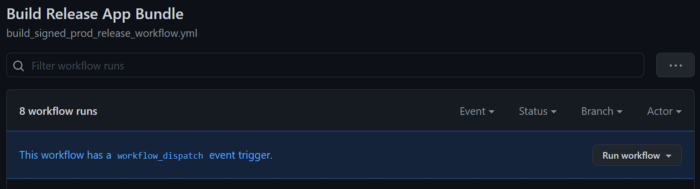
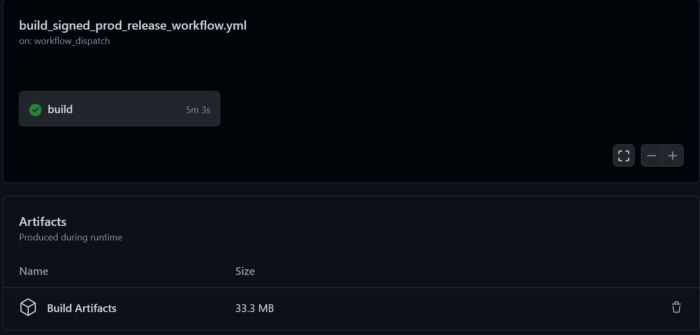

# How To Securely Build and Sign Your Android App With GitHub Actions

> 이 글은 Kennay Kermani의 [How To Securely Build and Sign Your Android App With GitHub Actions](https://proandroiddev.com/how-to-securely-build-and-sign-your-android-app-with-github-actions-ad5323452ce)을 번역 하였다. 

- KeyStore파일을 리포지터리에 업로드 하지 않고 자동화된 릴리즈앱의 사이닝을 Github Action으로 구현 해 보기

GooglePlay스토어와 같은 앱 스토어에 앱을 출시하는 작업은 일반적으로 Android개발자가 거쳐야 할 작업이다. 앱의 소유자 인지 확인 하기 위해서 앱을 업로드 하기 전에 APK(Android Application Package)또는 AAB([Android App Bundle](https://developer.android.com/guide/app-bundle))으로 디지털 서명 해 야 한다. 

앱을 서명하기 위해서는 인증서가 포함된 `.jks`(Java KeyStore)파일을 생성 해야 한다. 앱을 혼자 작업하는 경우 Android Studio에 내장 된 [`Generate Signed Bundle/APK`](https://developer.android.com/studio/publish/app-signing#sign-apk)기능을 이용하여 쉽게 키스토어 파일을 생성 할 수 있다. 

그러나 팀으로 작업하는 경우 대부분의 모든 개발자가 해당 키 저장소 및 자격 증명에 대해 접근할 수 있어야 한다. 자격 증명과 키스토어를 공유 하는 것은 보안 문제이므로 일반적으로는 키스토어를 저장소에 업로드 하고 인증서를 GitHub Secret에 저장하는 것 이다. 

이것은 개인 리포지터리에 대한 허용 가능한 절충안이 될 수 있지만 공용 리포지터리에 대해서는 (보안 문제로 인해)허용 되지 않는다. 인증서가 GitHub Secret에 저장 되어 있더라도 관련없는 사람이 키스토어에 접근하는 것 은 원하지 않기 때문이다. 

이 글에서 공유하고 싶은 해결방법은 바로 키스토어 파일을 인코딩하고 인증서와 함께 GitHub의 Secret에 저장 하는 것 이다. 

그리고 CI/CD(Continuous Integration/Continous Delivery)를 사용하여 키스토어 파일을 안전하게 디코딩 하여 릴리즈 버전의 앱에 서명하여 업로드 하는 것 이다. 

이를 위해 GitHub를 이용한 예제를 보도록 하자. 

## Table of contents

1. Gradle 설정
2. 키스토어 인코딩 
3. GitHub Workflow 설정
4. 결론 

## 1. Gradle Set-Up

실제 구현을 하기 전에 앱의 `build.gradle`에서 `sigingConfig` 설정 하여 GitHub의 환경 변수로 사용 해야 한다. 

아래의 코드 일부는 먼저 임시 GitHub Workflow폴더에서 디코딩된 키스토어 파일을 가져와 앱 폴더에 복사 한다. 

```gradle
 signingConfigs {
        release {
            def tmpFilePath = System.getProperty("user.home") + "/work/_temp/keystore/"
            def allFilesFromDir = new File(tmpFilePath).listFiles()

            if (allFilesFromDir != null) {
                def keystoreFile = allFilesFromDir.first()
                keystoreFile.renameTo("keystore/your_keystore.jks")
            }

            storeFile = file("keystore/your_keystore.jks")
            storePassword System.getenv("SIGNING_STORE_PASSWORD")
            keyAlias System.getenv("SIGNING_KEY_ALIAS")
            keyPassword System.getenv("SIGNING_KEY_PASSWORD")
        }
    }
```

이 방식을 사용하면 키스토어 파일을 해당 경로에 로컬로 두고 `.gitignore`에 추가 해서 gradle을 빌드 할 수 있다. 그 다음 줄은 환경 변수들을 릴리즈 대상으로 설정해 준다. 

## 2. Encoding the KeyStore

다음 단계로 키스토어 파일의 인코딩을 해야 한다. 이 시점에선 이미 키스토어 파일을 소유하고 있다고 가정 한다. 앱 서명에 대해 잘 모른다면 [이 문서](https://developer.android.com/studio/publish/app-signing)를 살펴보도록 하자.

인코딩의 경우 이미 많이 사용되고 있는 Base64인코딩을 사용한다. 이 예제에서의 경우 `KeyStorefile`인코딩을 통해 파일을 GitHub Secrets에 텍스트로 저장할 수 있으며 나중에 GitHub Workflow프로세스에서 원래 키스토어 파일로 디코딩 할 수 있다. 

암호화 단계에서는 [OpenSSL](https://www.openssl.org/source/)을 이용하여 쉽게 수행할 수 있다. OpenSSL을 다운로드하여 설치 한 뒤 `.jks`파일이 있는 폴더로 이동한다. 해당 폴더내에서 Unix터미널을 이용하거나, Window에서는 Git bash를 사용하여 아래 명령어를 실행 한다. 

```
openssl base64 < your_signing_keystore.jks | tr -d '\n' | tee your_signing_keystore_base64_encoded.txt
```

모든것이 올바르게 진행되었다면 키스토어파일을 나타내는 암호 텍스트가 포함된 새로 운 파일 `your_signing_keystore_base64_encoded.txt`파일이 생성된다. 

## 3. The GitHub Actions Workflow

CI/CD 파이라인을 구축하기 위해 GitHub Actions를 사용할 것 이다. 그러나 Workflow를 시작하기 전에 먼저 GitHub의 Secret을 설정 해야 한다. 

### 3.1 Set up your GitHub Secrets

이 섹션에서는 언급한 `build.gradle`파일의 식별자를 사용했다고 가정 한다. 환경 변수의 이름을 바꾼 경우 그에 따라 GitHub Secret이름을 수정 해야 한다. 

첫번째 Secret은 키스토어파일의 인코딩된 Base64이다. 그렇게 하기 위해서는 프로젝트의 GitHub Secret으로 이동하여 `KEYSTORE`라는 새 GitHub Secret을 추가 한다. 

그리고 `your_signing_keystore_base64_encoded.txt`파일에서 내용을 복사 하여 새로운 Secret의 값(value)필드에 추가 한다. 

다음으로 `SIGNING_STORE_PASSWORD`라는 Secret을 만들고 키스토어 암호를 저장 한다. 

그런 다음, `SIGNING_KEY_PASSWORD`라는 키 비밀번호를 저장 한다. 

마지막으로 추가 하는 Secret은 `SIGNING_KEY_ALIAS`이며 앱의 alias를 저장 한다. 

### 3.2 The Workflow 

이제 Secret을 설정하였으므로 실제 Workflow를 진행할 수 있다. 

나중에 Workflow를 수동으로 트리거 할 수 있기를 원하므로 `on: workflow_dispatch`로 설정 한다. 

```
name: Build Release App Bundle

on: workflow_dispatch
```

인코딩된 키스토어파일을 디코딩 하기 위해 Tim Heuer의 [Base64-to-file Github Action](https://github.com/timheuer/base64-to-file)을 사용 한다. 

GitHub Action을 사용하면 GitHub의 Secret 키스토어를 참조 하는 `encodingString`매개 변수를 정의할 수 있다. `fileName`매개 변수를 사용 하여 Workflow의 임시 디렉토리에 있는 키스토어 파일의 디렉토리와 파일 이름을 설정 해 준다. 

이 글에서 첫번째 부분에서 논의 했듯이 `build.gradle`은 해당 파일을 복사 하여 키스토어로 사용 할 수 있다. 

```
jobs:
  build:
    runs-on: ubuntu-latest
    steps:
      - name: Decode Keystore
        id: decode_keystore
        uses: timheuer/base64-to-file@v1
        with:
          fileName: 'keystore/your_signing_keystore.jks'
          encodedString: ${{ secrets.KEYSTORE }}
```

다음 단계에서는 실제 번들 파일을 빌드 한다. 먼저 GitHub Action을 이용해 리포지터리를 check out한다. 이렇게 하면 Workflow가 있는 파일들에 접근할 수 있다. 

그런다음 Setup-Java GitHub Action을 사용 하여 `JDK 1.8`을 설정 한다. 

`chmod +x ./gradle`명령을 사용하여 Workflow에 대해 Gradle wrapper를 실행 가능하도록 설정 해 준다. 

`.gradlew app:bundleRelease`를 통해 실제로 앱 번들 파일을 빌드 한다. GitHub Secret을 환결 변수로 설정하는 방법에 유의 하도록 하자. 이 설정이 없으면 `build.gradle`이 정의된 환경 변수에 접근할 수 없게 된다. 

```
 - uses: actions/checkout@v2
      - name: set up JDK 1.8
        uses: actions/setup-java@v1
        with:
          java-version: 1.8
      - name: Make gradlew executable
        run: chmod +x ./gradlew
      - name: build prod
        run: ./gradlew app:bundleRelease
        env:
          SIGNING_KEY_ALIAS: ${{ secrets.SIGNING_KEY_ALIAS }}
          SIGNING_KEY_PASSWORD: ${{ secrets.SIGNING_KEY_PASSWORD }}
          SIGNING_STORE_PASSWORD: ${{ secrets.SIGNING_STORE_PASSWORD }}
```

Workflow의 마지막 단계에서 Upload Artifact GitHub Action을 사용 하여 전체 폴더를 업로드 한다. 

```
    - name: Upload
        uses: actions/upload-artifact@v2
        with:
          name: Build Artifacts
          path: app/build/outputs/
```

모두 정리된 Workflow는 아래와 같다.

```
name: Build Release App Bundle

on: workflow_dispatch

jobs:
  build:
    runs-on: ubuntu-latest
    steps:
      - name: Decode Keystore
        id: decode_keystore
        uses: timheuer/base64-to-file@v1
        with:
          fileName: 'keystore/your_signing_keystore.jks'
          encodedString: ${{ secrets.KEYSTORE }}
      - uses: actions/checkout@v2
      - name: set up JDK 1.8
        uses: actions/setup-java@v1
        with:
          java-version: 1.8
      - name: Make gradlew executable
        run: chmod +x ./gradlew
      - name: build prod
        run: ./gradlew app:bundleRelease
        env:
          SIGNING_KEY_ALIAS: ${{ secrets.SIGNING_KEY_ALIAS }}
          SIGNING_KEY_PASSWORD: ${{ secrets.SIGNING_KEY_PASSWORD }}
          SIGNING_STORE_PASSWORD: ${{ secrets.SIGNING_STORE_PASSWORD }}
      - name: Upload
        uses: actions/upload-artifact@v2
        with:
          name: Build Artifacts
          path: app/build/outputs/
```

### 3.3 The Workflow in Action

이제 Workflow를 구현하였으므로 GitHub 리포지터리의 Action탭을 이용해 접근 할 수 있다. 

탭 내부의 왼쪽에 있는 Workflow를 클릭 하면 이제 내용을 볼 수 있다.



새 릴리즈를 빌드 할 떄 마다 이제 Workflow로 실행을 하고 빌드 프로세스를 시작 할 수 있다. 

그런 다음 해당 Workflow의 맨 아래에서 빌드된 아티팩트들을 다운로드 할 수 있게 된다. 



## 4. Conclusion

이 글에서는 더이상 키스토어파일을 리포지터리에 직접 업로드 하지 않아도 되는 GitHub Workflow를 구현하는 방법에 대해 논의 하였다. 

대신 파일을 디코딩 하여 GitHub Secrets에 넣는다. Workflow내에서 이 Secret을 키스토어파일로 디코딩한 다 음 평소와 같이 앱 번들에 서명하는데 사용할 수 있게 된다. 

이 접근 방식은 공개 리포지터리를 소유하고 있는 경우에 특히 유용하다. 그러나 절충점은 키스토어파일이 일시적으로 Workflow 프로세스내 에서 원본 파일로 디코딩 된다는 점 이다. 

어찌되었든 파일에 직접 접근할 수 없기 때문에 이 절충안은 앱 전들에 서명하는 안전한 방법들 중 하나라고 생각 한다. 

몰론 설명된 접근 방식은 GitHub Workflows에서만 가능한건 아니지만 Secret을 허용한다면 문제 없이 사용할 수 있을 것 이다. 

여기까지 왔다면 이제 CI/CD프로세스를 더 좋게 개선할 수 있기를 기대 한다. 