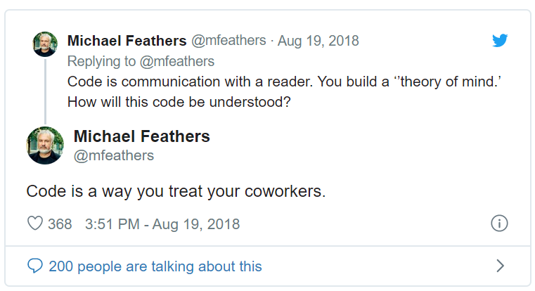
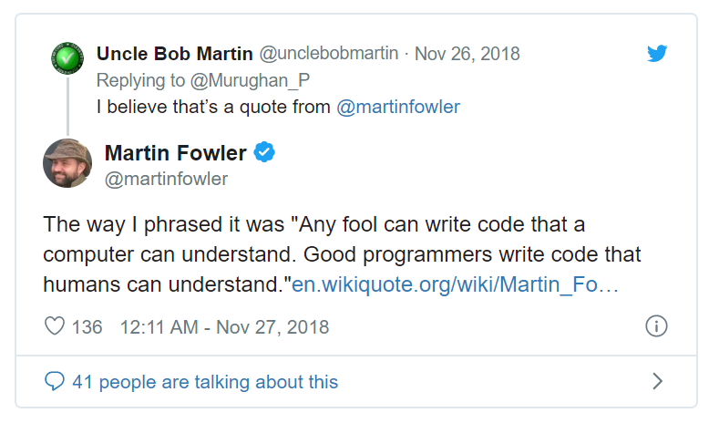
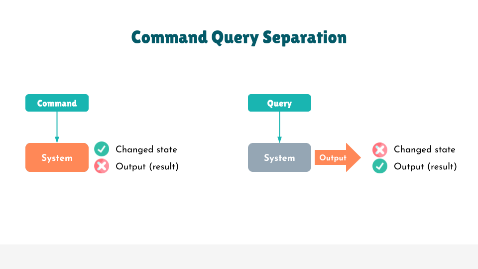
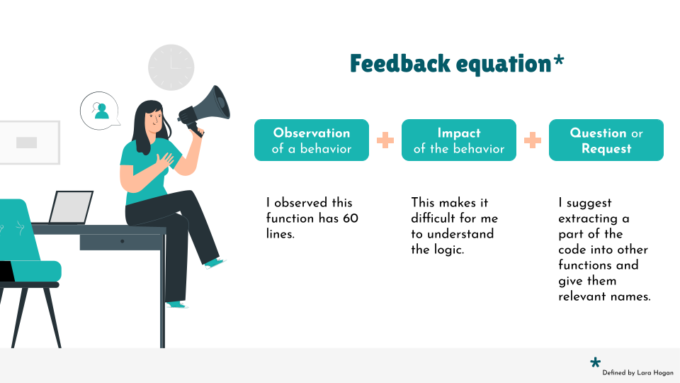

# Clean Code with Kotlin

> 이 글은 Magda Miu의 [Clean Code with Kotlin](https://magdamiu.com/2021/08/23/clean-code-with-kotlin-2/)을 번역 하였다. 

Kotlin을 사용하면 간결하고 풍부한 표현력을 가진 안전한 코드를 작성할 수 있다. 그렇다면 이는 클린 코드이지  않은가? 

이 글에서 우리는 클린 코드가 무엇인지 요약해보고 의미 있는 이름들을 정의하는 것의 중요성과 함수, 클래스를 작성하는 방법에 대해서 알아 볼 것 이다. 

그리고 불변성(Immutability)의 장점, 코틀린의 오류 핸들링 방법, 테스트 코드의 작성 모법 사례들에 대헤서도 알아 볼 것 이다. 이 글을 읽게 되면 클린 코드가 무엇을 의미하는지 더 잘 이해할 수 있게 되며, 코드에도 이를 적용할 수 있도록 그에 대한 팁과 방법들에 대해 알게 될 것 이다. 

> "코딩은 단거리 달리기가 아니라 마라톤이다." 

이제 클린 코드에 대한 기술을 같이 연습해보도록 하자. 

## What is Clean Code? 

"Clean Code"를 저술한 [Uncle Bob Martin](https://twitter.com/unclebobmartin)은 "클린 코드는 읽기 쉬어야한다. 이는 스토리와 같다"라고 한다. (가독성이 좋은 코드이어야 한다)

"Practices of the Agile Developer: Working in the Real World"를 저술한 [Venkat Subramaniam](https://twitter.com/venkat_s)은 "코드에서 명확한 의도에 대한 표현을 강조" 하며, "읽기 어려운 코드는 좋은 코드가 아니다" 라고 한다. (가독성이 떨어지는 코드는 좋은 코드가 아니다)





## How to measure if we have Clean Code? 

클린코드의 개념을 정리 했다면 이제 코드의 품질은 어떻게 측정 해야 할까? 

비공식적인 측정값은 wtfs/min이다. 만약 wtf/min이 적으면 행복한 개발자 팀이 있고, wtf/min이 많으면 행복하지 않은 개발자 팀이 있다고 가정 해보자. 여기서 wtf는 "끔찍한 기능(what a terrible feature)"을 의미한다. 

### Meaningful names

그런데 클린 코드를 작성하는 방법에 대해서는 이야기해본적이 없다. 그래서 클린 코드를 작성하는 일련의 규칙들이 존재 한다. 일단 의미있는 이름을 짓는 것 부터 시작해보자. 

코드를 작성할 때 패키지, 클래스, 함수, 변수등을 만든다. 그리고 이러한 요소들은 모두 각자의 이름을 작성해야 한다. 이름을 정하면 변수나 클래스일지라도 해당 구성 요소에 대한 의도를 정확하게 나타내야 한다. 코드에 좋은 가독성을 적용하기 위해서는 다음 세가지 질문에 답해야 한다. 

- **Why** it exists? (이것이 존재 하는 이유는 무엇인가?)
- **What** does it do? (이것은 무엇을 하는가?)
- **How** it is used? (이것은 어떻게 사용 되는가?)

|Types|Names Examples|
|---|---|
|Classes and Objects|`Customer`, `Account`, `WikiPage`|
|Methods|`postPayment`, `deleteAccount`, `displayPage`|
|Solution domain names|`AccountVisitor`|
|Problem domain names|`churnPerMonth`|

이에 대한 예제를 제공하기 위해 "unclean"한 코드 샘플(사악한 제리)와 깨끗한 코드의 샘플(천사 제리)의 두가지 유형 코드 조각이 있다. 


### Sample 1: 

```kotlin
data class GetFile(val d: String, val n: String)

val pattern = Regex("(.+)/([^/]*)")

fun files(ph: String): PathParts {
  val match = pattern.matchEntire(ph)
        ?: return PathParts("", ph)

  return PathParts(match.groupValues[1],
      match.groupValues[2])
}
```

```kotlin
data class PathParts(val directory: String, val fileName: String)

fun splitPath(path: String) =
    PathParts(
        path.substringBeforeLast('/', ""),
        path.substringAfterLast('/'))
```

### Sample 2: 

```kotlin
class Book(val title: String?, val publishYear: Int?)

fun displayBookDetails(book: Book) {
    val title = book.title
    if (title == null)
        throw IllegalArgumentException("Title required")
    val publishYear = book.publishYear
    if (publishYear == null) return

    println("$title: $publishYear")
}
```

```kotlin
class Book(val title: String?, val publishYear: Int?)

fun displayBookDetails(book: Book) {
    val title = book.title ?: 
throw IllegalArgumentException("Title required")
    val publishYear = book.publishYear ?: return

    println("$title: $publishYear")
}
```

### Sample 3:

```kotlin
users.filter{ it.job == Job.Developer }
    .map{ it.birthDate.dayOfMonth }
    .filter{ it <= 10 }
    .min()
```

```kotlin
users.filter{ user -> user.job == Job.Developer }
    .map{ developer -> developer.birthDate.dayOfMonth }
    .filter { birthDay -> birthDay <= 10 }
    .min()
```

코틀린을 사용한다면 불변성(Immutability)에 대해 더 **친화적**이라고 할 수 있다. 

- var보다 val을 사용 한다. 
- 변경 가능한 속성보다 읽기 전용 속성을 사용 한다. 
- 변경 가능한 컬렉션보다 읽기전용 컬렉션을 사용 한다. 
- `copy()`를 제공 하는 데이터클래스를 사용 한다. 

## Functions 

코틀린에서 함수를 작성할때의 규칙은 무엇이 있을까? 

- 첫번째 규칙 : 함수는 작아야 한다. 
- 두번째 규칙 : 함수는 그보다 작아야 한다. 

긴 함수를 사용하지 않는 것이 좋은 이유는 무엇일까? 긴 함수는 아래와 같은 단점들을 갖고 있다. 

- 테스트하기 더 어렵다
- 읽기 어렵다 (가독성이 떨어진다)
- 재사용성이 떨어진다
- 코드의 중복 가능성이 높다
- 코드를 변경할때 많은 문제가 생긴다
- 디버깅하기 어려워 진다 

그래서 코틀린에서는 함수를 작성할 때 다음과 같은 추가적인 규칙을 적용 한다:

- 많은 함수의 인수 => 객체로 그룹화하거나 목록을 사용 한다(동일한 유형일 경우)
- 함수는 사이드 이펙트가 없어야 한다 
- 함수의 들여쓰기 수준 => 최대 2번 들여쓰기
- if, else, while문에 한 줄의 코드가 있는 블록이 포함된다. 
- 설명이 포함된 긴 이름이 수수께끼같은 짧은 이름보다 좋다.
- 읽기 쉬어질 때 까지 코드를 변경하고 재구성 한다. 
- 명령 쿼리 분리 원칙을 적용 한다. (다음에 설명)

### Sample 1:

```kotlin
fun parseProduct(response: Response?): Product? {
    if (response == null) {
        throw ClientException("Response is null")
    }
    val code: Int = response.code()
    if (code == 200 || code == 201) {
        return mapToDTO(response.body())
    }
    if (code >= 400 && code <= 499) {
        throw ClientException("Invalid request")
    }
    if (code >= 500 && code <= 599) {
        throw ClientException("Server error")
    }
    throw ClientException("Error $code")
}
```

```kotlin
fun parseProduct(response: Response?) = when (response?.code()){
    null -> throw ClientException("Response is null")
    200, 201 -> mapToDTO(response.body())
    in 400..499 -> throw ClientException("Invalid request")
    in 500..599 -> throw ClientException("Server error")
    else -> throw ClientException("Error ${response.code()}")
}
```

### Sample 2: 

```kotlin
for (user in users) {
    if(user.subscriptions != null) {
        if (user.subscriptions.size > 0) {
            var isYoungerThan30 = user.isYoungerThan30()
            if (isYoungerThan30) {
                countUsers++
            }
        }
    }
}
```

```kotlin
var countUsersYoungerThan30WithSubscriptions = 0
for (user in users) {
    if (user.isYoungerThan30WithSubscriptions) {
        countUsersYoungerThan30WithSubscriptions++;
    }
}
```

### Command Query Separation Principle

주요 아이디어는 오브젝트의 메소드를 두 개의 분리된 범주로 나뉘어야 한다는 것 이다. 

- 쿼리 : 결과를 반환하고 시스템의 관찰 가능한 상태를 변경하지 않는다. (사이드이펙트 없음)
- 명령 : 시스템 상태를 변경하지만 값은 반환하지 않는다. 



## Classes

클래스는 작아야 한다. 단 하나의 책임과 하나의 변경 이유가 있어야 한다. 클래스가 원하는 시스템의 동작을 달성하기 위해서는 몇몇 다른 클래스와 협력해야 할 수도 있다. 

클래스 파일은 마치 신문기사 같다: 

- 이름은 간단하고 이해하기 쉬워야 한다.
- 위에서부터 높은 수준의 개념과 알고리즘이 포함된 부분이 있다. 
- 아래로 이동할수록 세부 정보가 나타난다. 
- 결국 가장 낮은 수준의 기능을 찾게 된다. 

### Cohesion 

- 응집력은 클래스/모듈의 요소가 기능적으로 관련되어 있는지에 대한 척도 이다. 
- 클래스가 응집력을 잃으면 클래스를 나누어야 한다. 

### Coupling 

- 결합력은 모듈간의 상호 의존도를 측정 하는 척도 이다. 
- 이런 분리를 통해 시스템의 각 요소들을 더 쉽게 이해할 수 있게 된다. 

> 최상의 시나리오는 높은 응집력에 느슨한 결합이다. 

높은 응집력과 느슨한 결합 외 에도 클래스를 작성할 때 다음과 같은 원칙도 따라야 한다. 

- **DRY**
  - Don't Repeat Yourself 
  - 코드 조각을 복사/붙여넣기 할 때마다 적용할 수 있다. 
  - 개발 비용을 절감하게 해준다. 
- **KISS**
  - Kepp It Simple and Stupid
  - 모든것을 수행하는 메소드를 구현할 때마다 적용 한다
  - 단순한 일은 덜 실패하게 된다 
  - 그러나 단숨함은 친숙함과 다르다. for루프는 익숙하지만 단순한 루프일 필요는 없다. 
- **SOLID**
  - SRP, OCP, LSP, ISP, DIP와 같은 규칙들을 말한다. 
  - [자세히 알고 싶다면, 기존 작성했던 이 글을 참고 한다.](https://github.com/ksu3101/TIL/blob/master/ETC/161113.md)

## Error Handling

예상치 못한 시나리오를 처리하는 방법에 대해 이야기 할 때 다음을 수행 해야 한다. 

- 사용자 정의 오류보다는 표준으로 제공 되는 오류를 사용 한다. 
- 오류 처리는 중요하지만, 코드 로직의 흐름을 흐리게 한다면 잘 못된 것 이다. 
- 코틀린에는 확인되지 않는 예외만 존재 한다. 
- 결과가 없을 경우 null또는 실패 결과를 사용 한다. 

코틀린에서는 함수가 아무것도 반환하지 않을 때 마다 `Nothing`을 사용할 수 있다. 

```kotlin
fun computeSqrt(number: Double): Double {
    if(number >= 0) {  
        return Math.sqrt(number)
    } else {  
        throw RuntimeException("No negative please")
    }
}
```

코틀린 공식 문서에 따르면 "봉인된 클래스(Sealed class)는 값이 제한된 집합의 유형 중 하나를 가질 수 있지만, 다른 유형은 가질 수 없는 제한된 클래스 계층 구조를 나타내는데 사용 된다. 어떤 의미에서는 열거형 클래스의 확장이라고 생각 할 수 있다. 열거형 유형에 대한 값 집합도 제한되지만 각 열거형 상수는 단일 인스턴스로만 존재하는 반면 봉인된 클래스의 하위 클래스에는 상태를 포함할 수 있는 여러 인스턴스가 있을 수 있다."

```kotlin
sealed class MovieSearchResult
data class MovieFound(val movie: Movie) : MovieSearchResult()
object MovieNotFound : MovieSearchResult()
object DatabaseOffline : MovieSearchResult()

fun displayMovieResult(movieResult: MovieSearchResult) {
    when(movieResult) {
        is MovieFound -> println("yey, we found the movie")
        is MovieNotFound -> TODO()
    }
}
```

```kotlin
val <T> T.exhaustive: T
    get() = this
    
fun displayMovieResult(movieResult: MovieSearchResult) {
    when(movieResult) {
        is MovieFound -> println("yey, we found the movie")
        is MovieNotFound -> TODO()
    }.exhaustive
}
```

## Testing

깔끔한 테스트 코드를 위해서는: 

- 테스트코드에 프로덕션 코드와 동일한 품질 표준을 사용하고 가독성의 중요성을 다시 상기 한다. 
- 테스트는 다음을 잘 적용하고 항상 지켜야 한다.
  - 유연성
  - 유지 보수성
  - 재사용성
  - 가독성
- 테스트의 경우에도 가독성을 높이는 동일한 도메인 언어를 사용 해야 한다. 
- 프로덕션 코드와 마찬가지로 테스트를 리팩토링해야 한다. 

테스트당 하나의 자산만 포함해야 한다:

- JUnit테스트의 모든 테스트 함수에는 단 하나의 assert문이 있어야 한다. 
- Given, When, Then 으로 이름을 적용 한다. (BDD- Behavior Driven Development)
- 가장 좋은 방법은 assert의 수를 최소화 하는 것 이다. 
- 테스트 기능당 단 하나의 개념만 테스트 한다. 

테스트에 실패하는 이유는 단 하나이어야만 한다. 

테스트를 작성할 때 다음과 같은 FIRST규칙을 준수한다. 

- Fast - 테스트는 빠르게 실행되어야 한다. 
- Independent - 테스트는 서로간에 의존하면 안된다. 테스트는 원하는 순서로 실행될 수 있어야 한다. 
- Repeatable - 특정 인프라의 적용 없이 모든 환경에서 반복 가능 해야 한다. 
- Self-validating - 자체 검증을 위해 Boolean출력이 필요 하다. 통과 또는 실패외에는 없다. 
- Timely - 프로덕션 코드가 작성되기 전에 적절한 시간에 작성되어야 한다. 이는 코드 작성이 유용해야 함을 뜻한다. 

## Comments 

규칙: 잘못된 코드에 주석을 추가하지 말고 설명이 잘 될때 까지(가독성이 좋아질때까지)다시 작성 한다. 

코드를 작성할때 처음부터 올바르게 작성하는 것은 어려우며 항상 다시 작성되곤한다. 그렇기 떄문에 코드에 너무 많은 코멘트를 추가하지 말고 명확한 코드가 작성될 때 까지 계속 리팩토링한다. 그리고 이를 기억 하자. 

## Code Review Base Practices 

코드리뷰의 장점: 

1. 코드의 품질과 일관성 향상에 도움이 된다. 
2. 코드에 대한 지식과 모범 사례등에 대해 서로간 교환 할 수 있게 된다. 
3. 새로운 코드 베이스에 대해 배울 수 있다. 
4. 코드에 대해 새로운 관점으로 볼 수 있게 된다. 
5. 코드를 작성하는 방법에 대해 새로운 팁과 요령을 알 수 있다. 

코드리뷰에 대해 이야기 할 때 코드 작성자, 코드 리뷰어 및 코드 자체의 3가지 요소들이 관련 되어진다. 

만약 코드 작성자 라면: 

- 코드의 작성 
  - 해야할 작업에 대해 이해하고 새로운 브랜치를 시작 한다. 
  - 코드를 작성하고 코드의 가독성이 높은지 그리고 개선(리팩토링)을 할 수 있는지 확인 한다. 
  - 보이스카우트 규칙을 준수한다. 
  - 테스트코드를 작성하고 코드가 팀의 규칙과 관행을 따르고 있는지 확인 한다. 
  - 커밋하기 전에 코드의 포맷을 지정 한다. 
  - Ktlint또는 SonarKotlin과 같은 도구를 사용하여 코드를 확인 한다. 
- 풀 리퀘스트를 전송하기 전에
  - 검토자들에 대한 관련 커밋 주석을 추가 한다
  - 풀 리퀘스트를 자주 보내고 작업이 완료 되었는지 여부를 지정 한다. 
  - 최소 2명의 검토자가 있어야 하며, 그 중 한명은 선임이어야 한다. 
- 코드 리뷰 후
  - 겸손해져라. 코드리뷰는 당신이 아닌 당신의 코드를 검토 한다.
  - 당신은 팀의 일원이므로 검토자와 같은 편이다. 
  - 개발은 지속되고 있으므로, 피드백도 지속적이어야 한다. 
  - 오래된 (나쁜) 습관을 언제 버려야 할 지에도 고민 한다.
  - 새로운 모범사례, 팁 등 요령을 배울 수 있는 기회임을 명심한다. 

  > The Boy scout rule : Leave the campground cleaner than you found it. 

당신이 코드 리뷰어 라면: 

- 나는... 으로 시작한느 코멘트를 사용 한다. 
  - 내 생각에는...
  - 나는...
  - 내가 믿는 바로는...
  - 내 제안은...
- 코드 작성자가 다른 관점에서 생각할 수 있도록 질문 한다. 
  - 어떤 것 에 대해 사용을 고려했나요? 
  - 당신은 어떤 것 에 대해 어떻게 생각 하나요? 
  - 어떤것을 사용해본적 있나요? 
- 코드 작성자에 관한 것 이 아닌 코드에 관한 일임을 기억 한다. 
  - 이 코드는...
  - 이 함수는...
  - 이 라인의 코드들은...
- 피드백 방정식을 이용해 측정 가능한 관찰을 기반으로 관련성 있는 의견을 작성 한다. 



## My summary

1. 팀과 함께 일련의 규칙을 정의 하고 이를 모두 알고 있는지 확인 한다. 
2. 기술 사용을 정당화 하고 프레임워크나 라이브러리를 사용하지 않는다. 
3. 모범 사례 시행(XP): 페어 프로그래밍, 코딩 표준, 코딩 카타.
4. 이해할 때 까지 질문: 해결하려는 문제를 알고 있으며 이를 정확하게 이해 했는지 확인 한다. 
5. 사람이 아니라 아이디어를 비판한다: 측정 가능한 관찰을 기반으로 정직하고 관련성 있는 피드백을 제공하는것을 기억 한다. 
6. 테스트, 테스트, 테스트: 코드 테스트, 테스트 피라미드에 대해 알아본다. 
7. 조기 통합, 자주 통합: 릴리즈 속도를 향상 시킨다. 
8. 코드의 공동 소유권 강조: 당신은 팀의 일부이며 모든 팀원은 코드에 대한 책임을 갖는다. 
9. 트레이드 오프의 우선 순위를 지정하고 적극적으로 평가 한다: 기능 구현의 장단점을 평가하고 데이터를 기반으로 결정을 내린다. 
10. 사용자의 말에 귀를 기울인다: 우리는 사람들을 위한 소프트웨어를 제공 하고 있으므로 고객의 요구사항과 피드백에 계속 집중해야 한다. 