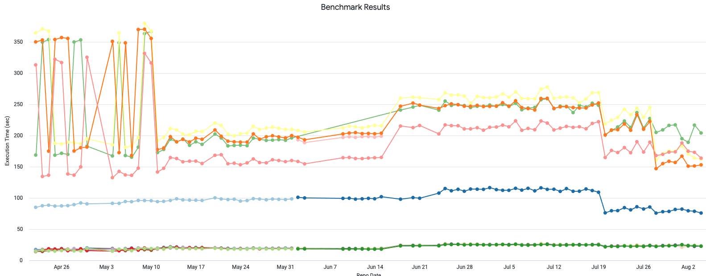
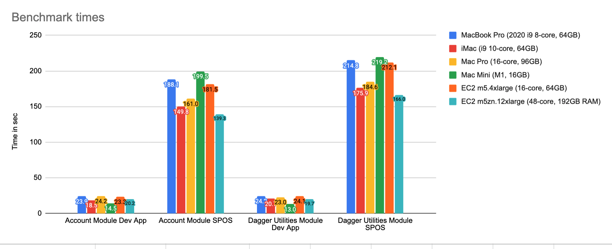

# Measure, measure, measure

> 이 글은 Ralf Wondratschek의 [Measure, measure, measure](https://developer.squareup.com/blog/measure-measure-measure/)을 번역 하였다. 

Android앱의 빌드 시간을 측정하는 방법에 대한 여정.

새로운 기능을 개발및 구현 하는데 얼마나 걸릴까? 이는 소프트웨어 엔지니어의 효율성을 향상시키는 데 있어 중요한 지표가 되며 회사가 다른 경쟁업체보다 우위를 점할 수 있도록 해준다. 그에는 API 경계, CI 시간, IDE의 응답성, 배포 속도, 빌드 시간 등 고려해야 할 다양한 차원이 존재 한다. 이 것들을 전체적으로 개선하기 위해선 모든 측면들에 대해 측정을 해야 한다. 이 중 일부는 쉽게 측정할 수 있겠지만 그렇지 않은 부분이 있는 사실을 깨달아야 한다. 

## Measure build times 

빌드 시간을 측정하는 방법은 생각보다 어려울 수 있다. 실제로는 Android의 [Gradle 빌드 스캔](https://scans.gradle.com/)을 사용하게 된다. 그러나 이렇게 얻은 수치는 빌드 시간을 측정하고 개선사항들을 찾아서 식별하는데 도움이 되지 않으며 보괴되어진 개발자 빌드 타임은 항상 뒤쳐질수 밖에 없다. 시간의 경가에 따른 결과만 보여주며 모든 개발자들이 이를 파악할 때 까지 중요한 변경사항들은 감지 하기가 어렵다. 또한 네트워크의 속도 저하, 개발자 컴퓨터에서 실행되고 있는 기타 응용 프로그램들, 시스템의 과열 등 기타 다른 여러가지 이유로 인하여 보고된 빌드 시간은 왜곡될 수 있다. 

## Build time benchmarks

빌드 스캔말고 Android앱의 빌드 시간을 벤치마크 하여 빌드 시간을 측정하여 문제가 없는지 확인을 해보자. 이런 벤치마크는 재현 가능하며 신뢰할 수 있는 수치로 최적화 되어 있다. 오프라인 모드에서 빌드를 실행하고 미리 가져온 아티팩트 캐시를 사용 하기 떄문이다. 반드시 개발자 경험을 말하는게 아니며 그럴 필요도 없다. [Gradle 프로파일러](https://github.com/gradle/gradle-profiler)를 이용하여 4라운드 동안 Gradle데몬을 워밍업 한 다음 7번 실행하여 빌드 타임을 측정 한다. Gradle프로파일러를 사용 하면 Kotlin및 Java파일에 점진적 변경을 적용하여 개발자가 로컬에서 수행할 수 있는 작업을 시뮬레이션 할 수 있다. 일반적인 시나리오는 다음과 같다:

```gradle
incremental_build_abi_change_in_account_module {
    tasks = [":module:app:assembleDebug"]

    apply-abi-change-to = "path/to/file/Java.java"
    apply-abi-change-to = "path/to/file/Kotlin.kt"

    show-build-cache-size = true
    warm-ups = 4
    gradle-args = ["--offline", "--no-build-cache"]
}
```

처음에는 이러한 벤치마크를 한달에 한번 수동으로 실행하여 얻은 측정 값을 기반으로 개발 접근 방식에 대해 다양한 전략을 얻을 수 있었다. 하지만 이는 새로운 사용 사례에는 충분하지 않았다. 그 이후로 EC2인스턴스에서 매일 벤치마크를 실행하고 벤치마크 결과를 데이터 백엔드에 보고 하는 파이프라인을 설정 하였다. 대시보드는 매일 업데이트 되며 개별로 벤치마크들을 보여 준다. 



대시보드를 설정한 후 개선사항들도 있었지만 포착된 사항들도 있었다. 

- 5월 11일에 Android Gradle플러그인 버전 4.2를 출시 되었다. 무작위로 긴 빌드 시간을 유발하던 버전 4.1의 버그가 수정 되었다. 
- 6월 18일에 `buildSrc`디렉터리를 포함한 빌드로 변환하여 빌드 시간이 30% 감소하였다. 대시 보드가 없었다면 이를 개발자들이 알아채지 못했을 것 이다. 서류상으로는 이에 대해 몰랐기 떄문이다. 
- 7월 20일에 포함된 빌드로 인한 문제를 수정 하였다. 
- 7월 28일에 Gradle 7.1을 적용하고 Gradle플러그인을 추가로 개선 하였다. 

## Developer machine evaluation

이러한 일관된 빌드 시간 벤치마크를 갖는 것 은 위에서 언급한 개발 사례에 도움이 되었을 뿐 만 아니라 모바일 개발자들을 위한 최고의 워크스테이션을 쉽게 평가하고 공정하게 비교할 수 있도록 도와주었다. 우리는 MacBook Pro에서 병목 현상과 써멀 스로틀링과 같은 이슈를 직면 하고 있으며 iMac, Mac Pro, M1 Mac Mini및 EC2 클라우드 머신을 테스트 하고 싶었다. 



이렇나 결과는 여러면에서 우리를 놀라게 하였다. Mac Pro에서는 더 많은 코어와 더 많은 RAM이 제공 되고 있지만 Intel프로세서가 장착된 iMac에서는 모든 시나리오에서 더 나은 성능을 보여주고 있기 때문이다. 그리고 단일 코어 속도로 이를 더 자세히 살펴 보았다. Mac Mini는 소규모 테스트 시나리오에서 큰 차이로 다른 컴퓨터들을 능가하였지만 더 큰 시나리오에서는 필요한 RAM과 코어 수가 부족 하였다; 따라서 더 나쁜 성능을 보이고 있는 것 이다. EC2인스턴스는 실행 가능한 대안 이지만 값비싼 "대형"인스턴스에 대해 비용을 지불하지 않는 한 iMac보다 느리다. 

## Conclusion

빌드 시간을 측정하는 과정들에서 몇가지 교훈을 얻을 수 있었다. 

Measure! Only because something looks better on paper it doesn’t need to perform as expected in real word scenarios. The best example is the Mac Pro.

빌드 시간을 측정하는 것 은 어렵다. 다른 사용 사례에서는 다른 전략이 필요 할 것 이다. 빌드 스캔은 훌륭 하기는 하지만 데이터가 뒤쳐진다. 

벤치마크를 설계하는 방법에 대해 주의 한다. 가변 네트워크 속도 또는 캐시 다운로드 시간과 같이 특정 방향으로 수치를 왜곡할 수 있는 외부 요인들을 피해야 한다. 

자주 그리고 지속적으로 측정 해야 한다. 때로는 동일한 코드 경로가 수천번 실행되는 대규모의 코드 베이스에서 가장 적은 변경 사항은 개발자들을 놀라게 할 것 이다. 

새로운 Mac이 출시 되면 벤치마크 제품군을 실행하고 최적의 개발자 시스템에 대해 더 많은 정보들을 기반으로 한 결정을 내릴것 이다. 우리는 Mac mini의 M1프로세서의 성능에 대해 많은 기대를 하였다. 그러나 우리의 리포지터리에는 특정 제약 조건이 있으며 이는 우리에게 좋은 선택이 아니다. 새로운 세대의 CPU는 앞으로 우리 프로젝트의 규모를 더 잘 처리할 수 있기를 기대 한다. 

전체 빌드 및 가장 큰 대상에 대한 기간을 측정하여 보면 새로운 관점이 열린다. 몇 개 또는 단일 모듈 빌드 시간을 측정하는 것 만으로는 충분하지 않다. 우리는 시나리오를 매크로 벤치마크처럼 취급 해야 한다. 