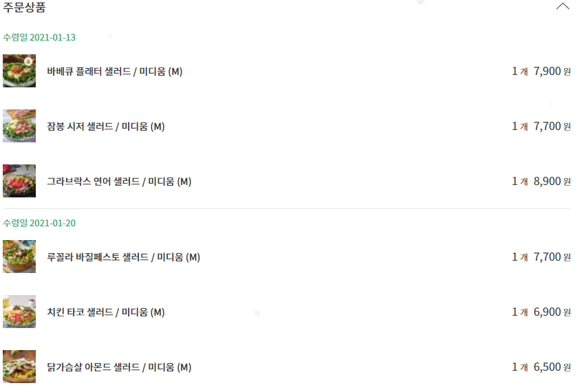
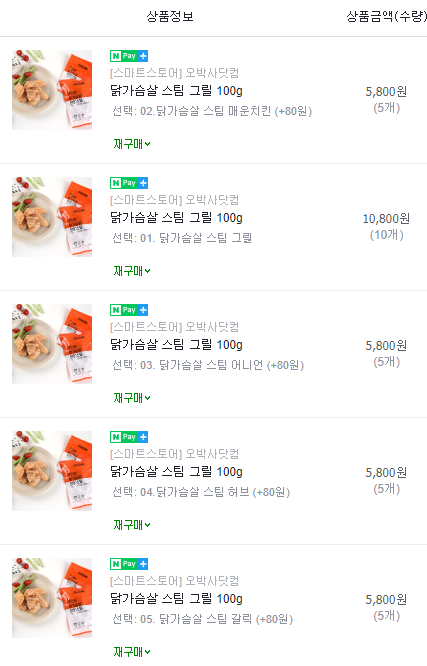

## 저나트륨 식단 및 도시락등 정리 

건강 관리를 위해 다이어트 식단 + 저 나트륨 도시락 및 대용품을 찾으면서 히스토리 관리를 위해 작성 하였음. 각 정기배송 식단 혹은 도시락 등을 먹은 뒤 개인적인 감상의 후기들을 작성 함. 

맛과 양, 가성비등은 10점 만점의 점수들을 각각 부여. 

### 1. [프레시 코드](https://www.freshcode.me/)

샐러드 정기 배송을 알아보다가 발견한 곳. 여러가지 유형의 정기 배송을 제공 하고 있음. 

- 식단 내용 
  - [새벽/정기배송] 프코한끼 샐러드 - 주 3일 [기간] 2주 / [배송] 주 1회 / [사이즈] M Size
  - 닭가슴살 아몬드, 치킨 타코, 루꼴라 바질페스토, 마카로니 콥, 로스트 비프, 그라브락스 연어, 잠봉 시저, 토종 곡물 간장밥, 아쉬파, 바베큐 플래터 등 다양한 메뉴 제공
- 점수
  - 맛 : 9/10
  - 양 : 7/10
  - 가성비 : 6/10
  - 나트륨 : 100 ~ 1100 (L사이즈 포함)
- 장점
  - 다양한 샐러드 메뉴 제공 
  - 먹어본 샐러드중에서는 가장 맛이 좋았음
  - 장기 정기배송 신청시 할인율이 증가 (2/3주 - 6퍼센트, 이후 8주까지 2주격주로 1퍼센트씩 증가)
- 단점
  - 식단들의 나트륨 함유량이 높은편 (100 ~ 1100)
  - 할인을 감안해도 가격이 비쌈 (대부분 샐러드의 가격이 7000~8000원)
  - M사이즈의 경우 성인 남성 기준으로 양이 적다고 느낄 수 있음
  - 일일 배송이 아닌 해당 주 식단을 원하는 날에 일괄 배송
- 결론
  - 맛있는 샐러드도 있다는 생각을 하게 해주었지만 가성비가 좋지 않고 나트륨이 높은 메뉴가 있음
  - 재구매 의사는 있지만 자주 시키지는 않을것 같음. 
  - 프레시코드외 에도 정기배송 가능한 업체가 몇군데 더 보였는데 한번 각각 시켜먹는것도 좋아 보임

### 2. 쿠팡 - 곰곰 도시락 시리즈

쿠팡에서 직접 관리/판매 하는 곰곰 도시락 시리즈

- 식단 내용
  - [곰곰 건간항 닭 도시락 시즌 1/2](https://www.coupang.com/vp/products/189267006?itemId=540447834&vendorItemId=5017244590&sourceType=CATEGORY&categoryId=225537&isAddedCart=)
  - [곰곰 건강한 밥 도시락](https://www.coupang.com/vp/products/189267000?itemId=540447825&vendorItemId=5017244964&sourceType=CATEGORY&categoryId=225537&isAddedCart=)
  - [곰곰 건강한 샐러드 도시락](https://www.coupang.com/vp/products/293454508?itemId=926514679&vendorItemId=5302343324&sourceType=CATEGORY&categoryId=225537&isAddedCart=)
- 점수 (공통)
  - 맛 : 6/10
  - 양 : 7/10
  - 가성비 : 8/10
  - 나트륨 : 평균 약 350 (첨부된 소스 포함하면 약 +500)
- 장점
  - 닭, 밥, 샐러드등 다양한 메뉴 제공 
  - 맛은 그럭저럭 먹을 만 함
  - 냉동이라 먹기에 간편하기는 함 (전자레인지)
  - 대부분 저 나트륨 (평균 350가량, 소스를 같이 뿌리면 약 800까지 오름)
  - 글 작성 시점에서 각 식단 도시락당 가격이 착한 편 (닭:총 6개 19500원, 밥:총 6개 21000원, 샐러드:총 6개 18360원) 대략 각 도시락 하나 당 3300원에서 4000원 선
  - 쿠팡 로켓배송으로 빠르게 받을 수 있음 
- 단점
  - 냉동 특유의 장기간 먹기 질리는 맛
  - 소스가 제공 되긴 하지만 나트륨이 많이 포함되어 있어 꺼려질 때가 있음. 그래서 따로 소스를 준비 해야 함 (오리엔탈 드레싱 과 같은 드레싱이나 각종 소스류)
  - 냉동실 자리를 많이 차지함 (도시락 6개가 한번에 배송)
- 결론
  - 그럭저럭 싸고 적절하게 한끼를 저 나트륨, 다이어트 식단으로 먹을 수 있음. 하루에 한끼로 어쩌다가 먹기에 좋으며 자주 먹기에는 맛이 상당히 물림. 
  - 재구매 의사는 높기는 함. 가끔씩 시켜서 쟁여두고 먹기에 좋음. (냉동이니까)

### 3. [오박사 닷컴](https://smartstore.naver.com/hangugmall) - 닭가슴 살 

회사 동료로부터 추천 받은 것. 냉동으로 구성되어 있음. 

- 닭가슴살 스팀 매운치킨, 그릴, 어니언, 허브, 갈릭 
- 점수 (공통)
  - 맛 : 4/10
  - 양 : 8/10
  - 가성비 : 9/10
  - 나트륨 : 약 100 ~ 300
- 장점
  - 개당 1000원 씩 하는 낮은 가격
  - 쟁여두고 필요할때 꺼내서 전자레인지에 돌려먹으면 되는 간편함
  - 낮은 나트륨으로 인해 나트륨 걱정할 필요가 없음
  - 다른 식단이나 도시락에 곁들여서 먹기에 좋음
- 단점
  - 단품으로 먹기에는 맛이 없음 (소스 필수)
  - 냉동으로 계속 먹고 싶지는 않음 
- 결론
  - 다이어트 식단이 부족하다고 느낄 때 같이 곁들여서 먹기에 좋은 일반적인 닭가슴살. 쟁여두고 먹기에 정말 좋지만 냉동실을 은근히 많이 차지 한다. 
  - 재구매의사도 괜찮음. 쟁여두고 먹기에 좋음.

### 4. 기타 

- B마트 : 채소 믹스 500g
  - 각종 채소들이 썰린채로 담겨있음
  - 다이어트 도시락 등 다른 식단에 곁들여서 먹기에 좋음
  - 근데 500g이라는 양이 생각보다 많아서 결국 일부를 버리게 됨