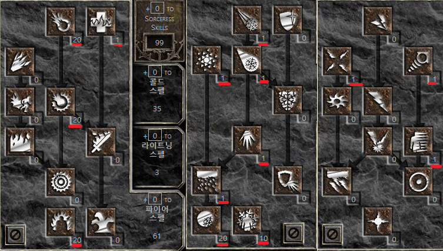

# 디아블로2 맨땅 정리 

## 1. 맨땅 해머딘 

맨땅용 해머딘. 초반엔 질+홀리파이어로 시작 해서 용병이 통찰(룬워드-폴암) 끼는 순간 부터 해머딘으로 전직. 

- [참고](https://www.youtube.com/watch?v=oUVN7_AzmvQ&ab_channel=%EB%8B%A8TV)

### 1.1 육성

- 노멀 1막
  - 스탯 : 힘60, 민첩35, 나머지 생명력
  - 스킬 : 질4개, 홀리파이어M, 나머지는 레지스트 파이어, (필요하면 비거 하나)
  - 포가튼 타워에서 룬(티르, 엘, 탈, 에드) 노가다 (8 RAL까지 나옴, 나메는 Ko까지)
  - 안다리엘은 해독 포션 먹고 잡으면 됨 
- 노멀 2막
  - 3줄 벨트 구입
  - 프레일 2소켓 -> 스틸 (티르/엘)
  - 갑옷 2소켓(브레스트 플레이트) -> 스텔스(탈/에드)
  - 투구 2소켓 -> 학식 (오르트/솔) 
  - 방패 3소켓 -> 고대인의 서약(랄/오르트/탈)
  - 듀리엘은 해빙 포션 먹고 잡으면 됨
- 노멀 3, 4막 
  - 별거 없음
- 노멀 5막, 노말 카우방
  - 노멀 폴암 먹고(숨렙 26~40) 라주크를 통해 4소켓 뚫음. (바디쉬 제외)
  - 4소켓 폴암으로 통찰력(랄/티르/탈/솔) 만듬
  - 똑같이 4소켓 크리스탈 소드를 위한 노멀 크리스탈 소드도 줏어놓음 (나이트메어 부터 4소켓이 등장 하긴 하지만 확률이 낮음 - 나메 라주크로 뚫어야 함)
  - 용병렙이 27이 되면 통찰을 착용 시켜주고 해머딘으로 전직. 

> 노멀은 전체적으로 쉽지만 4막 카오스 생츄어리부터 좀 빡셈. 디아블로에서 화염, 라이트닝 저항 꼭 맞출것. 
> 통찰 용병인데도 마나가 부족하다면 제왕운시 + 스피릿(무기)를 착용하면 마나가 넉넉해지고 빨리 재생되어 할만해진다.
> 스탯은 힘60, 민첩은 홀쉴키고 블럭율 50퍼 유지, 나머지 생명력

### 1.2 스킬

- 방어
  - 비거M (우선순위 3)
- 공격 
  - 컨센트레이션M (우선순위 2), 블레시드에임M(우선순위 4)
- 전투
  - 블레시드해머M (우선순위 1), 홀리쉴드M (우선순위 5)

### 1.3 룬워드

- 스틸 (검, 도끼, 메이스 2) 티르/엘 (13)
- 스텔스 (갑옷 2) 탈/에드 (l7)
- 고대인의 서약 (방패 3) 랄/오르트/탈 (21)
- 스트렝스 (근접무기 2) 앰/티르 (25) : 용병
- 스피릿 (검, 방패 4) 탈/주울/오르트/엠 (25)
- 통찰 (폴암, 지팡이 4) 랄/티르/탈/솔 (27)
- 학식 (방패 2) 오르트/솔 (27)
- 제왕운시 (방패 2) 샤에/에드 (29)
- 연기 (갑옷 2) 네프/룸 (37)
- 트레셔리 (갑옷 3) 샤에/주울/렘 (43)
- 스톤 (갑옷 4) 샤에/우움/풀/룸 (47)
- 협박 (갑옷 3) 샤에/우움/주울 (47)
- 인내 (무기, 갑옷 4) 엘/솔/돌/로 (59) : 용병 갑옷 

## 2. 맨땅 소서

맨땅용 파볼+오브 소서 간단 정리. 

### 스킬



### 육성

- 스탯 
  - 아이템 착용할 힘, 나머지 생명력
  - 파이어볼을 사용하고 나면 마나가 극심히 부족해지기 시작함. -> 에너지 50정도 투자 하기 좋음
  - 가장 먼저 용병 통찰력(4소켓 폴암)을 먼저 작업 하는게 가장 좋음
  - 파이어볼 적정레벨이 되면 한두발에 왠만한 몹들은 다 죽음. 
- 스킬 
  - 파이어 : 웜스1, 파이어볼트20, 파이어볼20, 파이어마스터리20, 메테오
  - 콜드 : 프로즌오브20, 콜드마스터리 5~10, (가는 길 5개)
  - 라이트닝 : 스태틱필드1, 텔레포트1(텔레키네시스1)
- 아이템
  - 투구 : 룬워드 학식(2,ort+sol)
  - 무기 : 룬워드 스피리트(4)
  - 갑옷 : 룬워드 스텔스(2)
  - 방패 : 룬워드 스피리트(4) or 제왕운시(3) 초반에 고대인의 서약도 괜찮음. 
  - 벨트 : 스웹 or 레지,피 4줄
  - 장갑 : 메이지피스트 or 찬스장갑
  - 신발 : 배추 or 달려,레지
  - 아뮬렛 : 패키,힘,저항,스킬
  - 반지 : 패캐,힘,저항 매찬
  - 용병 투구 : 아무거나 or 학식(2)
  - 용병 갑옷 : 스텔스(2)
  - 용병 무기 : 통찰력(2)
    - 노멀 카우, 4막 카생 에서 나오는 바디쉬를 제외한 모든 폴암은 4솟으로 뚫림

### 룬워드

- Lv27. 학식 (투구 2 / Ort + Sol / 오르트 솔)
```
+1 모든 스킬 상승
+10 에너지
라이트닝 저항력 +30%
데미지 감소 7
+2 마나 상승(적 제거시)
+2 시야 증가
```

- Lv25. 스피릿 (검, 방패 4 / Tal + Thul + Ort + Amn / 탈 주울 오르트 엠)
```
// 검
+2 모든 스킬 상승
+25~35% 매우 빠른 캐스팅 속도 증가 (변함)
+55% 매우 빠른 회복속도 증가
1~50 라이트닝 데미지 추가
3~14 콜드 데미지 추가
매초당 +75 포이즌 데미지 추가
7% 라이프 획득(공격 명중시)
+250 원거리 공격 방어
+22 생명력
+89~112 마나 (변함)
+3~8 매직 흡수 (변함)

// 방패
+2 모든 스킬 상승
+25~35% 매우 빠른 캐스팅 속도 증가 (변함)
+55% 매우 빠른 회복속도 증가
+250 원거리 공격 방어
+22 생명력
+89~112 마나 (변함)
콜드 저항력 +35%
라이트닝 저항력 +35%
포이즌 저항력 +35%
+3~8 매직 흡수 (변함)
공격자가 받는 데미지 14
```

- Lv17. 스텔스 (갑옷 2 / Tal + Eth / 탈 에드)
```
+25% 매우 빠른 달리기/걷기 속도 증가
+25% 매우 빠른 캐스팅 속도 증가
+25% 매우 빠른 회복속도 증가
+6 민첩성
마나 재생 15%
+15 스태미나 최대치
포이즌 저항력 +30%
마법 데미지 감소 3
```

- Lv29. 제왕운시 (방패 2 / Shael + Eth / 샤엘 에드)
```
+40% 매우 빠른 방어속도 증가
20% 공격저지 성공율 증가
마나 재생 15%
모든 저항력 +25
결빙되지 않음
50% 몬스터로부터 얻는 골드 증가
25% 매직 아이템 얻을 확률 증가
```

- Lv27. 통찰력 (폴암, 지팡이 4 / Ral + Tir + Tal + Sol / 랄 티르 탈 솔)
```
장착시 12~17레벨의 메디테이션 오라의 효과 적용 (변함)
+35% 매우 빠른 캐스팅 속도 증가
+200~260% 증가된 데미지 (변함)
+9 최소 데미지
180~250% 공격등급 추가 상승 (변함)
5~30 파이어 데미지 추가
매초당 +75 포이즌 데미지 추가
+1~6 크리티컬 스트라이크 (변함)
+5 모든 능력치
+2 마나 상승(적 제거시)
23% 매직 아이템 얻을 확률 증가
```

- Lv19. 꽃잎 (스태프 2 / Tir + Ral / 티르 랄)
```
+3 파이어 스킬 상승
5~30 파이어 데미지 추가
+3 인페르노 (소서리스 전용)
+3 웜쓰 (소서리스 전용)
+3 파이어 볼트 (소서리스 전용)
+(캐릭터 레벨당 2) 2~198 방어 (캐릭터 레벨에 비례해서)
+2 마나 상승(적 제거시)
콜드 저항력 +33%
```

- 참고 링크
  - [맨땅 소서 for 레저렉션](https://tisaa.tistory.com/entry/%EB%94%94%EC%95%84%EB%B8%94%EB%A1%9C2-%EB%A0%88%EC%A0%80%EB%A0%89%EC%85%98-%EC%B4%88%EB%B3%B4%EC%9E%90%EB%A5%BC-%EC%9C%84%ED%95%9C-%EC%B2%AB-%EC%BA%90%EB%A6%AD%ED%84%B0-%EB%A7%A8%EB%95%85-%EC%86%8C%EC%84%9C%EB%A6%AC%EC%8A%A4%EC%9B%90%EC%86%8C%EC%88%A0%EC%82%AC-%EC%9C%A1%EC%84%B1%EB%B2%95-%ED%8C%8C%EB%B3%BC%EC%98%A4%EB%B8%8C%EC%86%8C%EC%84%9C)