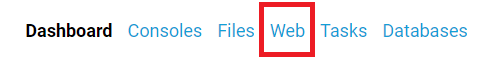
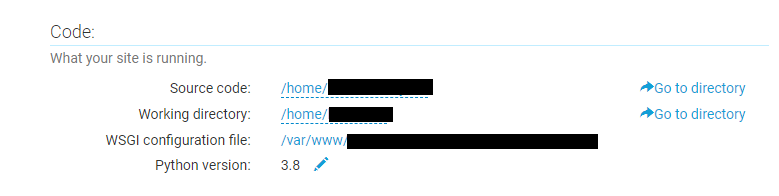

## pythonanywhere에 Flask세팅 하고 간단한 Restful API 세팅하기

[pythonanywhere](https://www.pythonanywhere.com/)에 가입 하지 않았다면 가입을 먼저 한뒤, 가입 떄의 이메일로 확인 메일까지 컨펌 하도록 한다. 가입할때 사용되는 username은 나중에 `(username).pythonanywhere.com` 가 된다.

일단 오늘은 pythonanywhere에 Flask를 간단하게 세팅 하고 필요한 경우 git 리포에 있는 파이썬 flask를 clone하는 경우에 대해서도 추가로 작성 하였다. 

### 1. Flask 세팅 

1. 로그인 한 뒤 보이는 대쉬보드 화면에서 상단 메뉴중 `Web`을 선택 한다. 

2. 왼쪽의 `(+) Add a new web app`을 선택 한 뒤 Next를 누르며 진행 한다. `Select a Python Web Framework`가 등장하면 Django와 web2py, Flask, Bottle등이 보여진다. 여기에서 Flask를 선택 한다. 

3. 다음으로는 파이썬 버전을 선택 할 수 있다. 각 버전별의 차이점으로는 각 버전별로 작성 하는 문법이 달라진다고 하는데 정확한 다름은 모를것 같다. 일단 글 작성 다시 가장 최신버전인 **Python 3.8**을 선택 하도록 하자. 참고로 선택하는 Flask는 1.1.1버전 밖에 없다. 

4. 그다음, Flask 앱을 보관하는데 사용할 Python파일의 경로를 미리 주어지며 이를 새로 입력 할 수 있다. 이미 이 파일이 존재 한다면 해당 파일의 내용을 새 앱으로 덮어쓰게 되니 주의하면 된다. 

5. 정상적으로 pythonanywhere에 Flask가 세팅이 되었다면 이 시점에서 `(username).pythonanywhere.com`을 통해서 Python 웹에 접근할 수 있다. 

- 이미 파이썬으로 작성된 Flask 웹 서비스 파일들이 git 저장소에 존재 한다면 해당 저장소에서 `git clone`으로 가져올 수 있다. 
- clone한 뒤 가상환견을 생성하고 실행 해 준뒤 `pip`를 이용해 필요한 모듈들을 모두 설치해주도록 한다. 

### 2. pythonanywhere 웹 호스팅 

다시 상단바 메뉴에서 `Web`을 선택 한다. 

만약 이미 `clone`한 웹 서비스가 있다면 해당 디렉토리를 `Source code:`로 변경 한다. 

그리고 `WSGI configuration file`의 내용중 path에 대해서 필요에 따라 수정 한다. (clone했을 경우)

가상환경(Virtualenv)의 경우 위 bash설정때 입력했던 가상환경 이름을 입력 해 준다. 

그리고 css나 js파일과 같은 정적 파일의 위치를 url으로 지정해 맵핑 하는 작업이 필요할 수 있다. 이 경우 `/static/`에 설정 해주면 된다. 

마지막으로 녹색 버튼을 눌러 새로고침 해주고, 노란색 버튼을 누르면 3개월동안은 이 계정을 통해 무료로 사용할 수 있다. 

